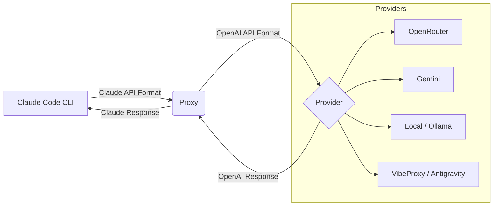

<div align="center">

# 🔄 Claude Code Proxy

**Use Claude Code CLI with any OpenAI-compatible provider**

[](https://www.python.org/downloads/)
[](https://opensource.org/licenses/MIT)

[Quick Start](#-quick-start) • [Features](#-features) • [Configuration](docs/getting-started/configuration.md) • [Examples](docs/guides/examples.md)

</div>

---

## 📖 What It Does

Claude Code Proxy sits between Claude Code CLI and your chosen API provider. It tricks Claude Code into thinking it's talking to Anthropic, but routes requests to **OpenRouter, Gemini, OpenAI, Azure, Ollama, or LM Studio**.

**Why?** Save money, run locally, or use models like GPT-5/o1/Gemini 3/Claude via Antigravity.

---

## 🌌 VibeProxy + Antigravity (Recommended)

The easiest way to use Claude Code with premium models for **free** (no API keys needed):

1. **Install VibeProxy**: [Download from releases](https://github.com/automazeio/vibeproxy/releases)
2. **Authenticate**: Launch VibeProxy and sign in with Google (Antigravity OAuth)
3. **Setup Proxy**:
   ```bash
   python start_proxy.py --setup  # Select "VibeProxy/Antigravity"
   ```

**What you get:**
- Claude Opus 4.5 with 128k thinking tokens
- Gemini 3 Pro/Flash
- BIG/MIDDLE/SMALL model routing
- Usage tracking and analytics
- No API keys or billing required

[Learn more about Antigravity models →](config/env.example#L339)

---

## 🚀 Quick Start

1. **Clone and Install**
   ```bash
   git clone https://github.com/aaaronmiller/claude-code-proxy.git
   cd claude-code-proxy
   uv sync
   ```

2. **Setup**
   Run the interactive setup wizard to configure your provider and models:
   ```bash
   python start_proxy.py --setup
   ```

3. **Start Proxy**
   ```bash
   python start_proxy.py
   ```

4. **Connect Claude Code**
   In a separate terminal:
   ```bash
   export ANTHROPIC_BASE_URL=http://localhost:8082
   claude
   ```

## 📂 Project Structure

The repository is organized for clarity and ease of use:

- **`start_proxy.py`**: The single entry point for the server and all CLI tools.
- **`config/`**: Configuration templates and presets.
- **`data/`**: Runtime data (databases, logs, usage stats).
- **`deploy/`**: Deployment configurations (Docker, etc.).
- **`docs/`**: Comprehensive documentation.
- **`dev/scripts/`**: Developer and maintenance scripts.
- **`src/`**: Source code.

## 🛠️ CLI Tools

All tools are accessible via `start_proxy.py`:

- **Setup Wizard**: `python start_proxy.py --setup`
- **Configure Prompts**: `python start_proxy.py --configure-prompts`
- **Configure Terminal**: `python start_proxy.py --configure-terminal`
- **Configure Dashboard**: `python start_proxy.py --configure-dashboard`
- **View Analytics**: `python start_proxy.py --analytics`
- **Select Models**: `python start_proxy.py --select-models`

---

## 🌐 Web Configuration UI

Access the web dashboard at `http://localhost:8082` when the proxy is running.

**Features:**
- **Provider Presets**: One-click setup for VibeProxy, OpenRouter, Gemini, OpenAI, Ollama, LM Studio
- **Model Configuration**: Set BIG/MIDDLE/SMALL model routing with reasoning settings
- **Hybrid Mode**: Route different model tiers to different providers
- **Terminal Settings**: Configure display mode, colors, metrics visibility
- **Profile Management**: Save and load configuration profiles
- **Live Monitoring**: Real-time request stats and WebSocket log streaming

The UI features a cyberpunk terminal theme with neon accents and supports all configuration options.

---

## 🧩 How It Works



---

## ✨ Features

- **🌌 Antigravity Support**: Access Claude Opus/Sonnet via Google's Antigravity service (free with OAuth).
- **💰 Cost Savings**: Use free models (Gemini Flash, OpenRouter free tier) or cheaper alternatives.
- **🏠 Local Privacy**: Run 100% offline with Ollama or LM Studio.
- **🧠 Extended Thinking**: Enable up to 128k thinking tokens for reasoning models (Claude, o1, Gemini).
- **🌐 Web Dashboard**: Browser-based configuration UI with cyberpunk terminal theme.
- **📊 Terminal Dashboard**: Live request monitoring and metrics.
- **🔀 Hybrid Routing**: Route simple tasks to cheap models and complex tasks to smart models.
- **✏️ Custom Prompts**: Inject custom system prompts for different model tiers.

---

## 📚 Documentation

- **[Configuration Guide](docs/getting-started/configuration.md)** - Full list of environment variables.
- **[Examples](docs/guides/examples.md)** - Recipes for different setups (Free, Local, Power User).
- **[Troubleshooting](docs/troubleshooting/common-issues.md)** - Solutions for common problems.
- **[API Reference](docs/api/reference.md)** - For developers.

---

## 🐛 Common Issues

**401 User Not Found (OpenRouter)**
You likely have a negative balance or $0.00 credit. OpenRouter requires a positive balance even for free models.
[Read more](docs/troubleshooting/401-errors.md)

**Connection Refused**
Make sure `python start_proxy.py` is running in a separate terminal window.

**Model Not Found**
Check your `BIG_MODEL`, `MIDDLE_MODEL`, and `SMALL_MODEL` settings in `.env`.

---

## 🔮 Potential Future Additions

1. **Desktop GUI Client (Electron/Tauri)**
   - System tray integration, global hotkeys, and a native chat experience.
   - *Tech*: Tauri (Rust + React) for lightweight performance.

2. **Advanced Analytics Platform**
   - Aggregate usage data from multiple proxy instances for teams.
   - *Tech*: Postgres, Grafana/Metabase, separate FastAPI service.

3. **Multi-Agent Orchestrator ("Swarm Mode")**
   - Extend Crosstalk to support complex, multi-step workflows where specialist models collaborate autonomously.
   - *Tech*: LangGraph or custom orchestration layer.

4. **MCP Server Integration**
   - Expose the proxy as an MCP Server, allowing Claude Desktop to use it as a tool for routing requests to alternative providers.
   - *Tech*: Model Context Protocol SDK.

---

<div align="center">
Made with ❤️ for the Claude Code community
</div>
