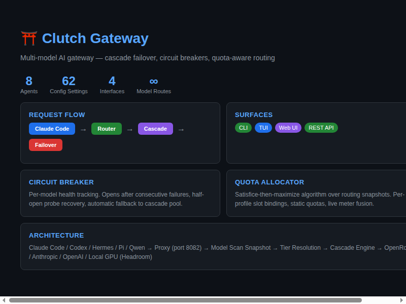

<div align="center">

# Clutch Gateway

### Run 8 coding agents through one gateway. Cheaper context, automatic failover, one launcher.



[](https://github.com/aaaronmiller/claude-code-proxy)
[](MIT)

```
  Claude Code  ·  Codex  ·  Qwen  ·  Pi
  Hermes       ·  Ante   ·  Antigravity  ·  OpenCode
           ↓
    ┌─ Clutch Gateway ───────────────┐
    │  :8787  Headroom compression   │
    │  :8082  Router + fallback      │
    │  :8317  CLI proxy (optional)   │
    └────────────────────────────────┘
           ↓
    OpenRouter · Anthropic · OpenAI · Gemini · Ollama
```

</div>

## Your aliases are broken. Here's the fix.

You have 25 aliases in your `.zshrc`. Half of them pass the wrong flags. Hermes doesn't get `--yolo`, Codex gets `--dangerously-bypass-approvals` (a flag that doesn't exist), and Ante has no bypass flag at all so it approves every file change manually.

This repo fixes that with two things:

1. **A local gateway** (`:8082`) that routes requests, compresses context, cascades through free models when paid ones fail, and tracks usage.
2. **`xx`** — a unified launcher replacing all 25 aliases with a single 3-character encoding.

```bash
# Before: 25 aliases, half broken
alias cc='unset ANTHROPIC... && ANTHROPIC_BASE_URL=... rtk claude ...'
alias hsi='... --dangerously-skip-permissions (hermes has --yolo, dumbass) ...'
alias codex-run='... --dangerously-bypass-approvals (flag doesn't exist) ...'

# After: One command for everything (wrapped in cg_run for crash recovery)
cc        # = cg_run xx cip   → Claude init, proxy
hsi       # = cg_run xx hip   → Hermes init, proxy
codex-run # = cg_run xx xip   → Codex init, proxy
```

---

## Quick Start

```bash
# 1. Install
git clone https://github.com/aaaronmiller/claude-code-proxy.git
cd claude-code-proxy
cp .env.example .env

# 2. Start the gateway
./proxies up

# 3. Install the xx launcher
bash scripts/install-aliases.sh
exec zsh   # or source ~/.zshrc

# 4. Launch anything
xx cip  # Claude Code — proxy route, fresh session
```

That's it. **30 seconds to launching any coding agent** through a local gateway with context compression, automatic failover, and free-model cascading.

---

## The `xx` Encoding System

Stop remembering 25 aliases. This is the only thing you need to know:

```
xx <AGENT><MODE><ROUTE>[<TIER>]
```

| Position | Char | Meaning | Example |
|----------|------|---------|---------|
| **1: Agent** | `c` | Claude Code | |
| | `h` | Hermes | |
| | `x` | Codex | |
| | `q` | Qwen | |
| | `p` | Pi | |
| | `o` | OpenCode | |
| | `a` | Ante | |
| | `g` | Antigravity | |
| **2: Mode** | `i` | Init (new session) | |
| | `c` | Continue (resume last) | |
| | `n` | Non-interactive (prompt flag) | |
| | `s` | Session (`--session <id>`) | |
| | `r` | Resume picker | |
| **3: Route** | `p` | Proxy (routing + fallback) | **Everyday use** |
| | `b` | Bypass (keep proxy features, skip model reroute) | |
| | `d` | Debug (direct to provider, no proxy) | Troubleshooting |
| **4: Tier** | *(optional)* | | |
| | `d` | DeepSeek V4 Flash | Budget coding |
| | `n` | Nemotron 3 Super 120B | Daily driver |
| | `k` | Kimi K2.6 | |
| | `q` | Qwen3 Next 80B | |
| | `m` | Model-scan best | Auto-selected |
| | `f` | Model-scan free | Cheapest working |
| | `0`-`9` | Named profiles | Your custom config |

### Everyday examples

All aliases wrap through `cg_run` (crash-guard tmux attach + recovery). Run `xx <code>` directly to skip the wrapper.

```bash
# ── Claude Code ──────────────────────────────────────────────────
cc                  # = cg_run xx cip      Init, proxy
ccc                 # = cg_run xx ccf      Continue, free tier
cc-debug            # = cg_run xx cid      Init, direct (no proxy)
cc-ds               # = cg_run xx cipd     Init, proxy, DeepSeek tier
cc -m claude/sonnet-4  # Init with model override

# ── Hermes ───────────────────────────────────────────────────────
hsi                 # = cg_run xx hip      Init, proxy
hsr                 # = cg_run xx hcf      Continue, free tier
hsi-bp              # = cg_run xx hib      Init, bypass route
xx hif              # raw:  Init, proxy, free tier (no cg_run)

# ── Pi ───────────────────────────────────────────────────────────
psi                 # = cg_run xx pip      Init, proxy
psi-c               # = cg_run xx pcf      Continue, free tier
psi-ds              # = cg_run xx pipd     Init, proxy, DeepSeek

# ── Codex ────────────────────────────────────────────────────────
codex-run           # = cg_run xx xip      Init, proxy
codex-res           # = cg_run xx xcf      Continue, free tier
xx xid              # raw:  Init, direct

# ── Qwen / Antigravity / Ante / OpenCode ────────────────────────
qw                  # = cg_run xx qip      Qwen init, proxy
antigravity         # = cg_run xx gip      Antigravity init, proxy
ante                # = cg_run xx aip      Ante init, proxy
oc                  # = cg_run xx oip      OpenCode init, proxy
```

### Session management

Every tool supports `--session <id>` — the launcher maps it to each tool's native flag:

```bash
xx hip -s abc123    # Hermes → hermes --resume abc123
xx pip -s abc123    # Pi → pi --session abc123
xx gip -s abc123    # Antigravity → agy --conversation abc123
xx cip -s abc123    # Claude Code → session handled by proxy
```

### Model override

```bash
xx cip -m gpt-4o                    # Override the main model
xx hip -m claude/sonnet-4           # Switch mid-stream
xx qcpd -p "refactor this"         # Prompt without --model
```

---

## How It Works

```
 ┌──────────────────────────────────────────────────────────────────┐
 │                         Your Terminal                            │
 │  xx cip   xx hip   xx xcf   xx qip   xx pip   xx gip  xx aip   │
 └──────────┬───────────┬──────────┬──────────┬───────────────────-┘
            │           │          │          │
            └──────┬────┘──────────┘──────────┘
                   │
            ┌──────▼─────────────────────────────┐
            │     RTK Terminal Compression         │
            │   (filters shell noise from prompts) │
            └──────────────┬──────────────────────-┘
                           │
            ┌──────────────▼──────────────────────┐
            │   Headroom Context Compressor :8787  │
            │  (GPU-accelerated prompt compression) │
            │  saves 40-70% on context window       │
            └──────────────┬──────────────────────-┘
                           │
            ┌──────────────▼──────────────────────┐
            │    Clutch Gateway Router :8082        │
            │                                      │
            │  ┌─────────────────────────────────┐ │
            │  │  Role Router                     │ │
            │  │  • BIG → primary model           │ │
            │  │  • MIDDLE → tool calls           │ │
            │  │  • SMALL → background tasks      │ │
            │  │  • FALLBACK → cascade chain      │ │
            │  └──────────────┬──────────────────┘ │
            │                 │                    │
            │  ┌──────────────▼──────────────────┐ │
            │  │  Circuit Breaker                 │ │
            │  │  • 3 failures = 60s cooldown    │ │
            │  │  • Auto-fallback to next tier   │ │
            │  │  • Rate-limit detection          │ │
            │  └─────────────────────────────────┘ │
            └──────────────┬──────────────────────-┘
                           │
         ┌─────────────────┼────────┬───────────┬──────────┐
         ▼                 ▼        ▼           ▼          ▼
   OpenRouter          Anthropic  OpenAI    Gemini    Ollama
   (free + paid)        (Pro)     (API)    (API)     (local)
```

---

## Why This Exists

### The alias problem

Every AI coding tool has its own CLI, its own flags, its own auth. You end up with:

```bash
alias cc='_proxy_stack_auto_start && ANTHROPIC_BASE_URL=... ANTHROPIC_API_KEY=... rtk claude --dangerously-skip-permissions'
alias hsi='_proxy_stack_auto_start && OPENAI_BASE_URL=... OPENAI_API_KEY=pass rtk hermes --dangerously-skip-permissions'
alias psi='_proxy_stack_auto_start && OPENAI_BASE_URL=... OPENAI_API_KEY=pass rtk pi --provider openai'
```

That's three lines for three tools. Most people have **20+ lines**. And they're almost certainly **wrong** — Hermes uses `--yolo`, not `--dangerously-skip-permissions`. Codex uses `-a never`, not `--dangerously-bypass-approvals-and-sandbox`. Ante has no approval bypass flag at all.

`xx` replaces all of that with a single 3-character command. **Each correct flag per tool is baked in.** You can't get them wrong — the launcher knows each tool's exact CLI interface.

### The cost problem

Coding agents burn tokens differently from chat apps. They replay files, tool logs, terminal output, and long histories over and over. A generic API gateway helps, but it doesn't understand the agent loop.

- **Headroom** compresses prompt context **before** it hits the provider bill.
- **RTK** compresses terminal output **before** it poisons the next turn.
- **Role-aware routing** sends web searches to cheap models, reasoning to smart models, tool calls to fast models.
- **Cascade fallback** tries 3-4 free models before giving up on a request.

### The session problem

Every tool names session flags differently:

| Tool | Flag |
|------|------|
| Claude Code | implicit (proxy handles it) |
| Hermes | `--resume <id>` |
| Pi | `--session <id>` |
| Antigravity | `--conversation <id>` |
| Codex | `resume` subcommand |

`xx` normalizes this: `--session <id>` works on every tool. The launcher maps it to the correct native flag.

---

## Free Model Cascading

The proxy doesn't just route — it **fails forward**. When your primary model returns a 401, rate-limits you, or times out, it tries the next one automatically.

```
BIG tier:  moonshotai/kimi-k2.6:free
           ↓ failure
           nvidia/nemotron-3-super-120b-a12b:free
           ↓ failure
           deepseek/deepseek-v4-flash:free
           ↓ failure
           openai/gpt-oss-120b:free  (last resort)

MIDDLE tier (tool calls):
           qwen/qwen3-next-80b-a3b-thinking
           ↓ failure
           deepseek/deepseek-v4-flash:free
           ↓ failure
           nvidia/nemotron-3-super-120b-a12b:free
```

Configured in `.env` and `~/.xx/config.json`. Add your own models, reorder priorities, set quota limits per provider.

---

## `xx` vs raw CLI tools

| Scenario | Without `xx` | With `xx` |
|----------|-------------|-----------|
| Launch Claude Code | `ANTHROPIC_BASE_URL=... ANTHROPIC_API_KEY=... rtk claude --dangerously-skip-permissions` | `xx cip` |
| Continue last session | Same + `--continue` | `xx ccf` |
| Launch Hermes free tier | `OPENAI_BASE_URL=... rtk hermes --yolo --accept-hooks chat` | `xx hif` |
| Launch Pi with DeepSeek | `OPENAI_BASE_URL=... rtk pi --provider openai` | `xx pipd` |
| Debug mode (no proxy) | Unset all env vars, bypass RC, run raw | `xx cid` |
| Custom model | Figure out which `--model` flag the tool uses | `xx cip -m gpt-4o` |
| Session management | `--resume` vs `--conversation` vs `--session` vs subcommand | `xx cip -s <id>` |
| Crash recovery | `tmux attach -t ...` or lose the session | `cc` (cg_run built in) |

---

## Configuration

### `~/.xx/config.json`

```json
{
  "proxy": {
    "base_url": "http://127.0.0.1:8082",
    "health_url": "http://127.0.0.1:8082/health",
    "auto_start": true
  },
  "model_tiers": {
    "BIG": {
      "default": "moonshotai/kimi-k2.6:free",
      "cascade": [
        "openai/gpt-oss-120b:free",
        "nvidia/nemotron-3-super-120b-a12b:free",
        "deepseek/deepseek-v4-flash:free"
      ]
    },
    "MIDDLE": {
      "default": "nvidia/nemotron-3-super-120b-a12b:free",
      "cascade": [
        "nvidia/nemotron-3-super-120b-a12b:free",
        "openai/gpt-oss-120b:free"
      ]
    },
    "SMALL": {
      "default": "nvidia/nemotron-3-nano-omni-30b-a3b-reasoning:free",
      "cascade": [
        "openai/gpt-oss-120b:free",
        "nvidia/nemotron-3-super-120b-a12b:free"
      ]
    }
  },
  "fallbacks": [
    "deepseek/deepseek-v4-flash:free",
    "nvidia/nemotron-3-super-120b-a12b:free",
    "openai/gpt-oss-120b:free"
  ],
  "toolcall_models": [
    "qwen/qwen3-next-80b-a3b-thinking",
    "deepseek/deepseek-v4-flash:free",
    "nvidia/nemotron-3-super-120b-a12b:free",
    "openai/gpt-oss-120b:free"
  ],
  "quotas": {
    "deepseek/deepseek-v4-flash:free": {
      "max_requests_per_minute": 30,
      "cooldown_seconds": 10
    }
  }
}
```

### `.env`

Copy `.env.example` → `.env`. Key variables:

| Variable | Purpose |
|----------|---------|
| `BIG_MODEL` | Default model for primary agent work |
| `TOOLCALL_MODELS` | Comma-separated cascade for tool-calling |
| `OPENROUTER_FALLBACK_MODELS` | Models to try when primary fails |
| `FALLBACK_METHOD` | `cascade`, `openrouter_native`, or both |

---

## Proxies (Lifecycle Manager)

The `proxies` command starts/stops the full gateway chain:

```bash
proxies up           # Start gateway + Headroom in tmux
proxies down         # Stop everything
proxies status       # Health check for all services
proxies logs         # Tail proxy logs
proxies watch        # Live metrics dashboard
proxies config show  # Inspect the current chain config
proxies restart headroom  # Restart compression layer only
```

---

## Model-Scan Integration

The gateway integrates with [model-scan](https://github.com/aaaronmiller/model-scan) — a provider health diagnostics tool that scores models on intelligence, speed, agentic ability, and coding skill. The proxy uses these scores to:

- Select the best free model for each role
- Detect model degradation (slow TPS, high error rates)
- Auto-swap failing models for healthy ones
- Track quota exhaustion per provider

```bash
# Scan all providers and update model rankings
cd ~/code/model-scan
./model-scan --refresh-all

# Apply the best-rated free model
xx cipm  # Claude with model-scan "best" tier
xx cipf  # Claude with model-scan "free" tier
```

---

## Architecture

```
claude-code-proxy/
├── proxies                   # Lifecycle manager (start/stop/status)
├── scripts/
│   ├── install-aliases.sh   # xx installer for .zshrc/.bashrc
│   ├── ccp-launch.sh        # Session-scoped profile launcher
├── config/
│   └── proxy_chain.json     # Service chain definition
├── profiles/                 # Per-agent routing profiles
│   └── profiles.json
├── src/                      # Gateway API server
│   ├── api/                  # FastAPI endpoints
│   └── routing/              # Model routing + cascades
├── compression/
│   ├── headroom/             # GPU-accelerated context compression
│   └── rtk/                  # Terminal output compression
├── docs/                     # Operator guides
└── .env                      # Environment overrides
```

---

## Comparison

| Feature | Raw CLI | LiteLLM | Portkey | **Clutch Gateway** |
|---------|---------|---------|---------|-------------------|
| Context compression | ❌ | ❌ | ❌ | ✅ Headroom |
| Terminal compression | ❌ | ❌ | ❌ | ✅ RTK |
| Role-based routing | ❌ | ✅ basic | ✅ basic | ✅ agent-aware |
| Free model cascading | ❌ | ❌ | ❌ | ✅ |
| Circuit breakers | ❌ | ❌ | ✅ | ✅ |
| Model-scan integration | ❌ | ❌ | ❌ | ✅ |
| Unified launcher (`xx`) | ❌ | ❌ | ❌ | ✅ |
| Per-tool correct flags | ❌ | ❌ | ❌ | ✅ built-in |
| `--session` normalization | ❌ | ❌ | ❌ | ✅ |
| Quota tracking | ❌ | ❌ | ❌ | ✅ |

---

## Troubleshooting

### `Cannot continue from message role: assistant`

**Pi only.** The Pi agent loop requires conversations to end with a user message before continuing. If a session ended mid-response (assistant message last), Pi won't continue it.

**Fix**: Use `xx pip -s <id>` (init mode with session reference) instead of `--continue`. Or strip the trailing assistant message from the session file.

### Proxy health check fails

```bash
curl http://127.0.0.1:8082/health
# Should return 200. If not: proxies up
```

### Model not found in cascade

Check `.env` for `BIG_MODEL`, `TOOLCALL_MODELS`, and run `cd ~/code/model-scan && ./model-scan --refresh-all` to update rankings.

---

## What's Next

- **Quantized local models** — run Llama 4 / DeepSeek via Ollama as fallback tier
- **Multi-host gateway** — share one gateway across your LAN
- **Usage dashboard** — cost breakdown per tool, per session, per model
- **Agent-to-agent routing** — Claude calls Pi calls Hermes, all through one gateway

---

<div align="center">

**MIT** — Built for the agentic coding era. PRs welcome.

</div>
