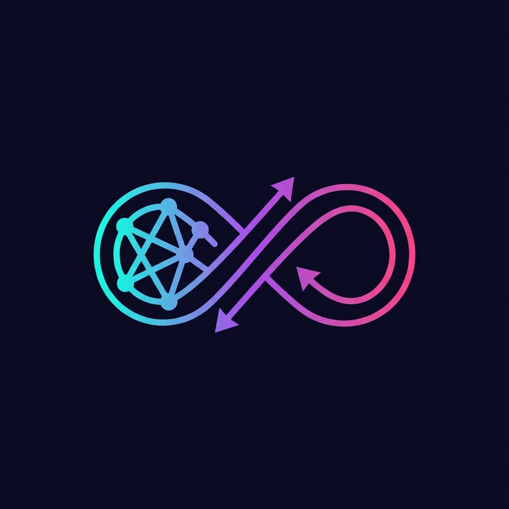

<div align="center">



# ⚡ The Ultimate Proxy

**The only proxy you need for Claude Code CLI**

[](https://www.python.org/downloads/)
[](https://opensource.org/licenses/MIT)
[](#)

[Quick Start](#-quick-start) • [Features](#-features) • [Web Dashboard](#-web-dashboard) • [Crosstalk](docs/crosstalk.md) • [Compression Stack](#-compression-stack) • [Roadmap](ROADMAP.md) • [Changelog](changelog.md)

<br>


**Route Claude Code to any provider. Save 90% on API costs. Run locally for free.**

</div>

---

## 🌟 What Is It?

The Ultimate Proxy sits between Claude Code CLI and your chosen API provider. It translates Anthropic's API format to OpenAI-compatible format, letting you use **any model** with Claude Code:

```
Claude Code CLI  →  The Ultimate Proxy  →  Any Provider
                                           ├─ OpenRouter
                                           ├─ Gemini / VibeProxy
                                           ├─ OpenAI
                                           ├─ Azure
                                           ├─ Ollama (local)
                                           └─ LM Studio (local)
```

---

## 🚀 Quick Start

### Option 1: Unified Installation (Recommended)

**Single command installs everything:**

```bash
curl -fsSL https://raw.githubusercontent.com/aaaronmiller/claude-code-proxy/main/install-all.sh | bash
```

This will:
- ✅ Clone claude-code-proxy
- ✅ Install Headroom (compression layer)
- ✅ Install RTK (command compression)
- ✅ Install all Python dependencies
- ✅ Configure systemd services
- ✅ Add compression aliases
- ✅ Start all services
- ✅ Show health status

**Manual installation:**

```bash
# Clone & install
git clone https://github.com/aaaronmiller/claude-code-proxy.git ~/code/claude-code-proxy
cd ~/code/claude-code-proxy
./install-all.sh
```

### Using with Claude Code

In a **new terminal**, run:

```bash
export ANTHROPIC_BASE_URL=http://localhost:8082
export ANTHROPIC_API_KEY=pass
claude
```

If you want the proxy itself to require a client key, set `PROXY_AUTH_KEY`.
`ANTHROPIC_API_KEY` is for the Claude Code client side and no longer enables proxy auth by default.

> 💡 **Pro Tip**: Add aliases to your `~/.zshrc` for easier access (see [Setup Guide](docs/setup.md))

---

## 🌌 VibeProxy + Antigravity (Free Premium Models)

The easiest way to use Claude Code with premium models for **free**:

1. **Install VibeProxy**: [Download](https://github.com/automazeio/vibeproxy/releases)
2. **Authenticate**: Sign in with Google (Antigravity OAuth)
3. **Setup**: `python start_proxy.py --setup` → Select "VibeProxy/Antigravity"

**What you get:**
- 🧠 Claude Opus 4.5 with 128k thinking tokens
- ⚡ Gemini 3 Pro/Flash
- 📊 BIG/MIDDLE/SMALL model routing
- 📈 Usage tracking & analytics
- 💸 No API keys or billing required

---

## ✨ Features

| Feature | Description |
|---------|-------------|
| **Multi-Provider** | OpenRouter, Gemini, OpenAI, Azure, Ollama, LM Studio |
| **Model Routing** | BIG/MIDDLE/SMALL tiers with intelligent routing |
| **Web Dashboard** | Real-time monitoring with 2025 glassmorphism UI |
| **Crosstalk** | Model-to-model conversations (up to 8 models) |
| **Usage Tracking** | Cost analytics and token metrics |
| **Extended Thinking** | Up to 128k thinking tokens for reasoning models |
| **Prompt Injection** | Add custom prompts showing routing info |
| **Model Cascade** | Automatic fallback on provider errors |

---

## 🎨 Web Dashboard

Access at `http://localhost:8082` when running.

- **2025 Glassmorphism UI** with aurora gradients
- Real-time request monitoring
- Provider configuration
- Model selection with hybrid routing
- WebSocket live log streaming
- Profile management

---

## 🗣️ Crosstalk

Multi-model conversations where AI models talk to each other:

```bash
# Launch visual TUI
python start_proxy.py --crosstalk-studio

# Quick setup
python start_proxy.py --crosstalk "claude-opus,gemini-pro" --topic "Explore consciousness"
```

**Features:**
- Up to 8 models in a conversation
- Multiple paradigms: relay, debate, memory, report
- Jinja templates for message formatting
- Backrooms-compatible import/export
- MCP integration for programmatic access

[Read the Crosstalk Guide →](CROSSTALK.md)

---

## 🛠️ CLI Commands

```bash
# Configuration
python start_proxy.py --setup           # First-time wizard
python start_proxy.py --settings        # Unified settings TUI
python start_proxy.py --doctor          # Health check + auto-fix

# Model management
python start_proxy.py --select-models   # Interactive model selector
python start_proxy.py --set-big MODEL   # Quick set BIG model
python start_proxy.py --show-models     # List available models

# Diagnostics
python start_proxy.py --config          # Show configuration
python start_proxy.py --dry-run         # Validate without starting
python start_proxy.py --analytics       # View usage stats
```

---

## 📁 Project Structure

```
the-ultimate-proxy/
├── start_proxy.py          # Main entry point
├── .env                    # Configuration
├── CROSSTALK.md           # Multi-model chat docs
│
├── src/
│   ├── core/              # Proxy core logic
│   ├── api/               # FastAPI routes + WebSocket
│   ├── services/          # Providers, models, prompts
│   └── cli/               # CLI tools and TUIs
│
├── configs/crosstalk/     # Crosstalk presets & templates
├── web-ui/                # Svelte + bits-ui dashboard
└── docs/                  # Extended documentation
```

---

## 🐛 Troubleshooting

**401 Unauthorized**
```bash
python start_proxy.py --doctor  # Auto-fix API keys
```

**Model Not Found**
```bash
python start_proxy.py --show-models  # List available models
```

**Connection Refused**
- Ensure proxy is running: `python start_proxy.py`
- Check port 8082 is not in use

---

## 🗜️ Compression Stack

**NEW (April 2026):** Integrated compression layer for 95-99% cost savings

### Quick Start

```bash
# Start compression stack
cs-start

# Use Claude with auto-compression
csi  # or csr to resume

# Quick stats
cs-stats-quick
```

### Features

- **97% compression rate** (900→26 tokens)
- **92% GPU VRAM utilization** (RTX 4050 optimized)
- **Multi-CLI support** (Claude, Qwen, Codex, OpenCode, OpenClaw, Hermes)
- **Real-time dashboard** (terminal + web)
- **4 compression modes** (max/balanced/speed/free-tier)

### Architecture

```
Claude Code → Proxy (:8082) → Headroom (:8787) → OpenRouter
                           ↓
                    GPU: 92% VRAM
                    97% compression
```

### Documentation

- **Full Guide:** [docs/COMPRESSION-STACK.md](docs/COMPRESSION-STACK.md)
- **Performance Analysis:** [docs/PERFORMANCE-ANALYSIS.md](docs/PERFORMANCE-ANALYSIS.md)
- **GPU Optimization:** [docs/GPU-OPTIMIZATION.md](docs/GPU-OPTIMIZATION.md)
- **Roadmap:** [ROADMAP.md](ROADMAP.md)
- **Changelog:** [changelog.md](changelog.md)

### Low-VRAM / No-GPU Support

Coming in Phase 1 (April 2026):
- Intel Arc A370M (5GB) mode
- CPU-only mode
- Network proxy access (SSH/cleartext)

---

## 🔮 Roadmap

**See full roadmap:** [ROADMAP.md](ROADMAP.md)

### Phase 1: Parallel Installation (April 2026)
- [ ] Single install script for all proxies
- [ ] Unified start/stop commands
- [ ] Low-VRAM mode (5GB GPU)
- [ ] No-GPU mode
- [ ] Network proxy access

### Phase 2: Tight Integration (May 2026)
- [ ] Shared state management
- [ ] Unified health monitoring
- [ ] Log aggregation

### Phase 3: Full Merger (Q3 2026)
- [ ] Headroom as proxy middleware
- [ ] Single unified proxy process
- [ ] Resource optimization

---

<div align="center">

**The Ultimate Proxy** • Made with ❤️ for the Claude Code community

[Report Bug](https://github.com/aaaronmiller/the-ultimate-proxy/issues) • [Request Feature](https://github.com/aaaronmiller/the-ultimate-proxy/issues)

</div>
