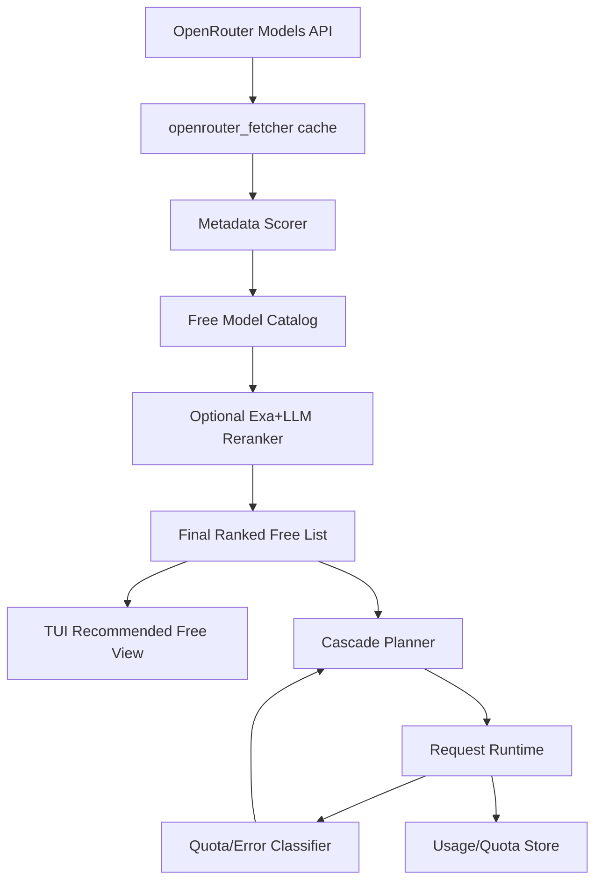

# Design: Free-Model Smart Selection + Quota-Aware Cascade

## 1. Overview
This design adds a hybrid ranking and cascading subsystem for OpenRouter free models while reusing existing fetcher/enricher/ranker code.

The system combines:
- Deterministic metadata scoring (fast, always-on).
- Optional LLM+Exa reranking (slow, periodic/offline).
- Runtime quota-aware failover and cooldown.

## 2. Existing Components Reused
- `src/services/models/openrouter_fetcher.py`
- `src/services/models/openrouter_enricher.py`
- `src/services/models/model_ranker.py`
- `src/services/models/model_filter.py` (to be refactored)
- `src/core/client.py` cascade function (already implemented)
- `src/services/usage/usage_tracker.py` (extended with model/day counters)
- `src/cli/model_selector.py` TUI integration

## 3. Key Architecture Changes



## 4. Data Model
### 4.1 Free model catalog record
```json
{
  "model_id": "provider/model:free",
  "created": 1769552670,
  "age_days": 18,
  "class": "stealth_free",
  "context_length": 256000,
  "max_completion_tokens": 16384,
  "supports_tools": true,
  "supports_reasoning": true,
  "score_programmatic": 82.4,
  "score_llm": 87.0,
  "score_final": 85.2,
  "health": {
    "last_24h_error_rate": 0.12,
    "cooldown_until": null
  }
}
```

### 4.2 Per-model daily quota state (UTC)
```json
{
  "date_utc": "2026-02-13",
  "model_id": "openai/gpt-oss-120b:free",
  "requests": 742,
  "rate_limit_429": 17,
  "provider_429": 4,
  "server_5xx": 2,
  "last_error_at": "2026-02-13T20:35:00Z"
}
```

## 5. Scoring Methodology
## 5.1 Programmatic score (always-on)
Proposed weighted score (0-100):
- Coding capability proxy: tools + reasoning + structured output (25)
- Context/output capacity (20)
- Recency boost (stealth models) (20)
- Stability/health (recent error rate, cooldown) (20)
- Historical local success/latency from usage DB (15)

Classification:
- `stealth_free`: free and `age_days <= STEALTH_WINDOW_DAYS` (default 30)
- `evergreen_free`: free and older than stealth window

## 5.2 LLM+Exa rerank (optional)
- Run on top-K programmatic models (e.g., 25).
- Request structured output JSON (strict schema) for coding suitability.
- Blend score with `score_programmatic` via configurable weight (`LLM_BLEND_WEIGHT`).

## 6. Cascade Decision Engine
Current state:
- `create_chat_completion_with_cascade` exists but is not invoked by endpoint handlers.

Proposed behavior:
1. Determine tier (`big|middle|small`) and candidate chain:
   - Primary model.
   - User-defined cascade list (`*_CASCADE`).
   - Optional auto-appended `recommended_free_chain` when OpenRouter free mode enabled.
2. Classify errors:
   - Immediate switch: 429 free-model/day, 429 provider rate-limit, 5xx, connection/timeouts.
   - No switch: malformed request, auth issues unrelated to model availability.
3. Apply cooldown and backoff:
   - Model enters cooldown after N failures in M minutes.
4. Persist event + counters.

## 7. API/Config Additions
### 7.1 Env vars
- `ENABLE_SMART_FREE_RANKING=true|false`
- `STEALTH_WINDOW_DAYS=30`
- `FREE_MODEL_MIN_CONTEXT=64000`
- `FREE_MODEL_TOP_K=40`
- `ENABLE_LLM_RERANK=true|false`
- `RERANK_TOP_K=25`
- `CASCADE_ON_FREE_LIMIT=true|false`
- `CASCADE_COOLDOWN_SECONDS=600`
- `CASCADE_MAX_HOPS=5`
- `QUOTA_WARN_THRESHOLD_PCT=80`

### 7.2 Optional endpoints
- `GET /api/models/free/recommended`
- `GET /api/models/free/quota-status`
- `POST /api/models/free/rebuild-rankings`

## 8. TUI Changes (`src/cli/model_selector.py`)
- Add view mode cycle: `recommended-free` -> `recommended` -> `all`.
- Add badges: `STEALTH`, `EVERGREEN`, `HOT`, `COOLDOWN`.
- Add status panel with daily usage and UTC reset note.
- Keep explicit "show all" toggle so full list remains reachable.

## 9. Observability
- Extend websocket logs with cascade reason codes and model hops.
- Add per-day per-model quota counters in usage DB.
- Add summary in dashboard: free model remaining budget trend and fallback events.

## 10. Error Handling
- If OpenRouter metadata unavailable: fallback to cached rankings.
- If reranker unavailable: use programmatic score only.
- If all cascade models exhausted: return original terminal error with cascade trace summary.

## 11. Security/Privacy
- Never log raw keys.
- Store only operational metadata (counts, timestamps, model IDs, errors).
- Preserve existing no-content storage posture for usage tracking.

## 12. Test Strategy
- Unit tests for scoring/classification and cooldown logic.
- Integration tests for cascade transition on simulated 429/5xx.
- Regression tests ensuring `MODEL_CASCADE=true` actually changes runtime behavior.
- TUI snapshot/behavior tests for new modes and badges.

## 13. External Reference Notes
- OpenRouter UTC-day counters and free limits: https://openrouter.ai/docs/api-reference/limits/
- OpenRouter model fallback semantics: https://openrouter.ai/docs/model-routing
- OpenRouter provider fallback controls: https://openrouter.ai/docs/features/provider-routing
- UX inspiration for rapid model switching: https://github.com/foreveryh/claude-code-switch
