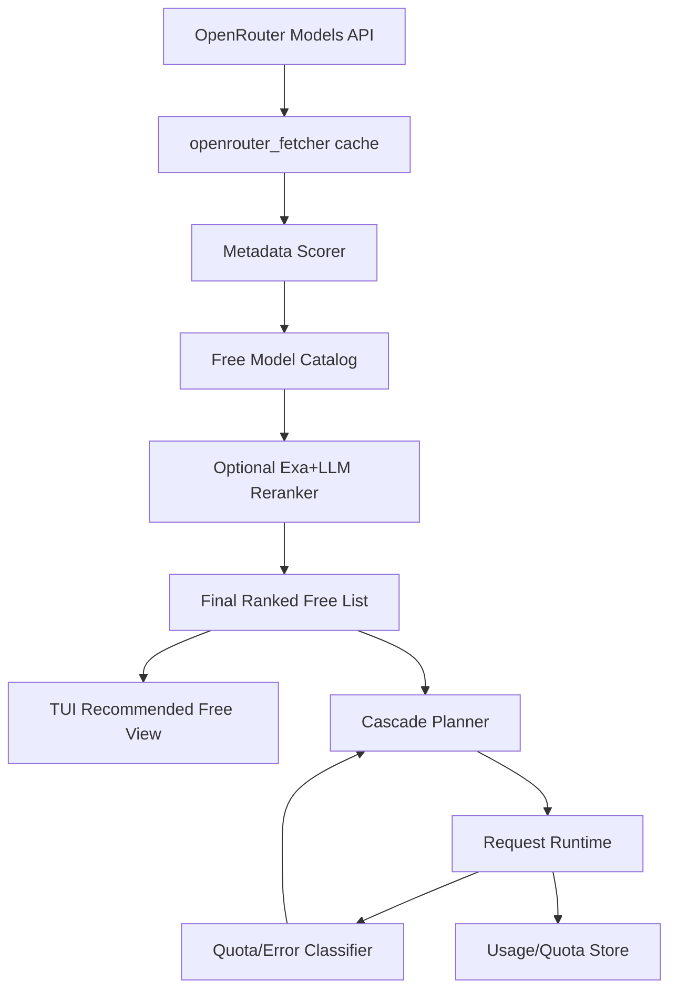

# Text/Config File Audit: /home/cheta/code/claude-code-proxy/docs/proposals/free-model-cascade-prd.md
**File Size:** 6044 bytes

## Features & Sections Declared:
# PRD: Free-Model Smart Selection + Quota-Aware Cascade
## 1. Problem Statement
## 2. Research Findings (External)
### 2.1 Free-model daily window semantics
### 2.2 Existing fallback/routing patterns to borrow
## 3. Current-State Analysis (This Repo)
### 3.1 Cascade implementation gap
### 3.2 Model discovery and ranking
### 3.3 TUI discoverability
## 4. Goals
## 5. Non-Goals
## 6. User Personas
## 7. Functional Requirements
## 8. Non-Functional Requirements
## 9. Success Metrics
## 10. Risks
## 11. Rollout Strategy


## Content / Data Structure:
```text
# PRD: Free-Model Smart Selection + Quota-Aware Cascade

## 1. Problem Statement
The current model-selection and cascade experience is not robust enough for heavy OpenRouter free-tier workflows:
- Free model limits are frequently reached and require manual model switching.
- The recommended list relies heavily on static curated arrays and local usage history, not real-time model metadata quality.
- High-value short-lived "stealth" free models are hard to discover quickly in the TUI.
- Existing cascade logic exists in `OpenAIClient` but is not wired into request handlers.

## 2. Research Findings (External)
### 2.1 Free-model daily window semantics
OpenRouter documents free-model limits as daily quotas and tracks usage counters on the **current UTC day** (`usage_daily`).

Conclusion for planning:
- Treat free-model quotas as **calendar-day UTC windows**, not rolling trailing 24h windows.
- Daily reset behavior should be modeled as next UTC day boundary.

Sources:
- OpenRouter limits docs: https://openrouter.ai/docs/api-reference/limits/
- OpenRouter FAQ: https://openrouter.ai/docs/faq
- OpenRouter support article: https://openrouter.zendesk.com/hc/en-us/articles/39501163636379-OpenRouter-Rate-Limits-What-You-Need-to-Know

### 2.2 Existing fallback/routing patterns to borrow
- OpenRouter model-level fallback supports ordered model lists via `models` parameter.
  Source: https://openrouter.ai/docs/model-routing
- OpenRouter provider routing supports configurable provider order and fallbacks.
  Source: https://openrouter.ai/docs/features/provider-routing
- Claude Code Switch (`claude-code-switch`) emphasizes practical fallback and model-switch ergonomics.
  Source: https://github.com/foreveryh/claude-code-switch

## 3. Current-State Analysis (This Repo)
### 3.1 Cascade implementation gap
- Cascade function exists: `src/core/client.py` (`create_chat_completion_with_cascade`), but request handlers call `create_chat_completion` directly.
- Result: `MODEL_CASCADE=true` does not provide the expected failover behavior in normal Claude endpoint flow.

### 3.2 Model discovery and ranking
- OpenRouter model fetch/enrichment exists and captures useful metadata (`created`, `context_length`, `supports_tools`, `pricing.is_free`, etc.).
- `ModelFilter` currently uses static `TOP_MODELS`, `FREE_MODELS`, `NEW_MODELS` lists.
- LLM+Exa ranker exists (`model_ranker.py`) with tool calls and can return coding-focused ranking output.

### 3.3 TUI discoverability
- TUI already supports recommended vs all toggle and model badges.
- It lacks a first-class free-tier strategy: stealth-vs-evergreen grouping, quota risk indicators, and cascade-preview path.

## 4. Goals
1. Build a hybrid free-model ranking pipeline:
- Programmatic scoring from OpenRouter model metadata.
- Optional LLM+Exa refinement over top candidates.

2. Add quota-aware cascading for OpenRouter free models:
- Automatic model failover on quota/rate/upstream errors.
- Cooldown and health tracking to avoid repeated failing models.

3. Improve operator UX:
- Faster discovery of high-value free coding models.
- Clear "recommended free list" and optional "show all models" path.
- Daily quota telemetry and approaching-limit warnings.

## 5. Non-Goals
- No provider-specific hardcoding for every transient free model.
- No dependency on web scraping for critical runtime path.
- No forced prompt injection for warnings (opt-in only).

## 6. User Personas
- Power user running Claude Code against OpenRouter free tier.
- User who wants best coding output with minimal manual model swaps.
- Operator who wants deterministic fallback behavior under rate limits.

## 7. Functional Requirements
1. Hybrid Ranking
- System SHALL build a candidate set from OpenRouter metadata for free models.
- System SHALL classify free models into:
  - `stealth_free`: recently created and high potential.
  - `evergreen_free`: stable long-available free models.
- System SHALL score candidates programmatically (context, tools, reasoning, recency, provider diversity, usage health).
- System SHALL optionally run Exa+LLM refinement on top-N candidates.

2. Cascade Runtime
- System SHALL detect OpenRouter free-tier failures (429 free-model/day, provider rate-limit, transient 5xx).
- System SHALL route to next model in configured cascade chain.
- System SHALL apply per-model cooldown windows after repeated failures.
- System SHALL log cascade transitions with reason and target model.

3. TUI Integration
- TUI SHALL provide `Recommended Free` mode as default when OpenRouter is active.
- TUI SHALL allow `Show All` models via command/key toggle.
- TUI SHALL display class badges (stealth, evergreen), context, output, tools/reasoning indicators.

4. Quota Telemetry
- System SHALL persist per-model/day request counters and error counters.
- System SHALL expose daily usage state and estimated reset time (UTC).
- System SHALL warn when nearing quota thresholds (configurable).

## 8. Non-Functional Requirements
- Sorting must complete under 500ms from cached metadata, excluding optional LLM refinement.
- Cascade decision must add <20ms overhead in non-failure cases.
- No secret leakage in logs or telemetry payloads.
- Feature must degrade gracefully when Exa key or ranker model is unavailable.

## 9. Success Metrics
- >= 90% reduction in manual model swaps after free-tier 429 events.
- >= 50% faster model selection in TUI for free-tier users.
- >= 80% of sessions remain available after first free-tier quota error via cascade.

## 10. Risks
- Model metadata can be stale between cache refreshes.
- Provider-side behavior for temporary free models can change rapidly.
- Over-aggressive fallback may increase latency if not bounded.

## 11. Rollout Strategy
1. Phase 1: Wire existing cascade into non-streaming path and add telemetry.
2. Phase 2: Add programmatic ranking + TUI "Recommended Free" view.
3. Phase 3: Add optional Exa/LLM reranking and stealth/evergreen classification.
4. Phase 4: Add streaming-path fallback and full quota dashboard indicators.

```


---


# Text/Config File Audit: /home/cheta/code/claude-code-proxy/docs/proposals/free-model-cascade-design.md
**File Size:** 5438 bytes

## Features & Sections Declared:
# Design: Free-Model Smart Selection + Quota-Aware Cascade
## 1. Overview
## 2. Existing Components Reused
## 3. Key Architecture Changes
## 4. Data Model
### 4.1 Free model catalog record
### 4.2 Per-model daily quota state (UTC)
## 5. Scoring Methodology
## 5.1 Programmatic score (always-on)
## 5.2 LLM+Exa rerank (optional)
## 6. Cascade Decision Engine
## 7. API/Config Additions
### 7.1 Env vars
### 7.2 Optional endpoints
## 8. TUI Changes (`src/cli/model_selector.py`)
## 9. Observability
## 10. Error Handling
## 11. Security/Privacy
## 12. Test Strategy
## 13. External Reference Notes


## Content / Data Structure:
```text
# Design: Free-Model Smart Selection + Quota-Aware Cascade

## 1. Overview
This design adds a hybrid ranking and cascading subsystem for OpenRouter free models while reusing existing fetcher/enricher/ranker code.

The system combines:
- Deterministic metadata scoring (fast, always-on).
- Optional LLM+Exa reranking (slow, periodic/offline).
- Runtime quota-aware failover and cooldown.

## 2. Existing Components Reused
- `src/services/models/openrouter_fetcher.py`
- `src/services/models/openrouter_enricher.py`
- `src/services/models/model_ranker.py`
- `src/services/models/model_filter.py` (to be refactored)
- `src/core/client.py` cascade function (already implemented)
- `src/services/usage/usage_tracker.py` (extended with model/day counters)
- `src/cli/model_selector.py` TUI integration

## 3. Key Architecture Changes



## 4. Data Model
### 4.1 Free model catalog record
```json
{
  "model_id": "provider/model:free",
  "created": 1769552670,
  "age_days": 18,
  "class": "stealth_free",
  "context_length": 256000,
  "max_completion_tokens": 16384,
  "supports_tools": true,
  "supports_reasoning": true,
  "score_programmatic": 82.4,
  "score_llm": 87.0,
  "score_final": 85.2,
  "health": {
    "last_24h_error_rate": 0.12,
    "cooldown_until": null
  }
}
```

### 4.2 Per-model daily quota state (UTC)
```json
{
  "date_utc": "2026-02-13",
  "model_id": "openai/gpt-oss-120b:free",
  "requests": 742,
  "rate_limit_429": 17,
  "provider_429": 4,
  "server_5xx": 2,
  "last_error_at": "2026-02-13T20:35:00Z"
}
```

## 5. Scoring Methodology
## 5.1 Programmatic score (always-on)
Proposed weighted score (0-100):
- Coding capability proxy: tools + reasoning + structured output (25)
- Context/output capacity (20)
- Recency boost (stealth models) (20)
- Stability/health (recent error rate, cooldown) (20)
- Historical local success/latency from usage DB (15)

Classification:
- `stealth_free`: free and `age_days <= STEALTH_WINDOW_DAYS` (default 30)
- `evergreen_free`: free and older than stealth window

## 5.2 LLM+Exa rerank (optional)
- Run on top-K programmatic models (e.g., 25).
- Request structured output JSON (strict schema) for coding suitability.
- Blend score with `score_programmatic` via configurable weight (`LLM_BLEND_WEIGHT`).

## 6. Cascade Decision Engine
Current state:
- `create_chat_completion_with_cascade` exists but is not invoked by endpoint handlers.

Proposed behavior:
1. Determine tier (`big|middle|small`) and candidate chain:
   - Primary model.
   - User-defined cascade list (`*_CASCADE`).
   - Optional auto-appended `recommended_free_chain` when OpenRouter free mode enabled.
2. Classify errors:
   - Immediate switch: 429 free-model/day, 429 provider rate-limit, 5xx, connection/timeouts.
   - No switch: malformed request, auth issues unrelated to model availability.
3. Apply cooldown and backoff:
   - Model enters cooldown after N failures in M minutes.
4. Persist event + counters.

## 7. API/Config Additions
### 7.1 Env vars
- `ENABLE_SMART_FREE_RANKING=true|false`
- `STEALTH_WINDOW_DAYS=30`
- `FREE_MODEL_MIN_CONTEXT=64000`
- `FREE_MODEL_TOP_K=40`
- `ENABLE_LLM_RERANK=true|false`
- `RERANK_TOP_K=25`
- `CASCADE_ON_FREE_LIMIT=true|false`
- `CASCADE_COOLDOWN_SECONDS=600`
- `CASCADE_MAX_HOPS=5`
- `QUOTA_WARN_THRESHOLD_PCT=80`

### 7.2 Optional endpoints
- `GET /api/models/free/recommended`
- `GET /api/models/free/quota-status`
- `POST /api/models/free/rebuild-rankings`

## 8. TUI Changes (`src/cli/model_selector.py`)
- Add view mode cycle: `recommended-free` -> `recommended` -> `all`.
- Add badges: `STEALTH`, `EVERGREEN`, `HOT`, `COOLDOWN`.
- Add status panel with daily usage and UTC reset note.
- Keep explicit "show all" toggle so full list remains reachable.

## 9. Observability
- Extend websocket logs with cascade reason codes and model hops.
- Add per-day per-model quota counters in usage DB.
- Add summary in dashboard: free model remaining budget trend and fallback events.

## 10. Error Handling
- If OpenRouter metadata unavailable: fallback to cached rankings.
- If reranker unavailable: use programmatic score only.
- If all cascade models exhausted: return original terminal error with cascade trace summary.

## 11. Security/Privacy
- Never log raw keys.
- Store only operational metadata (counts, timestamps, model IDs, errors).
- Preserve existing no-content storage posture for usage tracking.

## 12. Test Strategy
- Unit tests for scoring/classification and cooldown logic.
- Integration tests for cascade transition on simulated 429/5xx.
- Regression tests ensuring `MODEL_CASCADE=true` actually changes runtime behavior.
- TUI snapshot/behavior tests for new modes and badges.

## 13. External Reference Notes
- OpenRouter UTC-day counters and free limits: https://openrouter.ai/docs/api-reference/limits/
- OpenRouter model fallback semantics: https://openrouter.ai/docs/model-routing
- OpenRouter provider fallback controls: https://openrouter.ai/docs/features/provider-routing
- UX inspiration for rapid model switching: https://github.com/foreveryh/claude-code-switch

```


---


# Text/Config File Audit: /home/cheta/code/claude-code-proxy/docs/proposals/free-model-cascade-tasks.md
**File Size:** 3370 bytes

## Features & Sections Declared:
# Implementation Task List: Free-Model Smart Selection + Quota-Aware Cascade
## 1. Wire cascade into runtime
## 2. Add quota/error classification and cooldown
## 3. Build deterministic free-model ranking pipeline
## 4. Integrate optional LLM+Exa reranking
## 5. Extend data persistence for daily UTC tracking
## 6. Expose API surfaces for ranked free models and quota status
## 7. Upgrade TUI model selector for free-tier workflow
## 8. Configuration and docs
## 9. Hardening and rollout
## Suggested Execution Order


## Content / Data Structure:
```text
# Implementation Task List: Free-Model Smart Selection + Quota-Aware Cascade

## 1. Wire cascade into runtime
- [ ] 1.1 Route non-streaming Claude endpoint through `create_chat_completion_with_cascade`
- [ ] 1.2 Route streaming path through cascade-capable wrapper (or explicit fallback policy)
- [ ] 1.3 Add tier inference helper (`big|middle|small`) for all request flows
- [ ] 1.4 Add tests proving `MODEL_CASCADE=true` changes behavior on 429/5xx

## 2. Add quota/error classification and cooldown
- [ ] 2.1 Implement centralized error classifier for free-limit/rate-limit/transient failures
- [ ] 2.2 Add per-model cooldown state and hop budget (`CASCADE_MAX_HOPS`)
- [ ] 2.3 Persist cascade events with reason codes for analytics/dashboard
- [ ] 2.4 Add tests for cooldown and exhaustion behavior

## 3. Build deterministic free-model ranking pipeline
- [ ] 3.1 Create `FreeModelScorer` module using OpenRouter cached metadata
- [ ] 3.2 Implement stealth vs evergreen classification (`STEALTH_WINDOW_DAYS`)
- [ ] 3.3 Add health-informed ranking using usage/error telemetry
- [ ] 3.4 Save ranked catalog artifact in `data/` with generation timestamp
- [ ] 3.5 Add unit tests for scoring weights and tie-break rules

## 4. Integrate optional LLM+Exa reranking
- [ ] 4.1 Add strict structured-output schema for reranker output
- [ ] 4.2 Rerank top-K candidates and blend with deterministic scores
- [ ] 4.3 Add resilient fallback to deterministic-only mode on rerank failure
- [ ] 4.4 Add tests for schema validation and blend logic

## 5. Extend data persistence for daily UTC tracking
- [ ] 5.1 Add table(s) for per-model daily request/error counters keyed by UTC date
- [ ] 5.2 Add ingestion hooks in request-completion paths
- [ ] 5.3 Add query helpers for quota warning thresholds and reset display
- [ ] 5.4 Add migration and DB-level tests

## 6. Expose API surfaces for ranked free models and quota status
- [ ] 6.1 Add `GET /api/models/free/recommended`
- [ ] 6.2 Add `GET /api/models/free/quota-status`
- [ ] 6.3 Add `POST /api/models/free/rebuild-rankings`
- [ ] 6.4 Add endpoint tests and response schema checks

## 7. Upgrade TUI model selector for free-tier workflow
- [ ] 7.1 Add view mode `recommended-free` and keep `all` as explicit toggle
- [ ] 7.2 Add model badges (`STEALTH`, `EVERGREEN`, `COOLDOWN`, `HOT`)
- [ ] 7.3 Add quota status strip with UTC reset note
- [ ] 7.4 Add keyboard command help updates and snapshot tests

## 8. Configuration and docs
- [ ] 8.1 Add new env vars to `config/env.example` with safe defaults
- [ ] 8.2 Add troubleshooting guide for 429 free-limit cascades
- [ ] 8.3 Add operator docs for ranking refresh cadence and override knobs
- [ ] 8.4 Add release notes describing behavior changes and migration path

## 9. Hardening and rollout
- [ ] 9.1 Add feature flags for staged rollout (`ENABLE_SMART_FREE_RANKING`, `CASCADE_ON_FREE_LIMIT`)
- [ ] 9.2 Add observability dashboard cards for cascade success rate and quota pressure
- [ ] 9.3 Perform load/regression test pass on high-concurrency retry scenarios
- [ ] 9.4 Define rollback switch and runbook

## Suggested Execution Order
1. Task group 1 (runtime wiring)
2. Task group 2 (error classifier + cooldown)
3. Task group 5 (daily UTC persistence)
4. Task groups 3 + 4 (ranking + reranking)
5. Task groups 6 + 7 (API + TUI)
6. Task groups 8 + 9 (docs + rollout)


```


---


# Text/Config File Audit: /home/cheta/code/claude-code-proxy/docs/api/api-reference.md
**File Size:** 7920 bytes

## Features & Sections Declared:
# API Reference
## Table of Contents
## System Health
### GET `/api/system/health`
### GET `/api/system/health/diagnostic`
## Metrics & Analytics
### GET `/api/metrics/aggregate`
### GET `/api/metrics/sessions`
### GET `/api/metrics/sessions/{session_id}`
### GET `/api/metrics/tool-analytics`
### GET `/api/metrics/cache-analytics`
## Session Metrics
### GET `/api/metrics/history`
### GET `/api/metrics/history/trends`
## CLI Tools
### GET `/api/cli-tools`
### GET `/api/cli-tools/stats`
### GET `/api/cli-tools/timeline`
### GET `/api/cli-tools/{tool_id}`
## Error Responses
### 404 Not Found
### 500 Internal Server Error
### 503 Service Unavailable
## Rate Limiting
## Authentication


## Content / Data Structure:
```text
# API Reference

The Ultimate Proxy provides a REST API for monitoring, analytics, and configuration.

**Base URL:** `http://localhost:8082`

---

## Table of Contents

1. [System Health](#system-health)
2. [Metrics & Analytics](#metrics--analytics)
3. [Session Metrics](#session-metrics)
4. [CLI Tools](#cli-tools)
5. [Historical Data](#historical-data)

---

## System Health

### GET `/api/system/health`

Get basic system health status.

**Response:**
```json
{
  "status": "healthy",
  "uptime": "2h 15m",
  "resources": {
    "cpu_percent": 12.5,
    "memory_mb": 256.3,
    "memory_percent": 1.2
  },
  "database": {
    "enabled": true,
    "size_mb": 12.5,
    "path": "usage_tracking.db"
  }
}
```

### GET `/api/system/health/diagnostic`

Get comprehensive diagnostic information.

**Response:**
```json
{
  "status": "healthy",
  "timestamp": "2026-03-30T19:30:00Z",
  "check_duration_ms": 45.2,
  "uptime": {
    "seconds": 8100,
    "formatted": "2h 15m"
  },
  "resources": {...},
  "logs": {
    "tier": "production",
    "dir": "logs",
    "files": [...],
    "total_size_mb": 0.5,
    "recent_errors": []
  },
  "providers": {
    "default": {"status": "healthy", ...},
    "big": {...},
    "middle": {...},
    "small": {...}
  },
  "database": {...},
  "requests": {
    "last_hour": 156,
    "last_24h": 3420,
    "errors_last_hour": 2,
    "avg_duration_ms": 234.5
  },
  "configuration": {...}
}
```

---

## Metrics & Analytics

### GET `/api/metrics/aggregate`

Get aggregate metrics across all sessions.

**Response:**
```json
{
  "status": "success",
  "timestamp": "2026-03-30T19:30:00Z",
  "metrics": {
    "total_sessions": 12,
    "total_requests": 156,
    "total_tokens": 245000,
    "total_cost": 0.0234,
    "total_tool_calls": 45,
    "tool_success_rate": 95.5,
    "cache_hit_rate": 67.3,
    "cached_tokens": 82000,
    "avg_tokens_per_request": 1570.5,
    "avg_latency_ms": 234.5,
    "avg_tokens_per_second": 45.2,
    "active_sessions": [...]
  }
}
```

### GET `/api/metrics/sessions`

Get all active session metrics.

**Response:**
```json
{
  "status": "success",
  "timestamp": "2026-03-30T19:30:00Z",
  "sessions": [
    {
      "session_id": "abc123...",
      "started_at": "2026-03-30T17:00:00Z",
      "requests": 15,
      "input_tokens": 12000,
      "output_tokens": 8000,
      "thinking_tokens": 2000,
      "cached_tokens": 5000,
      "total_tokens": 27000,
      "total_latency_ms": 3500,
      "estimated_cost": 0.0023,
      "tool_calls_total": 5,
      "tool_calls_success": 5,
      "tool_calls_failure": 0,
      "cache_hits": 3,
      "cache_misses": 2,
      "models_used": {"gpt-4o": 10, "gpt-4o-mini": 5},
      "last_activity": "2026-03-30T19:25:00Z"
    }
  ],
  "count": 12
}
```

### GET `/api/metrics/sessions/{session_id}`

Get metrics for a specific session.

**Parameters:**
- `session_id` (path) - Session identifier

**Response:** Same structure as session object in `/api/metrics/sessions`

### GET `/api/metrics/tool-analytics`

Get tool call analytics.

**Parameters:**
- `hours` (query, optional) - Hours to include (default: 24)
- `session_id` (query, optional) - Filter by session

**Response:**
```json
{
  "status": "success",
  "period_hours": 24,
  "total_tool_calls": 156,
  "success_rate": 94.2,
  "tools": {
    "Bash": {
      "total": 85,
      "success": 82,
      "failure": 3,
      "success_rate": 96.5,
      "unique_sessions": 8
    },
    "Read": {
      "total": 42,
      "success": 40,
      "failure": 2,
      "success_rate": 95.2,
      "unique_sessions": 6
    }
  }
}
```

### GET `/api/metrics/cache-analytics`

Get cache usage analytics.

**Parameters:**
- `hours` (query, optional) - Hours to include (default: 24)

**Response:**
```json
{
  "status": "success",
  "period_hours": 24,
  "total_requests": 234,
  "cache_hits": 157,
  "cache_misses": 77,
  "cache_hit_rate": 67.1,
  "cached_tokens": 45230,
  "total_tokens": 125000,
  "token_savings_percent": 36.2,
  "estimated_cost_savings": 0.0452
}
```

---

## Session Metrics

### GET `/api/metrics/history`

Get historical metrics snapshots.

**Parameters:**
- `limit` (query, optional) - Max entries (default: 30)
- `start_date` (query, optional) - Filter start (YYYY-MM-DD)
- `end_date` (query, optional) - Filter end (YYYY-MM-DD)

**Response:**
```json
{
  "status": "success",
  "count": 30,
  "entries": [
    {
      "timestamp": "2026-03-30T03:00:00Z",
      "period_start": "2026-03-29T03:00:00Z",
      "period_end": "2026-03-30T03:00:00Z",
      "tool_calls": {
        "total": 156,
        "success": 147,
        "failure": 9,
        "success_rate": 94.2,
        "by_tool": {...}
      },
      "cache_usage": {
        "hits": 157,
        "misses": 77,
        "hit_rate": 67.1,
        "cached_tokens": 45230
      },
      "sessions": 12,
      "summary": "Period: ... | Tools: 156 calls (94.2% success) | ..."
    }
  ]
}
```

### GET `/api/metrics/history/trends`

Get trend data for charting.

**Parameters:**
- `days` (query, optional) - Days to include (default: 30)

**Response:**
```json
{
  "status": "success",
  "period_days": 30,
  "entry_count": 30,
  "trends": {
    "dates": ["2026-03-01", "2026-03-02", ...],
    "tool_calls": [156, 203, ...],
    "tool_success_rate": [94.2, 96.1, ...],
    "cache_hit_rate": [67.3, 72.1, ...],
    "cached_tokens": [45230, 52100, ...],
    "sessions": [12, 15, ...]
  }
}
```

---

## CLI Tools

### GET `/api/cli-tools`

Get data from all AI coding CLI tools.

**Response:**
```json
{
  "status": "success",
  "timestamp": "2026-03-30T19:30:00Z",
  "data": {
    "timestamp": "...",
    "tools": {
      "claude": {
        "name": "Claude Code",
        "available": true,
        "settings": {...},
        "sessions": {"count": 16, "items": [...]},
        "config_files": [...],
        "models_used": ["opus"],
        "plugins": [...]
      }
    },
    "summary": {
      "total_tools": 5,
      "total_sessions": 16,
      "total_config_files": 4
    }
  }
}
```

### GET `/api/cli-tools/stats`

Get aggregate CLI tool statistics.

**Response:**
```json
{
  "status": "success",
  "timestamp": "2026-03-30T19:30:00Z",
  "stats": {
    "total_tools": 5,
    "total_sessions": 16,
    "total_config_files": 4,
    "tools_breakdown": {...},
    "all_models": ["opus", "sonnet", "coder-model"],
    "all_plugins": [...],
    "config_file_types": {"CLAUDE.md": 2, "AGENTS.md": 1}
  }
}
```

### GET `/api/cli-tools/timeline`

Get session timeline from CLI tools.

**Parameters:**
- `days` (query, optional) - Days to include (default: 7)
- `tool` (query, optional) - Filter by tool ID

**Response:**
```json
{
  "status": "success",
  "period_days": 7,
  "session_count": 25,
  "timeline": [
    {
      "tool": "claude",
      "tool_name": "Claude Code",
      "session_id": "abc123...",
      "timestamp": "2026-03-30T18:00:00Z",
      "data": {...}
    }
  ]
}
```

### GET `/api/cli-tools/{tool_id}`

Get detailed data for a specific CLI tool.

**Parameters:**
- `tool_id` (path) - Tool identifier (claude, opencode, etc.)

**Response:** Same structure as tool object in `/api/cli-tools`

---

## Error Responses

### 404 Not Found
```json
{
  "status": "not_found",
  "message": "Session abc123 not found or inactive"
}
```

### 500 Internal Server Error
```json
{
  "status": "error",
  "error": "Error message details"
}
```

### 503 Service Unavailable
```json
{
  "status": "no_data",
  "message": "No metrics history available yet"
}
```

---

## Rate Limiting

Currently, no rate limiting is enforced on the API endpoints. All endpoints are local-only (bound to 0.0.0.0:8082).

---

## Authentication

No authentication is required for API access. The proxy is designed for local use only. For production deployments, consider adding authentication via:
- API key header
- OAuth2
- Reverse proxy authentication

---

*API version: 2.1.0 | Last updated: March 30, 2026*

```


---


# Text/Config File Audit: /home/cheta/code/claude-code-proxy/docs/api/reference.md
**File Size:** 14182 bytes

## Features & Sections Declared:
# API Reference
## Table of Contents
## Overview
## Authentication
### Client Authentication (Optional)
### Provider Authentication
## Endpoints
### POST /v1/messages
### GET /v1/models
### GET /health
### GET /stats
## Configuration Endpoints
### GET /config
### POST /config/reload
## Request/Response Formats
### Model Name Mapping
### Message Format
### Reasoning Tokens
## Error Handling
### Error Response Format
### HTTP Status Codes
### Error Types
### Common Errors
## WebSocket Support
## Python SDK Example
# Configure to use proxy
# Create message
## JavaScript/TypeScript SDK Example
## Rate Limiting
## Monitoring & Debugging
### Enable Debug Logging
### View Request/Response
### Usage Tracking
## More Resources


## Content / Data Structure:
```text
# API Reference

HTTP API endpoints and schemas for Claude Code Proxy.

---

## Table of Contents

- [Overview](#overview)
- [Authentication](#authentication)
- [Endpoints](#endpoints)
  - [Chat Completion](#post-v1chatcompletions)
  - [List Models](#get-v1models)
  - [Health Check](#get-health)
  - [Configuration](#configuration-endpoints)
- [Request/Response Formats](#requestresponse-formats)
- [Error Handling](#error-handling)
- [WebSocket Support](#websocket-support)

---

## Overview

Claude Code Proxy implements the Claude API (Anthropic format) and proxies to OpenAI-compatible providers. It exposes the following base endpoints:

**Base URL:** `http://localhost:8082` (default, configurable via `PORT` and `HOST`)

**API Version:** `v1`

**Supported Formats:**
- Request: Claude API format (Anthropic)
- Response: Claude API format (Anthropic)
- Backend: OpenAI API format (converted transparently)

---

## Authentication

### Client Authentication (Optional)

If `PROXY_AUTH_KEY` is set, clients must authenticate:

**Header:**
```
x-api-key: your-proxy-auth-key
```

Or:
```
Authorization: Bearer your-proxy-auth-key
```

**Example:**
```bash
curl http://localhost:8082/v1/models \
  -H "x-api-key: your-proxy-auth-key"
```

**Claude Code Configuration:**
```bash
export ANTHROPIC_API_KEY="your-proxy-auth-key"
export ANTHROPIC_BASE_URL=http://localhost:8082
```

### Provider Authentication

Configured via environment variables:
- `PROVIDER_API_KEY` - API key for backend provider
- `PROVIDER_BASE_URL` - Backend provider's base URL

---

## Endpoints

### POST /v1/messages

Create a chat completion (Claude API format).

**Request Body:**
```json
{
  "model": "claude-opus-4",
  "messages": [
    {
      "role": "user",
      "content": "Write a fibonacci function"
    }
  ],
  "max_tokens": 4096,
  "temperature": 0.7,
  "stream": false
}
```

**Optional Parameters:**
- `system` (string) - System prompt
- `temperature` (number, 0-1) - Sampling temperature
- `top_p` (number, 0-1) - Nucleus sampling
- `top_k` (integer) - Top-k sampling
- `stop_sequences` (array of strings) - Stop generation at these sequences
- `stream` (boolean) - Stream response (SSE)
- `metadata` (object) - Request metadata

**Extended Thinking Parameters:**
```json
{
  "thinking": {
    "type": "enabled",
    "budget_tokens": 16000
  }
}
```

Or for OpenAI format:
```json
{
  "reasoning_effort": "high"
}
```

**Response (Non-streaming):**
```json
{
  "id": "msg_01ABC123",
  "type": "message",
  "role": "assistant",
  "content": [
    {
      "type": "text",
      "text": "Here's a fibonacci function:\n\n```python\ndef fibonacci(n):\n    if n <= 1:\n        return n\n    return fibonacci(n-1) + fibonacci(n-2)\n```"
    }
  ],
  "model": "claude-opus-4",
  "stop_reason": "end_turn",
  "usage": {
    "input_tokens": 15,
    "output_tokens": 87
  }
}
```

**Response (Streaming):**

Server-Sent Events (SSE) with the following event types:

```
event: message_start
data: {"type":"message_start","message":{"id":"msg_01ABC","type":"message","role":"assistant","content":[],"model":"claude-opus-4","stop_reason":null,"usage":{"input_tokens":15,"output_tokens":0}}}

event: content_block_start
data: {"type":"content_block_start","index":0,"content_block":{"type":"text","text":""}}

event: content_block_delta
data: {"type":"content_block_delta","index":0,"delta":{"type":"text_delta","text":"Here"}}

event: content_block_delta
data: {"type":"content_block_delta","index":0,"delta":{"type":"text_delta","text":"'s a"}}

event: content_block_stop
data: {"type":"content_block_stop","index":0}

event: message_delta
data: {"type":"message_delta","delta":{"stop_reason":"end_turn"},"usage":{"output_tokens":87}}

event: message_stop
data: {"type":"message_stop"}
```

**cURL Example:**
```bash
curl http://localhost:8082/v1/messages \
  -H "Content-Type: application/json" \
  -H "x-api-key: your-proxy-auth-key" \
  -d '{
    "model": "claude-opus-4",
    "messages": [
      {
        "role": "user",
        "content": "Hello!"
      }
    ],
    "max_tokens": 1024
  }'
```

**Streaming Example:**
```bash
curl http://localhost:8082/v1/messages \
  -H "Content-Type: application/json" \
  -H "x-api-key: your-proxy-auth-key" \
  -d '{
    "model": "claude-opus-4",
    "messages": [
      {
        "role": "user",
        "content": "Count to 10"
      }
    ],
    "max_tokens": 1024,
    "stream": true
  }'
```

---

### GET /v1/models

List available models.

**Response:**
```json
{
  "object": "list",
  "data": [
    {
      "id": "claude-opus-4",
      "object": "model",
      "created": 1677649963,
      "owned_by": "anthropic"
    },
    {
      "id": "claude-sonnet-4",
      "object": "model",
      "created": 1677649963,
      "owned_by": "anthropic"
    },
    {
      "id": "claude-haiku-4",
      "object": "model",
      "created": 1677649963,
      "owned_by": "anthropic"
    }
  ]
}
```

**cURL Example:**
```bash
curl http://localhost:8082/v1/models \
  -H "x-api-key: your-proxy-auth-key"
```

---

### GET /health

Health check endpoint.

**Response:**
```json
{
  "status": "healthy",
  "version": "1.0.0",
  "provider": {
    "base_url": "https://openrouter.ai/api/v1",
    "model_mapping": {
      "claude-opus-4": "anthropic/claude-sonnet-4",
      "claude-sonnet-4": "google/gemini-pro-1.5",
      "claude-haiku-4": "google/gemini-flash-1.5"
    }
  },
  "features": {
    "streaming": true,
    "reasoning": true,
    "hybrid_mode": false,
    "usage_tracking": true,
    "dashboard": false
  }
}
```

**cURL Example:**
```bash
curl http://localhost:8082/health
```

---

### GET /stats

Get usage statistics (if `TRACK_USAGE=true`).

**Response:**
```json
{
  "total_requests": 1523,
  "total_tokens": {
    "input": 458392,
    "output": 234561,
    "thinking": 89234
  },
  "total_cost": {
    "usd": 12.34
  },
  "models": {
    "claude-opus-4": {
      "requests": 892,
      "tokens": 345234,
      "cost": 8.92
    },
    "claude-sonnet-4": {
      "requests": 531,
      "tokens": 198453,
      "cost": 2.67
    },
    "claude-haiku-4": {
      "requests": 100,
      "tokens": 148266,
      "cost": 0.75
    }
  },
  "time_period": {
    "start": "2025-01-01T00:00:00Z",
    "end": "2025-01-31T23:59:59Z"
  }
}
```

**Query Parameters:**
- `start_date` (ISO 8601) - Filter from date
- `end_date` (ISO 8601) - Filter to date
- `model` (string) - Filter by model

**cURL Example:**
```bash
curl "http://localhost:8082/stats?start_date=2025-01-01&model=claude-opus-4" \
  -H "x-api-key: your-proxy-auth-key"
```

---

## Configuration Endpoints

### GET /config

Get current configuration (sensitive values redacted).

**Response:**
```json
{
  "provider": {
    "base_url": "https://openrouter.ai/api/v1",
    "api_key_set": true
  },
  "models": {
    "big": "anthropic/claude-sonnet-4",
    "middle": "google/gemini-pro-1.5",
    "small": "google/gemini-flash-1.5"
  },
  "reasoning": {
    "effort": "high",
    "max_tokens": 16000
  },
  "features": {
    "dashboard": false,
    "usage_tracking": true,
    "hybrid_mode": false
  },
  "server": {
    "host": "0.0.0.0",
    "port": 8082,
    "log_level": "INFO"
  }
}
```

**cURL Example:**
```bash
curl http://localhost:8082/config \
  -H "x-api-key: your-proxy-auth-key"
```

---

### POST /config/reload

Reload configuration from .env file without restarting.

**Response:**
```json
{
  "status": "success",
  "message": "Configuration reloaded",
  "changes": {
    "big_model": {
      "old": "anthropic/claude-sonnet-4",
      "new": "openai/gpt-4o"
    }
  }
}
```

**cURL Example:**
```bash
curl -X POST http://localhost:8082/config/reload \
  -H "x-api-key: your-proxy-auth-key"
```

---

## Request/Response Formats

### Model Name Mapping

The proxy maps Claude model names to your configured models:

| Client Requests | Proxy Routes To | Environment Variable |
|----------------|-----------------|---------------------|
| `claude-opus-4` | Value of `BIG_MODEL` | `BIG_MODEL` |
| `claude-sonnet-4` | Value of `MIDDLE_MODEL` | `MIDDLE_MODEL` |
| `claude-haiku-4` | Value of `SMALL_MODEL` | `SMALL_MODEL` |
| Any other model | Passed through as-is | N/A |

**Example:**

Client request:
```json
{
  "model": "claude-opus-4",
  ...
}
```

Proxy routes to backend with:
```json
{
  "model": "anthropic/claude-sonnet-4",  // Value of BIG_MODEL
  ...
}
```

### Message Format

**Claude API Format (Client → Proxy):**
```json
{
  "role": "user",
  "content": "Hello"
}
```

Or with multiple content blocks:
```json
{
  "role": "user",
  "content": [
    {
      "type": "text",
      "text": "What's in this image?"
    },
    {
      "type": "image",
      "source": {
        "type": "base64",
        "media_type": "image/png",
        "data": "iVBORw0KG..."
      }
    }
  ]
}
```

**OpenAI Format (Proxy → Backend):**

Converted to:
```json
{
  "role": "user",
  "content": "Hello"
}
```

Or for multimodal:
```json
{
  "role": "user",
  "content": [
    {
      "type": "text",
      "text": "What's in this image?"
    },
    {
      "type": "image_url",
      "image_url": {
        "url": "data:image/png;base64,iVBORw0KG..."
      }
    }
  ]
}
```

### Reasoning Tokens

**Claude Format:**
```json
{
  "thinking": {
    "type": "enabled",
    "budget_tokens": 16000
  }
}
```

**OpenAI Format:**
```json
{
  "reasoning_effort": "high"
}
```

**Response includes thinking:**
```json
{
  "content": [
    {
      "type": "thinking",
      "thinking": "Let me analyze this step by step..."
    },
    {
      "type": "text",
      "text": "Based on my analysis..."
    }
  ],
  "usage": {
    "input_tokens": 50,
    "output_tokens": 200,
    "cache_read_tokens": 0,
    "cache_creation_tokens": 0
  }
}
```

---

## Error Handling

### Error Response Format

```json
{
  "error": {
    "type": "invalid_request_error",
    "message": "model is required",
    "param": "model",
    "code": "missing_required_parameter"
  }
}
```

### HTTP Status Codes

| Status | Description |
|--------|-------------|
| 200 | Success |
| 400 | Bad Request (invalid parameters) |
| 401 | Unauthorized (missing or invalid auth) |
| 403 | Forbidden (insufficient permissions) |
| 404 | Not Found (unknown endpoint) |
| 429 | Too Many Requests (rate limited) |
| 500 | Internal Server Error |
| 502 | Bad Gateway (backend provider error) |
| 503 | Service Unavailable (proxy down) |
| 504 | Gateway Timeout (backend timeout) |

### Error Types

| Error Type | Description |
|------------|-------------|
| `invalid_request_error` | Request is malformed or missing required fields |
| `authentication_error` | Invalid or missing authentication |
| `permission_error` | Valid auth but insufficient permissions |
| `not_found_error` | Requested resource doesn't exist |
| `rate_limit_error` | Too many requests |
| `api_error` | Backend provider returned an error |
| `overloaded_error` | Proxy or backend is overloaded |

### Common Errors

**401 Unauthorized:**
```json
{
  "error": {
    "type": "authentication_error",
    "message": "Invalid API key",
    "code": "invalid_api_key"
  }
}
```

**429 Rate Limited:**
```json
{
  "error": {
    "type": "rate_limit_error",
    "message": "Rate limit exceeded. Please try again in 60 seconds.",
    "code": "rate_limit_exceeded"
  }
}
```

**502 Bad Gateway:**
```json
{
  "error": {
    "type": "api_error",
    "message": "Backend provider returned an error: Model not found",
    "code": "backend_error",
    "provider_error": {
      "status": 404,
      "message": "Model 'invalid-model' not found"
    }
  }
}
```

---

## WebSocket Support

**Status:** Not currently implemented

WebSocket support for real-time streaming may be added in future versions.

Current streaming uses Server-Sent Events (SSE) via the `stream: true` parameter.

---

## Python SDK Example

```python
import anthropic

# Configure to use proxy
client = anthropic.Anthropic(
    api_key="your-proxy-auth-key",  # PROXY_AUTH_KEY
    base_url="http://localhost:8082"
)

# Create message
message = client.messages.create(
    model="claude-opus-4",
    max_tokens=1024,
    messages=[
        {"role": "user", "content": "Hello!"}
    ]
)

print(message.content[0].text)
```

**Streaming:**
```python
with client.messages.stream(
    model="claude-opus-4",
    max_tokens=1024,
    messages=[
        {"role": "user", "content": "Count to 10"}
    ]
) as stream:
    for text in stream.text_stream:
        print(text, end="", flush=True)
```

---

## JavaScript/TypeScript SDK Example

```typescript
import Anthropic from "@anthropic-ai/sdk";

const client = new Anthropic({
  apiKey: "your-proxy-auth-key",
  baseURL: "http://localhost:8082",
});

const message = await client.messages.create({
  model: "claude-opus-4",
  max_tokens: 1024,
  messages: [
    { role: "user", content: "Hello!" }
  ],
});

console.log(message.content[0].text);
```

**Streaming:**
```typescript
const stream = await client.messages.stream({
  model: "claude-opus-4",
  max_tokens: 1024,
  messages: [
    { role: "user", content: "Count to 10" }
  ],
});

for await (const event of stream) {
  if (event.type === "content_block_delta") {
    process.stdout.write(event.delta.text);
  }
}
```

---

## Rate Limiting

**Current Status:** Rate limiting is handled by the backend provider.

The proxy does not implement its own rate limiting. Rate limits depend on your backend provider:

- **OpenRouter:** Per-user limits based on tier
- **OpenAI:** 3,500 RPM / 90,000 TPM (free tier)
- **Gemini:** 60 RPM (free tier)
- **Ollama/LM Studio:** No limits (local)

---

## Monitoring & Debugging

### Enable Debug Logging

```bash
LOG_LEVEL="DEBUG"
TERMINAL_DISPLAY_MODE="debug"
```

### View Request/Response

Debug logs show:
- Full request to backend
- Full response from backend
- Token counts
- Latency
- Cost estimates

### Usage Tracking

Enable tracking to monitor:
```bash
TRACK_USAGE="true"
USAGE_DB_PATH="usage.db"
```

Query stats:
```bash
curl http://localhost:8082/stats
```

---

## More Resources

- [Configuration Guide](CONFIGURATION.md) - Environment variables
- [Examples](EXAMPLES.md) - Common setups
- [Troubleshooting](TROUBLESHOOTING_401.md) - Fix issues

```


---


# Text/Config File Audit: /home/cheta/code/claude-code-proxy/.vscode/settings.json
**File Size:** 2 bytes

## Content / Data Structure:
```text
{}
```


---


# Text/Config File Audit: /home/cheta/code/claude-code-proxy/cli/README.md
**File Size:** 7773 bytes

## Features & Sections Declared:
# Claude Proxy CLI & SDK
## Installation
### From PyPI (when published)
### From Source
## Quick Start
### 1. Configure API Connection
# Set base URL
# Set API key
# Or login with username/password
### 2. Query Analytics
# Basic metrics
# Specific metric
# Custom query with export
### 3. Predictive Analytics
# Get 7-day forecast
# Get smart thresholds
# Detect anomalies
### 4. Alert Management
# List alerts
# Create alert
# View history
### 5. Reports
# List templates
# Generate report
### 6. Integrations
# List integrations
# Test integration
### 7. GraphQL Queries
# Execute GraphQL query
## Python SDK
### Installation
### Basic Usage
# Initialize client
# Query analytics
# Get predictions
# Create alert
### Advanced Usage
# Custom queries
# Anomaly detection
# Report generation
# GraphQL queries
## Configuration
### Configuration File
### Environment Variables
## API Methods
### Analytics
### Predictive
### Alerts
### Reports
### Integrations
### Auth
### GraphQL
## CI/CD Integration
### GitHub Actions
### Docker
## Examples
### Cost Monitoring Script
#!/usr/bin/env python3
# Get last 7 days
# Get analytics
# Get forecast
# Alert if high
### Automated Reporting
# Generate report
# Send to Slack
# Schedule daily at 9 AM
## Error Handling
## Development
### Install for Development
### Running Tests
## License
## Support


## Content / Data Structure:
```text
# Claude Proxy CLI & SDK

Command-line interface and Python SDK for the Claude Proxy analytics platform.

## Installation

### From PyPI (when published)
```bash
pip install claude-proxy-cli
```

### From Source
```bash
cd cli
pip install .
```

## Quick Start

### 1. Configure API Connection

```bash
# Set base URL
claude-proxy config set base_url http://localhost:8082

# Set API key
claude-proxy config set api_key cp_your_api_key_here

# Or login with username/password
claude-proxy auth login --username admin --password admin123
```

### 2. Query Analytics

```bash
# Basic metrics
claude-proxy analytics --start 2026-01-01 --end 2026-01-05

# Specific metric
claude-proxy analytics --start 2026-01-01 --end 2026-01-05 --metric cost

# Custom query with export
claude-proxy analytics --custom --metrics tokens,cost,requests --export report.csv
```

### 3. Predictive Analytics

```bash
# Get 7-day forecast
claude-proxy predictive forecast --days 7

# Get smart thresholds
claude-proxy predictive thresholds --metric cost

# Detect anomalies
claude-proxy predictive detect --data '{"cost": 150, "tokens": 5000}'
```

### 4. Alert Management

```bash
# List alerts
claude-proxy alerts list

# Create alert
claude-proxy alerts create --name "High Cost Alert" --condition "cost>100" --priority 2

# View history
claude-proxy alerts history --limit 20
```

### 5. Reports

```bash
# List templates
claude-proxy reports templates

# Generate report
claude-proxy reports generate --template tpl_weekly_summary --start 2026-01-01 --end 2026-01-07 --format pdf --output report.pdf
```

### 6. Integrations

```bash
# List integrations
claude-proxy integrations list

# Test integration
claude-proxy integrations test --name slack
```

### 7. GraphQL Queries

```bash
# Execute GraphQL query
claude-proxy graphql --query '{
  metrics(startDate: "2026-01-01", endDate: "2026-01-05") {
    timestamp
    tokens
    cost
  }
}'
```

## Python SDK

### Installation

```bash
pip install requests  # Only dependency
```

### Basic Usage

```python
from claude_proxy import ClaudeProxyClient

# Initialize client
client = ClaudeProxyClient(
    base_url="http://localhost:8082",
    api_key="cp_your_api_key_here"
)

# Query analytics
analytics = client.get_analytics(
    start_date="2026-01-01",
    end_date="2026-01-05",
    metric="tokens",
    group_by="day"
)
print(analytics)

# Get predictions
forecast = client.get_predictions(days=7)
print(f"Predicted cost: ${forecast['summary']['total_cost']:.2f}")

# Create alert
alert = client.create_alert(
    name="Daily Cost Limit",
    condition={"metric": "cost", "operator": ">", "threshold": 500},
    priority=1
)
print(alert)
```

### Advanced Usage

```python
# Custom queries
result = client.get_custom_query(
    metrics="tokens,cost,requests",
    start_date="2026-01-01",
    end_date="2026-01-05",
    group_by="day"
)

# Anomaly detection
is_anomaly = client.detect_anomaly({
    "estimated_cost": 150,
    "total_tokens": 10000
})

# Report generation
report = client.generate_report(
    template_id="tpl_weekly_summary",
    start_date="2026-01-01",
    end_date="2026-01-07",
    format_type="pdf"
)

# GraphQL queries
data = client.graphql_query("""
    query {
        health
        providerStats(startDate: "2026-01-01", endDate: "2026-01-05") {
            provider
            totalCost
            totalTokens
        }
    }
""")
```

## Configuration

### Configuration File

Location: `~/.claude_proxy/config.json`

```json
{
  "base_url": "http://localhost:8082",
  "api_key": "cp_your_key_here"
}
```

### Environment Variables

```bash
export CLAUDE_PROXY_URL=http://localhost:8082
export CLAUDE_PROXY_API_KEY=cp_your_key_here
```

## API Methods

### Analytics
- `get_analytics(start_date, end_date, metric, group_by)`
- `get_custom_query(metrics, start_date, end_date, **kwargs)`
- `get_aggregate_stats(start_date, end_date)`

### Predictive
- `get_predictions(days)`
- `get_smart_thresholds(metric)`
- `detect_anomaly(request_data)`

### Alerts
- `list_alerts()`
- `create_alert(name, condition, priority)`
- `get_alert_history(limit)`

### Reports
- `list_templates()`
- `generate_report(template_id, start_date, end_date, format_type)`
- `get_scheduled_reports()`

### Integrations
- `list_integrations()`
- `test_integration(name)`

### Auth
- `login(username, password)`
- `create_api_key(name, permissions)`
- `list_api_keys()`

### GraphQL
- `graphql_query(query, variables)`

## CI/CD Integration

### GitHub Actions

```yaml
name: Cost Monitoring
on: [push]

jobs:
  monitor:
    runs-on: ubuntu-latest
    steps:
      - uses: actions/checkout@v2

      - name: Install CLI
        run: pip install claude-proxy-cli

      - name: Get Usage Stats
        env:
          CLAUDE_PROXY_API_KEY: ${{ secrets.CLAUDE_PROXY_API_KEY }}
        run: |
          claude-proxy analytics \
            --start $(date -d '7 days ago' +%Y-%m-%d) \
            --end $(date +%Y-%m-%d) \
            --metric cost \
            --export cost_report.csv

      - name: Check Forecast
        run: |
          claude-proxy predictive forecast --days 7
```

### Docker

```dockerfile
FROM python:3.11-slim
RUN pip install claude-proxy-cli
COPY . /app
WORKDIR /app
```

## Examples

### Cost Monitoring Script

```python
#!/usr/bin/env python3
from claude_proxy import ClaudeProxyClient
from datetime import datetime, timedelta

client = ClaudeProxyClient(
    base_url="http://localhost:8082",
    api_key="cp_your_key"
)

# Get last 7 days
end = datetime.now()
start = end - timedelta(days=7)

# Get analytics
analytics = client.get_analytics(
    start_date=start.strftime('%Y-%m-%d'),
    end_date=end.strftime('%Y-%m-%d'),
    metric="cost"
)

# Get forecast
forecast = client.get_predictions(days=7)

# Alert if high
if forecast["summary"]["total_cost"] > 100:
    print("⚠️ High cost predicted!")
    client.create_alert(
        name="CLI Auto Alert",
        condition={"metric": "cost", "operator": ">", "threshold": 100},
        priority=2
    )
```

### Automated Reporting

```python
from claude_proxy import ClaudeProxyClient
import schedule
import time

def generate_daily_report():
    client = ClaudeProxyClient(base_url="http://localhost:8082")

    # Generate report
    report = client.generate_report(
        template_id="tpl_daily_summary",
        start_date="2026-01-01",
        end_date="2026-01-01",
        format_type="pdf"
    )

    # Send to Slack
    client.graphql_query("""
        mutation {
            sendNotification(
                channel: "slack"
                message: "Daily report generated"
            )
        }
    """)

# Schedule daily at 9 AM
schedule.every().day.at("09:00").do(generate_daily_report)

while True:
    schedule.run_pending()
    time.sleep(60)
```

## Error Handling

```python
from claude_proxy import ClaudeProxyClient
import requests

client = ClaudeProxyClient(base_url="http://localhost:8082")

try:
    analytics = client.get_analytics("2026-01-01", "2026-01-05")
except requests.exceptions.ConnectionError:
    print("❌ Cannot connect to server")
except requests.exceptions.HTTPError as e:
    if e.response.status_code == 401:
        print("❌ Authentication failed")
    elif e.response.status_code == 429:
        print("⚠️ Rate limit exceeded")
    else:
        print(f"❌ HTTP Error: {e}")
except Exception as e:
    print(f"❌ Error: {e}")
```

## Development

### Install for Development

```bash
cd cli
pip install -e .
```

### Running Tests

```bash
pip install pytest
pytest tests/
```

## License

MIT License - see LICENSE file for details

## Support

- Documentation: https://claude-proxy.readthedocs.io/
- GitHub Issues: https://github.com/claude-proxy/claude-proxy/issues
- Email: support@claude-proxy.com

```


---


# Text/Config File Audit: /home/cheta/code/claude-code-proxy/models/model_catalog.json
**File Size:** 3091 bytes

## Content / Data Structure:
```text
{
  "generated_at": "2026-03-24T20:41:27.644953+00:00",
  "models": {
    "smartest": [],
    "coding": [],
    "free": [
      {
        "id": "nvidia/nemotron-3-super-120b-a12b:free",
        "name": "NVIDIA: Nemotron 3 Super (free)",
        "context_length": 262144,
        "max_output": 4096,
        "intelligence_score": 0.0,
        "throughput_tps": null,
        "price_per_1m_input": 0,
        "price_per_1m_output": 0,
        "is_free": true
      },
      {
        "id": "qwen/qwen3-next-80b-a3b-instruct:free",
        "name": "Qwen: Qwen3 Next 80B A3B Instruct (free)",
        "context_length": 262144,
        "max_output": 4096,
        "intelligence_score": 0.0,
        "throughput_tps": null,
        "price_per_1m_input": 0,
        "price_per_1m_output": 0,
        "is_free": true
      },
      {
        "id": "qwen/qwen3-coder:free",
        "name": "Qwen: Qwen3 Coder 480B A35B (free)",
        "context_length": 262000,
        "max_output": 4096,
        "intelligence_score": 0.0,
        "throughput_tps": null,
        "price_per_1m_input": 0,
        "price_per_1m_output": 0,
        "is_free": true
      },
      {
        "id": "stepfun/step-3.5-flash:free",
        "name": "StepFun: Step 3.5 Flash (free)",
        "context_length": 256000,
        "max_output": 4096,
        "intelligence_score": 0.0,
        "throughput_tps": null,
        "price_per_1m_input": 0,
        "price_per_1m_output": 0,
        "is_free": true
      },
      {
        "id": "nvidia/nemotron-3-nano-30b-a3b:free",
        "name": "NVIDIA: Nemotron 3 Nano 30B A3B (free)",
        "context_length": 256000,
        "max_output": 4096,
        "intelligence_score": 0.0,
        "throughput_tps": null,
        "price_per_1m_input": 0,
        "price_per_1m_output": 0,
        "is_free": true
      }
    ],
    "value": []
  },
  "all_models": {
    "nvidia/nemotron-3-super-120b-a12b:free": {
      "id": "nvidia/nemotron-3-super-120b-a12b:free",
      "name": "NVIDIA: Nemotron 3 Super (free)",
      "intelligence_score": 0.0,
      "context_length": 262144,
      "throughput_tps": null
    },
    "qwen/qwen3-next-80b-a3b-instruct:free": {
      "id": "qwen/qwen3-next-80b-a3b-instruct:free",
      "name": "Qwen: Qwen3 Next 80B A3B Instruct (free)",
      "intelligence_score": 0.0,
      "context_length": 262144,
      "throughput_tps": null
    },
    "qwen/qwen3-coder:free": {
      "id": "qwen/qwen3-coder:free",
      "name": "Qwen: Qwen3 Coder 480B A35B (free)",
      "intelligence_score": 0.0,
      "context_length": 262000,
      "throughput_tps": null
    },
    "stepfun/step-3.5-flash:free": {
      "id": "stepfun/step-3.5-flash:free",
      "name": "StepFun: Step 3.5 Flash (free)",
      "intelligence_score": 0.0,
      "context_length": 256000,
      "throughput_tps": null
    },
    "nvidia/nemotron-3-nano-30b-a3b:free": {
      "id": "nvidia/nemotron-3-nano-30b-a3b:free",
      "name": "NVIDIA: Nemotron 3 Nano 30B A3B (free)",
      "intelligence_score": 0.0,
      "context_length": 256000,
      "throughput_tps": null
    }
  }
}
```


---


# Text/Config File Audit: /home/cheta/code/claude-code-proxy/models/scout/meta.json
**File Size:** 810 bytes

## Content / Data Structure:
```text
{
  "last_run": "2026-03-24T20:41:27.644953+00:00",
  "last_deep_audit": "2026-03-24T20:41:27.644953+00:00",
  "run_history": [
    {
      "timestamp": "2026-03-24T20:09:43.349811+00:00",
      "mode": "force",
      "api_sync_duration_seconds": 3.395699977874756,
      "scrape_duration_seconds": 0.0,
      "models_count": 344,
      "token_usage": {
        "prompt_tokens": 0,
        "completion_tokens": 41711,
        "estimated_cost_usd": 0.0
      }
    },
    {
      "timestamp": "2026-03-24T20:41:27.644953+00:00",
      "mode": "force",
      "api_sync_duration_seconds": 9.055585861206055,
      "scrape_duration_seconds": 0.0,
      "models_count": 344,
      "token_usage": {
        "prompt_tokens": 0,
        "completion_tokens": 41711,
        "estimated_cost_usd": 0.0
      }
    }
  ]
}
```


---


# Text/Config File Audit: /home/cheta/code/claude-code-proxy/models/scout/models.json
**File Size:** 220959 bytes

## Content / Data Structure:
```text
[
  {
    "id": "xiaomi/mimo-v2-omni",
    "name": "Xiaomi: MiMo-V2-Omni",
    "organization": "xiaomi",
    "description_short": null,
    "description_full": null,
    "release_date": null,
    "parameter_size": null,
    "context_length": 262144,
    "max_output_tokens": null,
    "supports_vision": false,
    "supports_tools": false,
    "supports_caching": false,
    "quantization": null,
    "pricing": {
      "prompt": 4e-07,
      "completion": 2e-06,
      "cache_read": null,
      "cache_write": null,
      "cache_creation": null,
      "web_search": null
    },
    "performance": null,
    "benchmarks": null
  },
  {
    "id": "xiaomi/mimo-v2-pro",
    "name": "Xiaomi: MiMo-V2-Pro",
    "organization": "xiaomi",
    "description_short": null,
    "description_full": null,
    "release_date": null,
    "parameter_size": null,
    "context_length": 1048576,
    "max_output_tokens": null,
    "supports_vision": false,
    "supports_tools": false,
    "supports_caching": false,
    "quantization": null,
    "pricing": {
      "prompt": 1e-06,
      "completion": 3e-06,
      "cache_read": null,
      "cache_write": null,
      "cache_creation": null,
      "web_search": null
    },
    "performance": null,
    "benchmarks": null
  },
  {
    "id": "minimax/minimax-m2.7",
    "name": "MiniMax: MiniMax M2.7",
    "organization": "minimax",
    "description_short": null,
    "description_full": null,
    "release_date": null,
    "parameter_size": null,
    "context_length": 204800,
    "max_output_tokens": null,
    "supports_vision": false,
    "supports_tools": false,
    "supports_caching": false,
    "quantization": null,
    "pricing": {
      "prompt": 3e-07,
      "completion": 1.2e-06,
      "cache_read": null,
      "cache_write": null,
      "cache_creation": null,
      "web_search": null
    },
    "performance": null,
    "benchmarks": null
  },
  {
    "id": "openai/gpt-5.4-nano",
    "name": "OpenAI: GPT-5.4 Nano",
    "organization": "openai",
    "description_short": null,
    "description_full": null,
    "release_date": null,
    "parameter_size": null,
    "context_length": 400000,
    "max_output_tokens": null,
    "supports_vision": false,
    "supports_tools": false,
    "supports_caching": false,
    "quantization": null,
    "pricing": {
      "prompt": 2e-07,
      "completion": 1.25e-06,
      "cache_read": null,
      "cache_write": null,
      "cache_creation": null,
      "web_search": 0.01
    },
    "performance": null,
    "benchmarks": null
  },
  {
    "id": "openai/gpt-5.4-mini",
    "name": "OpenAI: GPT-5.4 Mini",
    "organization": "openai",
    "description_short": null,
    "description_full": null,
    "release_date": null,
    "parameter_size": null,
    "context_length": 400000,
    "max_output_tokens": null,
    "supports_vision": false,
    "supports_tools": false,
    "supports_caching": false,
    "quantization": null,
    "pricing": {
      "prompt": 7.5e-07,
      "completion": 4.5e-06,
      "cache_read": null,
      "cache_write": null,
      "cache_creation": null,
      "web_search": 0.01
    },
    "performance": null,
    "benchmarks": null
  },
  {
    "id": "mistralai/mistral-small-2603",
    "name": "Mistral: Mistral Small 4",
    "organization": "mistralai",
    "description_short": null,
    "description_full": null,
    "release_date": null,
    "parameter_size": null,
    "context_length": 262144,
    "max_output_tokens": null,
    "supports_vision": false,
    "supports_tools": false,
    "supports_caching": false,
    "quantization": null,
    "pricing": {
      "prompt": 1.5e-07,
      "completion": 6e-07,
      "cache_read": null,
      "cache_write": null,
      "cache_creation": null,
      "web_search": null
    },
    "performance": null,
    "benchmarks": null
  },
  {
    "id": "z-ai/glm-5-turbo",
    "name": "Z.ai: GLM 5 Turbo",
    "organization": "z-ai",
    "description_short": null,
    "description_full": null,
    "release_date": null,
    "parameter_size": null,
    "context_length": 202752,
    "max_output_tokens": null,
    "supports_vision": false,
    "supports_tools": false,
    "supports_caching": false,
    "quantization": null,
    "pricing": {
      "prompt": 1.2e-06,
      "completion": 4e-06,
      "cache_read": null,
      "cache_write": null,
      "cache_creation": null,
      "web_search": null
    },
    "performance": null,
    "benchmarks": null
  },
  {
    "id": "x-ai/grok-4.20-multi-agent-beta",
    "name": "xAI: Grok 4.20 Multi-Agent Beta",
    "organization": "x-ai",
    "description_short": null,
    "description_full": null,
    "release_date": null,
    "parameter_size": null,
    "context_length": 2000000,
    "max_output_tokens": null,
    "supports_vision": false,
    "supports_tools": false,
    "supports_caching": false,
    "quantization": null,
    "pricing": {
      "prompt": 2e-06,
      "completion": 6e-06,
      "cache_read": null,
      "cache_write": null,
      "cache_creation": null,
      "web_search": 0.005
    },
    "performance": null,
    "benchmarks": null
  },
  {
    "id": "x-ai/grok-4.20-beta",
    "name": "xAI: Grok 4.20 Beta",
    "organization": "x-ai",
    "description_short": null,
    "description_full": null,
    "release_date": null,
    "parameter_size": null,
    "context_length": 2000000,
    "max_output_tokens": null,
    "supports_vision": false,
    "supports_tools": false,
    "supports_caching": false,
    "quantization": null,
    "pricing": {
      "prompt": 2e-06,
      "completion": 6e-06,
      "cache_read": null,
      "cache_write": null,
      "cache_creation": null,
      "web_search": 0.005
    },
    "performance": null,
    "benchmarks": null
  },
  {
    "id": "nvidia/nemotron-3-super-120b-a12b:free",
    "name": "NVIDIA: Nemotron 3 Super (free)",
    "organization": "nvidia",
    "description_short": null,
    "description_full": null,
    "release_date": null,
    "parameter_size": null,
    "context_length": 262144,
    "max_output_tokens": null,
    "supports_vision": false,
    "supports_tools": false,
    "supports_caching": false,
    "quantization": null,
    "pricing": {
      "prompt": 0.0,
      "completion": 0.0,
      "cache_read": null,
      "cache_write": null,
      "cache_creation": null,
      "web_search": null
    },
    "performance": null,
    "benchmarks": null
  },
  {
    "id": "nvidia/nemotron-3-super-120b-a12b",
    "name": "NVIDIA: Nemotron 3 Super",
    "organization": "nvidia",
    "description_short": null,
    "description_full": null,
    "release_date": null,
    "parameter_size": null,
    "context_length": 262144,
    "max_output_tokens": null,
    "supports_vision": false,
    "supports_tools": false,
    "supports_caching": false,
    "quantization": null,
    "pricing": {
      "prompt": 1e-07,
      "completion": 5e-07,
      "cache_read": null,
      "cache_write": null,
      "cache_creation": null,
      "web_search": null
    },
    "performance": null,
    "benchmarks": null
  },
  {
    "id": "bytedance-seed/seed-2.0-lite",
    "name": "ByteDance Seed: Seed-2.0-Lite",
    "organization": "bytedance-seed",
    "description_short": null,
    "description_full": null,
    "release_date": null,
    "parameter_size": null,
    "context_length": 262144,
    "max_output_tokens": null,
    "supports_vision": false,
    "supports_tools": false,
    "supports_caching": false,
    "quantization": null,
    "pricing": {
      "prompt": 2.5e-07,
      "completion": 2e-06,
      "cache_read": null,
      "cache_write": null,
      "cache_creation": null,
      "web_search": null
    },
    "performance": null,
    "benchmarks": null
  },
  {
    "id": "qwen/qwen3.5-9b",
    "name": "Qwen: Qwen3.5-9B",
    "organization": "qwen",
    "description_short": null,
    "description_full": null,
    "release_date": null,
    "parameter_size": null,
    "context_length": 256000,
    "max_output_tokens": null,
    "supports_vision": false,
    "supports_tools": false,
    "supports_caching": false,
    "quantization": null,
    "pricing": {
      "prompt": 5e-08,
      "completion": 1.5e-07,
      "cache_read": null,
      "cache_write": null,
      "cache_creation": null,
      "web_search": null
    },
    "performance": null,
    "benchmarks": null
  },
  {
    "id": "openai/gpt-5.4-pro",
    "name": "OpenAI: GPT-5.4 Pro",
    "organization": "openai",
    "description_short": null,
    "description_full": null,
    "release_date": null,
    "parameter_size": null,
    "context_length": 1050000,
    "max_output_tokens": null,
    "supports_vision": false,
    "supports_tools": false,
    "supports_caching": false,
    "quantization": null,
    "pricing": {
      "prompt": 3e-05,
      "completion": 0.00018,
      "cache_read": null,
      "cache_write": null,
      "cache_creation": null,
      "web_search": 0.01
    },
    "performance": null,
    "benchmarks": null
  },
  {
    "id": "openai/gpt-5.4",
    "name": "OpenAI: GPT-5.4",
    "organization": "openai",
    "description_short": null,
    "description_full": null,
    "release_date": null,
    "parameter_size": null,
    "context_length": 1050000,
    "max_output_tokens": null,
    "supports_vision": false,
    "supports_tools": false,
    "supports_caching": false,
    "quantization": null,
    "pricing": {
      "prompt": 2.5e-06,
      "completion": 1.5e-05,
      "cache_read": null,
      "cache_write": null,
      "cache_creation": null,
      "web_search": 0.01
    },
    "performance": null,
    "benchmarks": null
  },
  {
    "id": "inception/mercury-2",
    "name": "Inception: Mercury 2",
    "organization": "inception",
    "description_short": null,
    "description_full": null,
    "release_date": null,
    "parameter_size": null,
    "context_length": 128000,
    "max_output_tokens": null,
    "supports_vision": false,
    "supports_tools": false,
    "supports_caching": false,
    "quantization": null,
    "pricing": {
      "prompt": 2.5e-07,
      "completion": 7.5e-07,
      "cache_read": null,
      "cache_write": null,
      "cache_creation": null,
      "web_search": null
    },
    "performance": null,
    "benchmarks": null
  },
  {
    "id": "openai/gpt-5.3-chat",
    "name": "OpenAI: GPT-5.3 Chat",
    "organization": "openai",
    "description_short": null,
    "description_full": null,
    "release_date": null,
    "parameter_size": null,
    "context_length": 128000,
    "max_output_tokens": null,
    "supports_vision": false,
    "supports_tools": false,
    "supports_caching": false,
    "quantization": null,
    "pricing": {
      "prompt": 1.75e-06,
      "completion": 1.4e-05,
      "cache_read": null,
      "cache_write": null,
      "cache_creation": null,
      "web_search": 0.1
    },
    "performance": null,
    "benchmarks": null
  },
  {
    "id": "google/gemini-3.1-flash-lite-preview",
    "name": "Google: Gemini 3.1 Flash Lite Preview",
    "organization": "google",
    "description_short": null,
    "description_full": null,
    "release_date": null,
    "parameter_size": null,
    "context_length": 1048576,
    "max_output_tokens": null,
    "supports_vision": false,
    "supports_tools": false,
    "supports_caching": false,
    "quantization": null,
    "pricing": {
      "prompt": 2.5e-07,
      "completion": 1.5e-06,
      "cache_read": null,
      "cache_write": null,
      "cache_creation": null,
      "web_search": null
    },
    "performance": null,
    "benchmarks": null
  },
  {
    "id": "bytedance-seed/seed-2.0-mini",
    "name": "ByteDance Seed: Seed-2.0-Mini",
    "organization": "bytedance-seed",
    "description_short": null,
    "description_full": null,
    "release_date": null,
    "parameter_size": null,
    "context_length": 262144,
    "max_output_tokens": null,
    "supports_vision": false,
    "supports_tools": false,
    "supports_caching": false,
    "quantization": null,
    "pricing": {
      "prompt": 1e-07,
      "completion": 4e-07,
      "cache_read": null,
      "cache_write": null,
      "cache_creation": null,
      "web_search": null
    },
    "performance": null,
    "benchmarks": null
  },
  {
    "id": "google/gemini-3.1-flash-image-preview",
    "name": "Google: Nano Banana 2 (Gemini 3.1 Flash Image Preview)",
    "organization": "google",
    "description_short": null,
    "description_full": null,
    "release_date": null,
    "parameter_size": null,
    "context_length": 65536,
    "max_output_tokens": null,
    "supports_vision": false,
    "supports_tools": false,
    "supports_caching": false,
    "quantization": null,
    "pricing": {
      "prompt": 5e-07,
      "completion": 3e-06,
      "cache_read": null,
      "cache_write": null,
      "cache_creation": null,
      "web_search": null
    },
    "performance": null,
    "benchmarks": null
  },
  {
    "id": "qwen/qwen3.5-35b-a3b",
    "name": "Qwen: Qwen3.5-35B-A3B",
    "organization": "qwen",
    "description_short": null,
    "description_full": null,
    "release_date": null,
    "parameter_size": null,
    "context_length": 262144,
    "max_output_tokens": null,
    "supports_vision": false,
    "supports_tools": false,
    "supports_caching": false,
    "quantization": null,
    "pricing": {
      "prompt": 1.625e-07,
      "completion": 1.3e-06,
      "cache_read": null,
      "cache_write": null,
      "cache_creation": null,
      "web_search": null
    },
    "performance": null,
    "benchmarks": null
  },
  {
    "id": "qwen/qwen3.5-27b",
    "name": "Qwen: Qwen3.5-27B",
    "organization": "qwen",
    "description_short": null,
    "description_full": null,
    "release_date": null,
    "parameter_size": null,
    "context_length": 262144,
    "max_output_tokens": null,
    "supports_vision": false,
    "supports_tools": false,
    "supports_caching": false,
    "quantization": null,
    "pricing": {
      "prompt": 1.95e-07,
      "completion": 1.56e-06,
      "cache_read": null,
      "cache_write": null,
      "cache_creation": null,
      "web_search": null
    },
    "performance": null,
    "benchmarks": null
  },
  {
    "id": "qwen/qwen3.5-122b-a10b",
    "name": "Qwen: Qwen3.5-122B-A10B",
    "organization": "qwen",
    "description_short": null,
    "description_full": null,
    "release_date": null,
    "parameter_size": null,
    "context_length": 262144,
    "max_output_tokens": null,
    "supports_vision": false,
    "supports_tools": false,
    "supports_caching": false,
    "quantization": null,
    "pricing": {
      "prompt": 2.6e-07,
      "completion": 2.08e-06,
      "cache_read": null,
      "cache_write": null,
      "cache_creation": null,
      "web_search": null
    },
    "performance": null,
    "benchmarks": null
  },
  {
    "id": "qwen/qwen3.5-flash-02-23",
    "name": "Qwen: Qwen3.5-Flash",
    "organization": "qwen",
    "description_short": null,
    "description_full": null,
    "release_date": null,
    "parameter_size": null,
    "context_length": 1000000,
    "max_output_tokens": null,
    "supports_vision": false,
    "supports_tools": false,
    "supports_caching": false,
    "quantization": null,
    "pricing": {
      "prompt": 6.5e-08,
      "completion": 2.6e-07,
      "cache_read": null,
      "cache_write": null,
      "cache_creation": null,
      "web_search": null
    },
    "performance": null,
    "benchmarks": null
  },
  {
    "id": "liquid/lfm-2-24b-a2b",
    "name": "LiquidAI: LFM2-24B-A2B",
    "organization": "liquid",
    "description_short": null,
    "description_full": null,
    "release_date": null,
    "parameter_size": null,
    "context_length": 32768,
    "max_output_tokens": null,
    "supports_vision": false,
    "supports_tools": false,
    "supports_caching": false,
    "quantization": null,
    "pricing": {
      "prompt": 3e-08,
      "completion": 1.2e-07,
      "cache_read": null,
      "cache_write": null,
      "cache_creation": null,
      "web_search": null
    },
    "performance": null,
    "benchmarks": null
  },
  {
    "id": "google/gemini-3.1-pro-preview-customtools",
    "name": "Google: Gemini 3.1 Pro Preview Custom Tools",
    "organization": "google",
    "description_short": null,
    "description_full": null,
    "release_date": null,
    "parameter_size": null,
    "context_length": 1048576,
    "max_output_tokens": null,
    "supports_vision": false,
    "supports_tools": false,
    "supports_caching": false,
    "quantization": null,
    "pricing": {
      "prompt": 2e-06,
      "completion": 1.2e-05,
      "cache_read": null,
      "cache_write": null,
      "cache_creation": null,
      "web_search": null
    },
    "performance": null,
    "benchmarks": null
  },
  {
    "id": "openai/gpt-5.3-codex",
    "name": "OpenAI: GPT-5.3-Codex",
    "organization": "openai",
    "description_short": null,
    "description_full": null,
    "release_date": null,
    "parameter_size": null,
    "context_length": 400000,
    "max_output_tokens": null,
    "supports_vision": false,
    "supports_tools": false,
    "supports_caching": false,
    "quantization": null,
    "pricing": {
      "prompt": 1.75e-06,
      "completion": 1.4e-05,
      "cache_read": null,
      "cache_write": null,
      "cache_creation": null,
      "web_search": 0.01
    },
    "performance": null,
    "benchmarks": null
  },
  {
    "id": "aion-labs/aion-2.0",
    "name": "AionLabs: Aion-2.0",
    "organization": "aion-labs",
    "description_short": null,
    "description_full": null,
    "release_date": null,
    "parameter_size": null,
    "context_length": 131072,
    "max_output_tokens": null,
    "supports_vision": false,
    "supports_tools": false,
    "supports_caching": false,
    "quantization": null,
    "pricing": {
      "prompt": 8e-07,
      "completion": 1.6e-06,
      "cache_read": null,
      "cache_write": null,
      "cache_creation": null,
      "web_search": null
    },
    "performance": null,
    "benchmarks": null
  },
  {
    "id": "google/gemini-3.1-pro-preview",
    "name": "Google: Gemini 3.1 Pro Preview",
    "organization": "google",
    "description_short": null,
    "description_full": null,
    "release_date": null,
    "parameter_size": null,
    "context_length": 1048576,
    "max_output_tokens": null,
    "supports_vision": false,
    "supports_tools": false,
    "supports_caching": false,
    "quantization": null,
    "pricing": {
      "prompt": 2e-06,
      "completion": 1.2e-05,
      "cache_read": null,
      "cache_write": null,
      "cache_creation": null,
      "web_search": null
    },
    "performance": null,
    "benchmarks": null
  },
  {
    "id": "anthropic/claude-sonnet-4.6",
    "name": "Anthropic: Claude Sonnet 4.6",
    "organization": "anthropic",
    "description_short": null,
    "description_full": null,
    "release_date": null,
    "parameter_size": null,
    "context_length": 1000000,
    "max_output_tokens": null,
    "supports_vision": false,
    "supports_tools": false,
    "supports_caching": false,
    "quantization": null,
    "pricing": {
      "prompt": 3e-06,
      "completion": 1.5e-05,
      "cache_read": null,
      "cache_write": null,
      "cache_creation": null,
      "web_search": 0.01
    },
    "performance": null,
    "benchmarks": null
  },
  {
    "id": "qwen/qwen3.5-plus-02-15",
    "name": "Qwen: Qwen3.5 Plus 2026-02-15",
    "organization": "qwen",
    "description_short": null,
    "description_full": null,
    "release_date": null,
    "parameter_size": null,
    "context_length": 1000000,
    "max_output_tokens": null,
    "supports_vision": false,
    "supports_tools": false,
    "supports_caching": false,
    "quantization": null,
    "pricing": {
      "prompt": 2.6e-07,
      "completion": 1.56e-06,
      "cache_read": null,
      "cache_write": null,
      "cache_creation": null,
      "web_search": null
    },
    "performance": null,
    "benchmarks": null
  },
  {
    "id": "qwen/qwen3.5-397b-a17b",
    "name": "Qwen: Qwen3.5 397B A17B",
    "organization": "qwen",
    "description_short": null,
    "description_full": null,
    "release_date": null,
    "parameter_size": null,
    "context_length": 262144,
    "max_output_tokens": null,
    "supports_vision": false,
    "supports_tools": false,
    "supports_caching": false,
    "quantization": null,
    "pricing": {
      "prompt": 3.9e-07,
      "completion": 2.34e-06,
      "cache_read": null,
      "cache_write": null,
      "cache_creation": null,
      "web_search": null
    },
    "performance": null,
    "benchmarks": null
  },
  {
    "id": "minimax/minimax-m2.5:free",
    "name": "MiniMax: MiniMax M2.5 (free)",
    "organization": "minimax",
    "description_short": null,
    "description_full": null,
    "release_date": null,
    "parameter_size": null,
    "context_length": 196608,
    "max_output_tokens": null,
    "supports_vision": false,
    "supports_tools": false,
    "supports_caching": false,
    "quantization": null,
    "pricing": {
      "prompt": 0.0,
      "completion": 0.0,
      "cache_read": null,
      "cache_write": null,
      "cache_creation": null,
      "web_search": null
    },
    "performance": null,
    "benchmarks": null
  },
  {
    "id": "minimax/minimax-m2.5",
    "name": "MiniMax: MiniMax M2.5",
    "organization": "minimax",
    "description_short": null,
    "description_full": null,
    "release_date": null,
    "parameter_size": null,
    "context_length": 196608,
    "max_output_tokens": null,
    "supports_vision": false,
    "supports_tools": false,
    "supports_caching": false,
    "quantization": null,
    "pricing": {
      "prompt": 2e-07,
      "completion": 1.17e-06,
      "cache_read": null,
      "cache_write": null,
      "cache_creation": null,
      "web_search": null
    },
    "performance": null,
    "benchmarks": null
  },
  {
    "id": "z-ai/glm-5",
    "name": "Z.ai: GLM 5",
    "organization": "z-ai",
    "description_short": null,
    "description_full": null,
    "release_date": null,
    "parameter_size": null,
    "context_length": 202752,
    "max_output_tokens": null,
    "supports_vision": false,
    "supports_tools": false,
    "supports_caching": false,
    "quantization": null,
    "pricing": {
      "prompt": 8e-07,
      "completion": 2.56e-06,
      "cache_read": null,
      "cache_write": null,
      "cache_creation": null,
      "web_search": null
    },
    "performance": null,
    "benchmarks": null
  },
  {
    "id": "qwen/qwen3-max-thinking",
    "name": "Qwen: Qwen3 Max Thinking",
    "organization": "qwen",
    "description_short": null,
    "description_full": null,
    "release_date": null,
    "parameter_size": null,
    "context_length": 262144,
    "max_output_tokens": null,
    "supports_vision": false,
    "supports_tools": false,
    "supports_caching": false,
    "quantization": null,
    "pricing": {
      "prompt": 7.8e-07,
      "completion": 3.9e-06,
      "cache_read": null,
      "cache_write": null,
      "cache_creation": null,
      "web_search": null
    },
    "performance": null,
    "benchmarks": null
  },
  {
    "id": "anthropic/claude-opus-4.6",
    "name": "Anthropic: Claude Opus 4.6",
    "organization": "anthropic",
    "description_short": null,
    "description_full": null,
    "release_date": null,
    "parameter_size": null,
    "context_length": 1000000,
    "max_output_tokens": null,
    "supports_vision": false,
    "supports_tools": false,
    "supports_caching": false,
    "quantization": null,
    "pricing": {
      "prompt": 5e-06,
      "completion": 2.5e-05,
      "cache_read": null,
      "cache_write": null,
      "cache_creation": null,
      "web_search": 0.01
    },
    "performance": null,
    "benchmarks": null
  },
  {
    "id": "qwen/qwen3-coder-next",
    "name": "Qwen: Qwen3 Coder Next",
    "organization": "qwen",
    "description_short": null,
    "description_full": null,
    "release_date": null,
    "parameter_size": null,
    "context_length": 262144,
    "max_output_tokens": null,
    "supports_vision": false,
    "supports_tools": false,
    "supports_caching": false,
    "quantization": null,
    "pricing": {
      "prompt": 1.2e-07,
      "completion": 7.5e-07,
      "cache_read": null,
      "cache_write": null,
      "cache_creation": null,
      "web_search": null
    },
    "performance": null,
    "benchmarks": null
  },
  {
    "id": "openrouter/free",
    "name": "Free Models Router",
    "organization": "openrouter",
    "description_short": null,
    "description_full": null,
    "release_date": null,
    "parameter_size": null,
    "context_length": 200000,
    "max_output_tokens": null,
    "supports_vision": false,
    "supports_tools": false,
    "supports_caching": false,
    "quantization": null,
    "pricing": {
      "prompt": 0.0,
      "completion": 0.0,
      "cache_read": null,
      "cache_write": null,
      "cache_creation": null,
      "web_search": null
    },
    "performance": null,
    "benchmarks": null
  },
  {
    "id": "stepfun/step-3.5-flash:free",
    "name": "StepFun: Step 3.5 Flash (free)",
    "organization": "stepfun",
    "description_short": null,
    "description_full": null,
    "release_date": null,
    "parameter_size": null,
    "context_length": 256000,
    "max_output_tokens": null,
    "supports_vision": false,
    "supports_tools": false,
    "supports_caching": false,
    "quantization": null,
    "pricing": {
      "prompt": 0.0,
      "completion": 0.0,
      "cache_read": null,
      "cache_write": null,
      "cache_creation": null,
      "web_search": null
    },
    "performance": null,
    "benchmarks": null
  },
  {
    "id": "stepfun/step-3.5-flash",
    "name": "StepFun: Step 3.5 Flash",
    "organization": "stepfun",
    "description_short": null,
    "description_full": null,
    "release_date": null,
    "parameter_size": null,
    "context_length": 256000,
    "max_output_tokens": null,
    "supports_vision": false,
    "supports_tools": false,
    "supports_caching": false,
    "quantization": null,
    "pricing": {
      "prompt": 1e-07,
      "completion": 3e-07,
      "cache_read": null,
      "cache_write": null,
      "cache_creation": null,
      "web_search": null
    },
    "performance": null,
    "benchmarks": null
  },
  {
    "id": "arcee-ai/trinity-large-preview:free",
    "name": "Arcee AI: Trinity Large Preview (free)",
    "organization": "arcee-ai",
    "description_short": null,
    "description_full": null,
    "release_date": null,
    "parameter_size": null,
    "context_length": 131000,
    "max_output_tokens": null,
    "supports_vision": false,
    "supports_tools": false,
    "supports_caching": false,
    "quantization": null,
    "pricing": {
      "prompt": 0.0,
      "completion": 0.0,
      "cache_read": null,
      "cache_write": null,
      "cache_creation": null,
      "web_search": 0.0
    },
    "performance": null,
    "benchmarks": null
  },
  {
    "id": "moonshotai/kimi-k2.5",
    "name": "MoonshotAI: Kimi K2.5",
    "organization": "moonshotai",
    "description_short": null,
    "description_full": null,
    "release_date": null,
    "parameter_size": null,
    "context_length": 262144,
    "max_output_tokens": null,
    "supports_vision": false,
    "supports_tools": false,
    "supports_caching": false,
    "quantization": null,
    "pricing": {
      "prompt": 4.5e-07,
      "completion": 2.2e-06,
      "cache_read": null,
      "cache_write": null,
      "cache_creation": null,
      "web_search": null
    },
    "performance": null,
    "benchmarks": null
  },
  {
    "id": "upstage/solar-pro-3",
    "name": "Upstage: Solar Pro 3",
    "organization": "upstage",
    "description_short": null,
    "description_full": null,
    "release_date": null,
    "parameter_size": null,
    "context_length": 128000,
    "max_output_tokens": null,
    "supports_vision": false,
    "supports_tools": false,
    "supports_caching": false,
    "quantization": null,
    "pricing": {
      "prompt": 1.5e-07,
      "completion": 6e-07,
      "cache_read": null,
      "cache_write": null,
      "cache_creation": null,
      "web_search": null
    },
    "performance": null,
    "benchmarks": null
  },
  {
    "id": "minimax/minimax-m2-her",
    "name": "MiniMax: MiniMax M2-her",
    "organization": "minimax",
    "description_short": null,
    "description_full": null,
    "release_date": null,
    "parameter_size": null,
    "context_length": 65536,
    "max_output_tokens": null,
    "supports_vision": false,
    "supports_tools": false,
    "supports_caching": false,
    "quantization": null,
    "pricing": {
      "prompt": 3e-07,
      "completion": 1.2e-06,
      "cache_read": null,
      "cache_write": null,
      "cache_creation": null,
      "web_search": null
    },
    "performance": null,
    "benchmarks": null
  },
  {
    "id": "writer/palmyra-x5",
    "name": "Writer: Palmyra X5",
    "organization": "writer",
    "description_short": null,
    "description_full": null,
    "release_date": null,
    "parameter_size": null,
    "context_length": 1040000,
    "max_output_tokens": null,
    "supports_vision": false,
    "supports_tools": false,
    "supports_caching": false,
    "quantization": null,
    "pricing": {
      "prompt": 6e-07,
      "completion": 6e-06,
      "cache_read": null,
      "cache_write": null,
      "cache_creation": null,
      "web_search": null
    },
    "performance": null,
    "benchmarks": null
  },
  {
    "id": "liquid/lfm-2.5-1.2b-thinking:free",
    "name": "LiquidAI: LFM2.5-1.2B-Thinking (free)",
    "organization": "liquid",
    "description_short": null,
    "description_full": null,
    "release_date": null,
    "parameter_size": null,
    "context_length": 32768,
    "max_output_tokens": null,
    "supports_vision": false,
    "supports_tools": false,
    "supports_caching": false,
    "quantization": null,
    "pricing": {
      "prompt": 0.0,
      "completion": 0.0,
      "cache_read": null,
      "cache_write": null,
      "cache_creation": null,
      "web_search": null
    },
    "performance": null,
    "benchmarks": null
  },
  {
    "id": "liquid/lfm-2.5-1.2b-instruct:free",
    "name": "LiquidAI: LFM2.5-1.2B-Instruct (free)",
    "organization": "liquid",
    "description_short": null,
    "description_full": null,
    "release_date": null,
    "parameter_size": null,
    "context_length": 32768,
    "max_output_tokens": null,
    "supports_vision": false,
    "supports_tools": false,
    "supports_caching": false,
    "quantization": null,
    "pricing": {
      "prompt": 0.0,
      "completion": 0.0,
      "cache_read": null,
      "cache_write": null,
      "cache_creation": null,
      "web_search": null
    },
    "performance": null,
    "benchmarks": null
  },
  {
    "id": "openai/gpt-audio",
    "name": "OpenAI: GPT Audio",
    "organization": "openai",
    "description_short": null,
    "description_full": null,
    "release_date": null,
    "parameter_size": null,
    "context_length": 128000,
    "max_output_tokens": null,
    "supports_vision": false,
    "supports_tools": false,
    "supports_caching": false,
    "quantization": null,
    "pricing": {
      "prompt": 2.5e-06,
      "completion": 1e-05,
      "cache_read": null,
      "cache_write": null,
      "cache_creation": null,
      "web_search": null
    },
    "performance": null,
    "benchmarks": null
  },
  {
    "id": "openai/gpt-audio-mini",
    "name": "OpenAI: GPT Audio Mini",
    "organization": "openai",
    "description_short": null,
    "description_full": null,
    "release_date": null,
    "parameter_size": null,
    "context_length": 128000,
    "max_output_tokens": null,
    "supports_vision": false,
    "supports_tools": false,
    "supports_caching": false,
    "quantization": null,
    "pricing": {
      "prompt": 6e-07,
      "completion": 2.4e-06,
      "cache_read": null,
      "cache_write": null,
      "cache_creation": null,
      "web_search": null
    },
    "performance": null,
    "benchmarks": null
  },
  {
    "id": "z-ai/glm-4.7-flash",
    "name": "Z.ai: GLM 4.7 Flash",
    "organization": "z-ai",
    "description_short": null,
    "description_full": null,
    "release_date": null,
    "parameter_size": null,
    "context_length": 202752,
    "max_output_tokens": null,
    "supports_vision": false,
    "supports_tools": false,
    "supports_caching": false,
    "quantization": null,
    "pricing": {
      "prompt": 6e-08,
      "completion": 4e-07,
      "cache_read": null,
      "cache_write": null,
      "cache_creation": null,
      "web_search": null
    },
    "performance": null,
    "benchmarks": null
  },
  {
    "id": "openai/gpt-5.2-codex",
    "name": "OpenAI: GPT-5.2-Codex",
    "organization": "openai",
    "description_short": null,
    "description_full": null,
    "release_date": null,
    "parameter_size": null,
    "context_length": 400000,
    "max_output_tokens": null,
    "supports_vision": false,
    "supports_tools": false,
    "supports_caching": false,
    "quantization": null,
    "pricing": {
      "prompt": 1.75e-06,
      "completion": 1.4e-05,
      "cache_read": null,
      "cache_write": null,
      "cache_creation": null,
      "web_search": 0.01
    },
    "performance": null,
    "benchmarks": null
  },
  {
    "id": "allenai/olmo-3.1-32b-instruct",
    "name": "AllenAI: Olmo 3.1 32B Instruct",
    "organization": "allenai",
    "description_short": null,
    "description_full": null,
    "release_date": null,
    "parameter_size": null,
    "context_length": 65536,
    "max_output_tokens": null,
    "supports_vision": false,
    "supports_tools": false,
    "supports_caching": false,
    "quantization": null,
    "pricing": {
      "prompt": 2e-07,
      "completion": 6e-07,
      "cache_read": null,
      "cache_write": null,
      "cache_creation": null,
      "web_search": null
    },
    "performance": null,
    "benchmarks": null
  },
  {
    "id": "bytedance-seed/seed-1.6-flash",
    "name": "ByteDance Seed: Seed 1.6 Flash",
    "organization": "bytedance-seed",
    "description_short": null,
    "description_full": null,
    "release_date": null,
    "parameter_size": null,
    "context_length": 262144,
    "max_output_tokens": null,
    "supports_vision": false,
    "supports_tools": false,
    "supports_caching": false,
    "quantization": null,
    "pricing": {
      "prompt": 7.5e-08,
      "completion": 3e-07,
      "cache_read": null,
      "cache_write": null,
      "cache_creation": null,
      "web_search": null
    },
    "performance": null,
    "benchmarks": null
  },
  {
    "id": "bytedance-seed/seed-1.6",
    "name": "ByteDance Seed: Seed 1.6",
    "organization": "bytedance-seed",
    "description_short": null,
    "description_full": null,
    "release_date": null,
    "parameter_size": null,
    "context_length": 262144,
    "max_output_tokens": null,
    "supports_vision": false,
    "supports_tools": false,
    "supports_caching": false,
    "quantization": null,
    "pricing": {
      "prompt": 2.5e-07,
      "completion": 2e-06,
      "cache_read": null,
      "cache_write": null,
      "cache_creation": null,
      "web_search": null
    },
    "performance": null,
    "benchmarks": null
  },
  {
    "id": "minimax/minimax-m2.1",
    "name": "MiniMax: MiniMax M2.1",
    "organization": "minimax",
    "description_short": null,
    "description_full": null,
    "release_date": null,
    "parameter_size": null,
    "context_length": 196608,
    "max_output_tokens": null,
    "supports_vision": false,
    "supports_tools": false,
    "supports_caching": false,
    "quantization": null,
    "pricing": {
      "prompt": 2.7e-07,
      "completion": 9.5e-07,
      "cache_read": null,
      "cache_write": null,
      "cache_creation": null,
      "web_search": null
    },
    "performance": null,
    "benchmarks": null
  },
  {
    "id": "z-ai/glm-4.7",
    "name": "Z.ai: GLM 4.7",
    "organization": "z-ai",
    "description_short": null,
    "description_full": null,
    "release_date": null,
    "parameter_size": null,
    "context_length": 202752,
    "max_output_tokens": null,
    "supports_vision": false,
    "supports_tools": false,
    "supports_caching": false,
    "quantization": null,
    "pricing": {
      "prompt": 3.9e-07,
      "completion": 1.75e-06,
      "cache_read": null,
      "cache_write": null,
      "cache_creation": null,
      "web_search": null
    },
    "performance": null,
    "benchmarks": null
  },
  {
    "id": "google/gemini-3-flash-preview",
    "name": "Google: Gemini 3 Flash Preview",
    "organization": "google",
    "description_short": null,
    "description_full": null,
    "release_date": null,
    "parameter_size": null,
    "context_length": 1048576,
    "max_output_tokens": null,
    "supports_vision": false,
    "supports_tools": false,
    "supports_caching": false,
    "quantization": null,
    "pricing": {
      "prompt": 5e-07,
      "completion": 3e-06,
      "cache_read": null,
      "cache_write": null,
      "cache_creation": null,
      "web_search": null
    },
    "performance": null,
    "benchmarks": null
  },
  {
    "id": "mistralai/mistral-small-creative",
    "name": "Mistral: Mistral Small Creative",
    "organization": "mistralai",
    "description_short": null,
    "description_full": null,
    "release_date": null,
    "parameter_size": null,
    "context_length": 32768,
    "max_output_tokens": null,
    "supports_vision": false,
    "supports_tools": false,
    "supports_caching": false,
    "quantization": null,
    "pricing": {
      "prompt": 1e-07,
      "completion": 3e-07,
      "cache_read": null,
      "cache_write": null,
      "cache_creation": null,
      "web_search": null
    },
    "performance": null,
    "benchmarks": null
  },
  {
    "id": "allenai/olmo-3.1-32b-think",
    "name": "AllenAI: Olmo 3.1 32B Think",
    "organization": "allenai",
    "description_short": null,
    "description_full": null,
    "release_date": null,
    "parameter_size": null,
    "context_length": 65536,
    "max_output_tokens": null,
    "supports_vision": false,
    "supports_tools": false,
    "supports_caching": false,
    "quantization": null,
    "pricing": {
      "prompt": 1.5e-07,
      "completion": 5e-07,
      "cache_read": null,
      "cache_write": null,
      "cache_creation": null,
      "web_search": null
    },
    "performance": null,
    "benchmarks": null
  },
  {
    "id": "xiaomi/mimo-v2-flash",
    "name": "Xiaomi: MiMo-V2-Flash",
    "organization": "xiaomi",
    "description_short": null,
    "description_full": null,
    "release_date": null,
    "parameter_size": null,
    "context_length": 262144,
    "max_output_tokens": null,
    "supports_vision": false,
    "supports_tools": false,
    "supports_caching": false,
    "quantization": null,
    "pricing": {
      "prompt": 9e-08,
      "completion": 2.9e-07,
      "cache_read": null,
      "cache_write": null,
      "cache_creation": null,
      "web_search": null
    },
    "performance": null,
    "benchmarks": null
  },
  {
    "id": "nvidia/nemotron-3-nano-30b-a3b:free",
    "name": "NVIDIA: Nemotron 3 Nano 30B A3B (free)",
    "organization": "nvidia",
    "description_short": null,
    "description_full": null,
    "release_date": null,
    "parameter_size": null,
    "context_length": 256000,
    "max_output_tokens": null,
    "supports_vision": false,
    "supports_tools": false,
    "supports_caching": false,
    "quantization": null,
    "pricing": {
      "prompt": 0.0,
      "completion": 0.0,
      "cache_read": null,
      "cache_write": null,
      "cache_creation": null,
      "web_search": null
    },
    "performance": null,
    "benchmarks": null
  },
  {
    "id": "nvidia/nemotron-3-nano-30b-a3b",
    "name": "NVIDIA: Nemotron 3 Nano 30B A3B",
    "organization": "nvidia",
    "description_short": null,
    "description_full": null,
    "release_date": null,
    "parameter_size": null,
    "context_length": 262144,
    "max_output_tokens": null,
    "supports_vision": false,
    "supports_tools": false,
    "supports_caching": false,
    "quantization": null,
    "pricing": {
      "prompt": 5e-08,
      "completion": 2e-07,
      "cache_read": null,
      "cache_write": null,
      "cache_creation": null,
      "web_search": null
    },
    "performance": null,
    "benchmarks": null
  },
  {
    "id": "openai/gpt-5.2-chat",
    "name": "OpenAI: GPT-5.2 Chat",
    "organization": "openai",
    "description_short": null,
    "description_full": null,
    "release_date": null,
    "parameter_size": null,
    "context_length": 128000,
    "max_output_tokens": null,
    "supports_vision": false,
    "supports_tools": false,
    "supports_caching": false,
    "quantization": null,
    "pricing": {
      "prompt": 1.75e-06,
      "completion": 1.4e-05,
      "cache_read": null,
      "cache_write": null,
      "cache_creation": null,
      "web_search": 0.01
    },
    "performance": null,
    "benchmarks": null
  },
  {
    "id": "openai/gpt-5.2-pro",
    "name": "OpenAI: GPT-5.2 Pro",
    "organization": "openai",
    "description_short": null,
    "description_full": null,
    "release_date": null,
    "parameter_size": null,
    "context_length": 400000,
    "max_output_tokens": null,
    "supports_vision": false,
    "supports_tools": false,
    "supports_caching": false,
    "quantization": null,
    "pricing": {
      "prompt": 2.1e-05,
      "completion": 0.000168,
      "cache_read": null,
      "cache_write": null,
      "cache_creation": null,
      "web_search": 0.01
    },
    "performance": null,
    "benchmarks": null
  },
  {
    "id": "openai/gpt-5.2",
    "name": "OpenAI: GPT-5.2",
    "organization": "openai",
    "description_short": null,
    "description_full": null,
    "release_date": null,
    "parameter_size": null,
    "context_length": 400000,
    "max_output_tokens": null,
    "supports_vision": false,
    "supports_tools": false,
    "supports_caching": false,
    "quantization": null,
    "pricing": {
      "prompt": 1.75e-06,
      "completion": 1.4e-05,
      "cache_read": null,
      "cache_write": null,
      "cache_creation": null,
      "web_search": 0.01
    },
    "performance": null,
    "benchmarks": null
  },
  {
    "id": "mistralai/devstral-2512",
    "name": "Mistral: Devstral 2 2512",
    "organization": "mistralai",
    "description_short": null,
    "description_full": null,
    "release_date": null,
    "parameter_size": null,
    "context_length": 262144,
    "max_output_tokens": null,
    "supports_vision": false,
    "supports_tools": false,
    "supports_caching": false,
    "quantization": null,
    "pricing": {
      "prompt": 4e-07,
      "completion": 2e-06,
      "cache_read": null,
      "cache_write": null,
      "cache_creation": null,
      "web_search": null
    },
    "performance": null,
    "benchmarks": null
  },
  {
    "id": "relace/relace-search",
    "name": "Relace: Relace Search",
    "organization": "relace",
    "description_short": null,
    "description_full": null,
    "release_date": null,
    "parameter_size": null,
    "context_length": 256000,
    "max_output_tokens": null,
    "supports_vision": false,
    "supports_tools": false,
    "supports_caching": false,
    "quantization": null,
    "pricing": {
      "prompt": 1e-06,
      "completion": 3e-06,
      "cache_read": null,
      "cache_write": null,
      "cache_creation": null,
      "web_search": null
    },
    "performance": null,
    "benchmarks": null
  },
  {
    "id": "z-ai/glm-4.6v",
    "name": "Z.ai: GLM 4.6V",
    "organization": "z-ai",
    "description_short": null,
    "description_full": null,
    "release_date": null,
    "parameter_size": null,
    "context_length": 131072,
    "max_output_tokens": null,
    "supports_vision": false,
    "supports_tools": false,
    "supports_caching": false,
    "quantization": null,
    "pricing": {
      "prompt": 3e-07,
      "completion": 9e-07,
      "cache_read": null,
      "cache_write": null,
      "cache_creation": null,
      "web_search": null
    },
    "performance": null,
    "benchmarks": null
  },
  {
    "id": "nex-agi/deepseek-v3.1-nex-n1",
    "name": "Nex AGI: DeepSeek V3.1 Nex N1",
    "organization": "nex-agi",
    "description_short": null,
    "description_full": null,
    "release_date": null,
    "parameter_size": null,
    "context_length": 131072,
    "max_output_tokens": null,
    "supports_vision": false,
    "supports_tools": false,
    "supports_caching": false,
    "quantization": null,
    "pricing": {
      "prompt": 1.35e-07,
      "completion": 5e-07,
      "cache_read": null,
      "cache_write": null,
      "cache_creation": null,
      "web_search": null
    },
    "performance": null,
    "benchmarks": null
  },
  {
    "id": "essentialai/rnj-1-instruct",
    "name": "EssentialAI: Rnj 1 Instruct",
    "organization": "essentialai",
    "description_short": null,
    "description_full": null,
    "release_date": null,
    "parameter_size": null,
    "context_length": 32768,
    "max_output_tokens": null,
    "supports_vision": false,
    "supports_tools": false,
    "supports_caching": false,
    "quantization": null,
    "pricing": {
      "prompt": 1.5e-07,
      "completion": 1.5e-07,
      "cache_read": null,
      "cache_write": null,
      "cache_creation": null,
      "web_search": null
    },
    "performance": null,
    "benchmarks": null
  },
  {
    "id": "openai/gpt-5.1-codex-max",
    "name": "OpenAI: GPT-5.1-Codex-Max",
    "organization": "openai",
    "description_short": null,
    "description_full": null,
    "release_date": null,
    "parameter_size": null,
    "context_length": 400000,
    "max_output_tokens": null,
    "supports_vision": false,
    "supports_tools": false,
    "supports_caching": false,
    "quantization": null,
    "pricing": {
      "prompt": 1.25e-06,
      "completion": 1e-05,
      "cache_read": null,
      "cache_write": null,
      "cache_creation": null,
      "web_search": 0.01
    },
    "performance": null,
    "benchmarks": null
  },
  {
    "id": "amazon/nova-2-lite-v1",
    "name": "Amazon: Nova 2 Lite",
    "organization": "amazon",
    "description_short": null,
    "description_full": null,
    "release_date": null,
    "parameter_size": null,
    "context_length": 1000000,
    "max_output_tokens": null,
    "supports_vision": false,
    "supports_tools": false,
    "supports_caching": false,
    "quantization": null,
    "pricing": {
      "prompt": 3e-07,
      "completion": 2.5e-06,
      "cache_read": null,
      "cache_write": null,
      "cache_creation": null,
      "web_search": null
    },
    "performance": null,
    "benchmarks": null
  },
  {
    "id": "mistralai/ministral-14b-2512",
    "name": "Mistral: Ministral 3 14B 2512",
    "organization": "mistralai",
    "description_short": null,
    "description_full": null,
    "release_date": null,
    "parameter_size": null,
    "context_length": 262144,
    "max_output_tokens": null,
    "supports_vision": false,
    "supports_tools": false,
    "supports_caching": false,
    "quantization": null,
    "pricing": {
      "prompt": 2e-07,
      "completion": 2e-07,
      "cache_read": null,
      "cache_write": null,
      "cache_creation": null,
      "web_search": null
    },
    "performance": null,
    "benchmarks": null
  },
  {
    "id": "mistralai/ministral-8b-2512",
    "name": "Mistral: Ministral 3 8B 2512",
    "organization": "mistralai",
    "description_short": null,
    "description_full": null,
    "release_date": null,
    "parameter_size": null,
    "context_length": 262144,
    "max_output_tokens": null,
    "supports_vision": false,
    "supports_tools": false,
    "supports_caching": false,
    "quantization": null,
    "pricing": {
      "prompt": 1.5e-07,
      "completion": 1.5e-07,
      "cache_read": null,
      "cache_write": null,
      "cache_creation": null,
      "web_search": null
    },
    "performance": null,
    "benchmarks": null
  },
  {
    "id": "mistralai/ministral-3b-2512",
    "name": "Mistral: Ministral 3 3B 2512",
    "organization": "mistralai",
    "description_short": null,
    "description_full": null,
    "release_date": null,
    "parameter_size": null,
    "context_length": 131072,
    "max_output_tokens": null,
    "supports_vision": false,
    "supports_tools": false,
    "supports_caching": false,
    "quantization": null,
    "pricing": {
      "prompt": 1e-07,
      "completion": 1e-07,
      "cache_read": null,
      "cache_write": null,
      "cache_creation": null,
      "web_search": null
    },
    "performance": null,
    "benchmarks": null
  },
  {
    "id": "mistralai/mistral-large-2512",
    "name": "Mistral: Mistral Large 3 2512",
    "organization": "mistralai",
    "description_short": null,
    "description_full": null,
    "release_date": null,
    "parameter_size": null,
    "context_length": 262144,
    "max_output_tokens": null,
    "supports_vision": false,
    "supports_tools": false,
    "supports_caching": false,
    "quantization": null,
    "pricing": {
      "prompt": 5e-07,
      "completion": 1.5e-06,
      "cache_read": null,
      "cache_write": null,
      "cache_creation": null,
      "web_search": null
    },
    "performance": null,
    "benchmarks": null
  },
  {
    "id": "arcee-ai/trinity-mini:free",
    "name": "Arcee AI: Trinity Mini (free)",
    "organization": "arcee-ai",
    "description_short": null,
    "description_full": null,
    "release_date": null,
    "parameter_size": null,
    "context_length": 131072,
    "max_output_tokens": null,
    "supports_vision": false,
    "supports_tools": false,
    "supports_caching": false,
    "quantization": null,
    "pricing": {
      "prompt": 0.0,
      "completion": 0.0,
      "cache_read": null,
      "cache_write": null,
      "cache_creation": null,
      "web_search": null
    },
    "performance": null,
    "benchmarks": null
  },
  {
    "id": "arcee-ai/trinity-mini",
    "name": "Arcee AI: Trinity Mini",
    "organization": "arcee-ai",
    "description_short": null,
    "description_full": null,
    "release_date": null,
    "parameter_size": null,
    "context_length": 131072,
    "max_output_tokens": null,
    "supports_vision": false,
    "supports_tools": false,
    "supports_caching": false,
    "quantization": null,
    "pricing": {
      "prompt": 4.5e-08,
      "completion": 1.5e-07,
      "cache_read": null,
      "cache_write": null,
      "cache_creation": null,
      "web_search": null
    },
    "performance": null,
    "benchmarks": null
  },
  {
    "id": "deepseek/deepseek-v3.2-speciale",
    "name": "DeepSeek: DeepSeek V3.2 Speciale",
    "organization": "deepseek",
    "description_short": null,
    "description_full": null,
    "release_date": null,
    "parameter_size": null,
    "context_length": 163840,
    "max_output_tokens": null,
    "supports_vision": false,
    "supports_tools": false,
    "supports_caching": false,
    "quantization": null,
    "pricing": {
      "prompt": 4e-07,
      "completion": 1.2e-06,
      "cache_read": null,
      "cache_write": null,
      "cache_creation": null,
      "web_search": null
    },
    "performance": null,
    "benchmarks": null
  },
  {
    "id": "deepseek/deepseek-v3.2",
    "name": "DeepSeek: DeepSeek V3.2",
    "organization": "deepseek",
    "description_short": null,
    "description_full": null,
    "release_date": null,
    "parameter_size": null,
    "context_length": 163840,
    "max_output_tokens": null,
    "supports_vision": false,
    "supports_tools": false,
    "supports_caching": false,
    "quantization": null,
    "pricing": {
      "prompt": 2.6e-07,
      "completion": 3.8e-07,
      "cache_read": null,
      "cache_write": null,
      "cache_creation": null,
      "web_search": null
    },
    "performance": null,
    "benchmarks": null
  },
  {
    "id": "prime-intellect/intellect-3",
    "name": "Prime Intellect: INTELLECT-3",
    "organization": "prime-intellect",
    "description_short": null,
    "description_full": null,
    "release_date": null,
    "parameter_size": null,
    "context_length": 131072,
    "max_output_tokens": null,
    "supports_vision": false,
    "supports_tools": false,
    "supports_caching": false,
    "quantization": null,
    "pricing": {
      "prompt": 2e-07,
      "completion": 1.1e-06,
      "cache_read": null,
      "cache_write": null,
      "cache_creation": null,
      "web_search": null
    },
    "performance": null,
    "benchmarks": null
  },
  {
    "id": "anthropic/claude-opus-4.5",
    "name": "Anthropic: Claude Opus 4.5",
    "organization": "anthropic",
    "description_short": null,
    "description_full": null,
    "release_date": null,
    "parameter_size": null,
    "context_length": 200000,
    "max_output_tokens": null,
    "supports_vision": false,
    "supports_tools": false,
    "supports_caching": false,
    "quantization": null,
    "pricing": {
      "prompt": 5e-06,
      "completion": 2.5e-05,
      "cache_read": null,
      "cache_write": null,
      "cache_creation": null,
      "web_search": 0.01
    },
    "performance": null,
    "benchmarks": null
  },
  {
    "id": "allenai/olmo-3-32b-think",
    "name": "AllenAI: Olmo 3 32B Think",
    "organization": "allenai",
    "description_short": null,
    "description_full": null,
    "release_date": null,
    "parameter_size": null,
    "context_length": 65536,
    "max_output_tokens": null,
    "supports_vision": false,
    "supports_tools": false,
    "supports_caching": false,
    "quantization": null,
    "pricing": {
      "prompt": 1.5e-07,
      "completion": 5e-07,
      "cache_read": null,
      "cache_write": null,
      "cache_creation": null,
      "web_search": null
    },
    "performance": null,
    "benchmarks": null
  },
  {
    "id": "google/gemini-3-pro-image-preview",
    "name": "Google: Nano Banana Pro (Gemini 3 Pro Image Preview)",
    "organization": "google",
    "description_short": null,
    "description_full": null,
    "release_date": null,
    "parameter_size": null,
    "context_length": 65536,
    "max_output_tokens": null,
    "supports_vision": false,
    "supports_tools": false,
    "supports_caching": false,
    "quantization": null,
    "pricing": {
      "prompt": 2e-06,
      "completion": 1.2e-05,
      "cache_read": null,
      "cache_write": null,
      "cache_creation": null,
      "web_search": null
    },
    "performance": null,
    "benchmarks": null
  },
  {
    "id": "x-ai/grok-4.1-fast",
    "name": "xAI: Grok 4.1 Fast",
    "organization": "x-ai",
    "description_short": null,
    "description_full": null,
    "release_date": null,
    "parameter_size": null,
    "context_length": 2000000,
    "max_output_tokens": null,
    "supports_vision": false,
    "supports_tools": false,
    "supports_caching": false,
    "quantization": null,
    "pricing": {
      "prompt": 2e-07,
      "completion": 5e-07,
      "cache_read": null,
      "cache_write": null,
      "cache_creation": null,
      "web_search": 0.005
    },
    "performance": null,
    "benchmarks": null
  },
  {
    "id": "google/gemini-3-pro-preview",
    "name": "Google: Gemini 3 Pro Preview",
    "organization": "google",
    "description_short": null,
    "description_full": null,
    "release_date": null,
    "parameter_size": null,
    "context_length": 1048576,
    "max_output_tokens": null,
    "supports_vision": false,
    "supports_tools": false,
    "supports_caching": false,
    "quantization": null,
    "pricing": {
      "prompt": 2e-06,
      "completion": 1.2e-05,
      "cache_read": null,
      "cache_write": null,
      "cache_creation": null,
      "web_search": null
    },
    "performance": null,
    "benchmarks": null
  },
  {
    "id": "deepcogito/cogito-v2.1-671b",
    "name": "Deep Cogito: Cogito v2.1 671B",
    "organization": "deepcogito",
    "description_short": null,
    "description_full": null,
    "release_date": null,
    "parameter_size": null,
    "context_length": 128000,
    "max_output_tokens": null,
    "supports_vision": false,
    "supports_tools": false,
    "supports_caching": false,
    "quantization": null,
    "pricing": {
      "prompt": 1.25e-06,
      "completion": 1.25e-06,
      "cache_read": null,
      "cache_write": null,
      "cache_creation": null,
      "web_search": null
    },
    "performance": null,
    "benchmarks": null
  },
  {
    "id": "openai/gpt-5.1",
    "name": "OpenAI: GPT-5.1",
    "organization": "openai",
    "description_short": null,
    "description_full": null,
    "release_date": null,
    "parameter_size": null,
    "context_length": 400000,
    "max_output_tokens": null,
    "supports_vision": false,
    "supports_tools": false,
    "supports_caching": false,
    "quantization": null,
    "pricing": {
      "prompt": 1.25e-06,
      "completion": 1e-05,
      "cache_read": null,
      "cache_write": null,
      "cache_creation": null,
      "web_search": 0.01
    },
    "performance": null,
    "benchmarks": null
  },
  {
    "id": "openai/gpt-5.1-chat",
    "name": "OpenAI: GPT-5.1 Chat",
    "organization": "openai",
    "description_short": null,
    "description_full": null,
    "release_date": null,
    "parameter_size": null,
    "context_length": 128000,
    "max_output_tokens": null,
    "supports_vision": false,
    "supports_tools": false,
    "supports_caching": false,
    "quantization": null,
    "pricing": {
      "prompt": 1.25e-06,
      "completion": 1e-05,
      "cache_read": null,
      "cache_write": null,
      "cache_creation": null,
      "web_search": 0.01
    },
    "performance": null,
    "benchmarks": null
  },
  {
    "id": "openai/gpt-5.1-codex",
    "name": "OpenAI: GPT-5.1-Codex",
    "organization": "openai",
    "description_short": null,
    "description_full": null,
    "release_date": null,
    "parameter_size": null,
    "context_length": 400000,
    "max_output_tokens": null,
    "supports_vision": false,
    "supports_tools": false,
    "supports_caching": false,
    "quantization": null,
    "pricing": {
      "prompt": 1.25e-06,
      "completion": 1e-05,
      "cache_read": null,
      "cache_write": null,
      "cache_creation": null,
      "web_search": null
    },
    "performance": null,
    "benchmarks": null
  },
  {
    "id": "openai/gpt-5.1-codex-mini",
    "name": "OpenAI: GPT-5.1-Codex-Mini",
    "organization": "openai",
    "description_short": null,
    "description_full": null,
    "release_date": null,
    "parameter_size": null,
    "context_length": 400000,
    "max_output_tokens": null,
    "supports_vision": false,
    "supports_tools": false,
    "supports_caching": false,
    "quantization": null,
    "pricing": {
      "prompt": 2.5e-07,
      "completion": 2e-06,
      "cache_read": null,
      "cache_write": null,
      "cache_creation": null,
      "web_search": null
    },
    "performance": null,
    "benchmarks": null
  },
  {
    "id": "kwaipilot/kat-coder-pro",
    "name": "Kwaipilot: KAT-Coder-Pro V1",
    "organization": "kwaipilot",
    "description_short": null,
    "description_full": null,
    "release_date": null,
    "parameter_size": null,
    "context_length": 256000,
    "max_output_tokens": null,
    "supports_vision": false,
    "supports_tools": false,
    "supports_caching": false,
    "quantization": null,
    "pricing": {
      "prompt": 2.07e-07,
      "completion": 8.28e-07,
      "cache_read": null,
      "cache_write": null,
      "cache_creation": null,
      "web_search": null
    },
    "performance": null,
    "benchmarks": null
  },
  {
    "id": "moonshotai/kimi-k2-thinking",
    "name": "MoonshotAI: Kimi K2 Thinking",
    "organization": "moonshotai",
    "description_short": null,
    "description_full": null,
    "release_date": null,
    "parameter_size": null,
    "context_length": 131072,
    "max_output_tokens": null,
    "supports_vision": false,
    "supports_tools": false,
    "supports_caching": false,
    "quantization": null,
    "pricing": {
      "prompt": 4.7e-07,
      "completion": 2e-06,
      "cache_read": null,
      "cache_write": null,
      "cache_creation": null,
      "web_search": null
    },
    "performance": null,
    "benchmarks": null
  },
  {
    "id": "amazon/nova-premier-v1",
    "name": "Amazon: Nova Premier 1.0",
    "organization": "amazon",
    "description_short": null,
    "description_full": null,
    "release_date": null,
    "parameter_size": null,
    "context_length": 1000000,
    "max_output_tokens": null,
    "supports_vision": false,
    "supports_tools": false,
    "supports_caching": false,
    "quantization": null,
    "pricing": {
      "prompt": 2.5e-06,
      "completion": 1.25e-05,
      "cache_read": null,
      "cache_write": null,
      "cache_creation": null,
      "web_search": null
    },
    "performance": null,
    "benchmarks": null
  },
  {
    "id": "perplexity/sonar-pro-search",
    "name": "Perplexity: Sonar Pro Search",
    "organization": "perplexity",
    "description_short": null,
    "description_full": null,
    "release_date": null,
    "parameter_size": null,
    "context_length": 200000,
    "max_output_tokens": null,
    "supports_vision": false,
    "supports_tools": false,
    "supports_caching": false,
    "quantization": null,
    "pricing": {
      "prompt": 3e-06,
      "completion": 1.5e-05,
      "cache_read": null,
      "cache_write": null,
      "cache_creation": null,
      "web_search": 0.018
    },
    "performance": null,
    "benchmarks": null
  },
  {
    "id": "mistralai/voxtral-small-24b-2507",
    "name": "Mistral: Voxtral Small 24B 2507",
    "organization": "mistralai",
    "description_short": null,
    "description_full": null,
    "release_date": null,
    "parameter_size": null,
    "context_length": 32000,
    "max_output_tokens": null,
    "supports_vision": false,
    "supports_tools": false,
    "supports_caching": false,
    "quantization": null,
    "pricing": {
      "prompt": 1e-07,
      "completion": 3e-07,
      "cache_read": null,
      "cache_write": null,
      "cache_creation": null,
      "web_search": null
    },
    "performance": null,
    "benchmarks": null
  },
  {
    "id": "openai/gpt-oss-safeguard-20b",
    "name": "OpenAI: gpt-oss-safeguard-20b",
    "organization": "openai",
    "description_short": null,
    "description_full": null,
    "release_date": null,
    "parameter_size": null,
    "context_length": 131072,
    "max_output_tokens": null,
    "supports_vision": false,
    "supports_tools": false,
    "supports_caching": false,
    "quantization": null,
    "pricing": {
      "prompt": 7.5e-08,
      "completion": 3e-07,
      "cache_read": null,
      "cache_write": null,
      "cache_creation": null,
      "web_search": null
    },
    "performance": null,
    "benchmarks": null
  },
  {
    "id": "nvidia/nemotron-nano-12b-v2-vl:free",
    "name": "NVIDIA: Nemotron Nano 12B 2 VL (free)",
    "organization": "nvidia",
    "description_short": null,
    "description_full": null,
    "release_date": null,
    "parameter_size": null,
    "context_length": 128000,
    "max_output_tokens": null,
    "supports_vision": false,
    "supports_tools": false,
    "supports_caching": false,
    "quantization": null,
    "pricing": {
      "prompt": 0.0,
      "completion": 0.0,
      "cache_read": null,
      "cache_write": null,
      "cache_creation": null,
      "web_search": null
    },
    "performance": null,
    "benchmarks": null
  },
  {
    "id": "nvidia/nemotron-nano-12b-v2-vl",
    "name": "NVIDIA: Nemotron Nano 12B 2 VL",
    "organization": "nvidia",
    "description_short": null,
    "description_full": null,
    "release_date": null,
    "parameter_size": null,
    "context_length": 131072,
    "max_output_tokens": null,
    "supports_vision": false,
    "supports_tools": false,
    "supports_caching": false,
    "quantization": null,
    "pricing": {
      "prompt": 2e-07,
      "completion": 6e-07,
      "cache_read": null,
      "cache_write": null,
      "cache_creation": null,
      "web_search": null
    },
    "performance": null,
    "benchmarks": null
  },
  {
    "id": "minimax/minimax-m2",
    "name": "MiniMax: MiniMax M2",
    "organization": "minimax",
    "description_short": null,
    "description_full": null,
    "release_date": null,
    "parameter_size": null,
    "context_length": 196608,
    "max_output_tokens": null,
    "supports_vision": false,
    "supports_tools": false,
    "supports_caching": false,
    "quantization": null,
    "pricing": {
      "prompt": 2.55e-07,
      "completion": 1e-06,
      "cache_read": null,
      "cache_write": null,
      "cache_creation": null,
      "web_search": null
    },
    "performance": null,
    "benchmarks": null
  },
  {
    "id": "qwen/qwen3-vl-32b-instruct",
    "name": "Qwen: Qwen3 VL 32B Instruct",
    "organization": "qwen",
    "description_short": null,
    "description_full": null,
    "release_date": null,
    "parameter_size": null,
    "context_length": 131072,
    "max_output_tokens": null,
    "supports_vision": false,
    "supports_tools": false,
    "supports_caching": false,
    "quantization": null,
    "pricing": {
      "prompt": 1.04e-07,
      "completion": 4.16e-07,
      "cache_read": null,
      "cache_write": null,
      "cache_creation": null,
      "web_search": null
    },
    "performance": null,
    "benchmarks": null
  },
  {
    "id": "liquid/lfm2-8b-a1b",
    "name": "LiquidAI: LFM2-8B-A1B",
    "organization": "liquid",
    "description_short": null,
    "description_full": null,
    "release_date": null,
    "parameter_size": null,
    "context_length": 32768,
    "max_output_tokens": null,
    "supports_vision": false,
    "supports_tools": false,
    "supports_caching": false,
    "quantization": null,
    "pricing": {
      "prompt": 1e-08,
      "completion": 2e-08,
      "cache_read": null,
      "cache_write": null,
      "cache_creation": null,
      "web_search": null
    },
    "performance": null,
    "benchmarks": null
  },
  {
    "id": "liquid/lfm-2.2-6b",
    "name": "LiquidAI: LFM2-2.6B",
    "organization": "liquid",
    "description_short": null,
    "description_full": null,
    "release_date": null,
    "parameter_size": null,
    "context_length": 32768,
    "max_output_tokens": null,
    "supports_vision": false,
    "supports_tools": false,
    "supports_caching": false,
    "quantization": null,
    "pricing": {
      "prompt": 1e-08,
      "completion": 2e-08,
      "cache_read": null,
      "cache_write": null,
      "cache_creation": null,
      "web_search": null
    },
    "performance": null,
    "benchmarks": null
  },
  {
    "id": "ibm-granite/granite-4.0-h-micro",
    "name": "IBM: Granite 4.0 Micro",
    "organization": "ibm-granite",
    "description_short": null,
    "description_full": null,
    "release_date": null,
    "parameter_size": null,
    "context_length": 131000,
    "max_output_tokens": null,
    "supports_vision": false,
    "supports_tools": false,
    "supports_caching": false,
    "quantization": null,
    "pricing": {
      "prompt": 1.7e-08,
      "completion": 1.1e-07,
      "cache_read": null,
      "cache_write": null,
      "cache_creation": null,
      "web_search": null
    },
    "performance": null,
    "benchmarks": null
  },
  {
    "id": "openai/gpt-5-image-mini",
    "name": "OpenAI: GPT-5 Image Mini",
    "organization": "openai",
    "description_short": null,
    "description_full": null,
    "release_date": null,
    "parameter_size": null,
    "context_length": 400000,
    "max_output_tokens": null,
    "supports_vision": false,
    "supports_tools": false,
    "supports_caching": false,
    "quantization": null,
    "pricing": {
      "prompt": 2.5e-06,
      "completion": 2e-06,
      "cache_read": null,
      "cache_write": null,
      "cache_creation": null,
      "web_search": 0.01
    },
    "performance": null,
    "benchmarks": null
  },
  {
    "id": "anthropic/claude-haiku-4.5",
    "name": "Anthropic: Claude Haiku 4.5",
    "organization": "anthropic",
    "description_short": null,
    "description_full": null,
    "release_date": null,
    "parameter_size": null,
    "context_length": 200000,
    "max_output_tokens": null,
    "supports_vision": false,
    "supports_tools": false,
    "supports_caching": false,
    "quantization": null,
    "pricing": {
      "prompt": 1e-06,
      "completion": 5e-06,
      "cache_read": null,
      "cache_write": null,
      "cache_creation": null,
      "web_search": 0.01
    },
    "performance": null,
    "benchmarks": null
  },
  {
    "id": "qwen/qwen3-vl-8b-thinking",
    "name": "Qwen: Qwen3 VL 8B Thinking",
    "organization": "qwen",
    "description_short": null,
    "description_full": null,
    "release_date": null,
    "parameter_size": null,
    "context_length": 131072,
    "max_output_tokens": null,
    "supports_vision": false,
    "supports_tools": false,
    "supports_caching": false,
    "quantization": null,
    "pricing": {
      "prompt": 1.17e-07,
      "completion": 1.365e-06,
      "cache_read": null,
      "cache_write": null,
      "cache_creation": null,
      "web_search": null
    },
    "performance": null,
    "benchmarks": null
  },
  {
    "id": "qwen/qwen3-vl-8b-instruct",
    "name": "Qwen: Qwen3 VL 8B Instruct",
    "organization": "qwen",
    "description_short": null,
    "description_full": null,
    "release_date": null,
    "parameter_size": null,
    "context_length": 131072,
    "max_output_tokens": null,
    "supports_vision": false,
    "supports_tools": false,
    "supports_caching": false,
    "quantization": null,
    "pricing": {
      "prompt": 8e-08,
      "completion": 5e-07,
      "cache_read": null,
      "cache_write": null,
      "cache_creation": null,
      "web_search": null
    },
    "performance": null,
    "benchmarks": null
  },
  {
    "id": "openai/gpt-5-image",
    "name": "OpenAI: GPT-5 Image",
    "organization": "openai",
    "description_short": null,
    "description_full": null,
    "release_date": null,
    "parameter_size": null,
    "context_length": 400000,
    "max_output_tokens": null,
    "supports_vision": false,
    "supports_tools": false,
    "supports_caching": false,
    "quantization": null,
    "pricing": {
      "prompt": 1e-05,
      "completion": 1e-05,
      "cache_read": null,
      "cache_write": null,
      "cache_creation": null,
      "web_search": 0.01
    },
    "performance": null,
    "benchmarks": null
  },
  {
    "id": "openai/o3-deep-research",
    "name": "OpenAI: o3 Deep Research",
    "organization": "openai",
    "description_short": null,
    "description_full": null,
    "release_date": null,
    "parameter_size": null,
    "context_length": 200000,
    "max_output_tokens": null,
    "supports_vision": false,
    "supports_tools": false,
    "supports_caching": false,
    "quantization": null,
    "pricing": {
      "prompt": 1e-05,
      "completion": 4e-05,
      "cache_read": null,
      "cache_write": null,
      "cache_creation": null,
      "web_search": 0.01
    },
    "performance": null,
    "benchmarks": null
  },
  {
    "id": "openai/o4-mini-deep-research",
    "name": "OpenAI: o4 Mini Deep Research",
    "organization": "openai",
    "description_short": null,
    "description_full": null,
    "release_date": null,
    "parameter_size": null,
    "context_length": 200000,
    "max_output_tokens": null,
    "supports_vision": false,
    "supports_tools": false,
    "supports_caching": false,
    "quantization": null,
    "pricing": {
      "prompt": 2e-06,
      "completion": 8e-06,
      "cache_read": null,
      "cache_write": null,
      "cache_creation": null,
      "web_search": 0.01
    },
    "performance": null,
    "benchmarks": null
  },
  {
    "id": "nvidia/llama-3.3-nemotron-super-49b-v1.5",
    "name": "NVIDIA: Llama 3.3 Nemotron Super 49B V1.5",
    "organization": "nvidia",
    "description_short": null,
    "description_full": null,
    "release_date": null,
    "parameter_size": null,
    "context_length": 131072,
    "max_output_tokens": null,
    "supports_vision": false,
    "supports_tools": false,
    "supports_caching": false,
    "quantization": null,
    "pricing": {
      "prompt": 1e-07,
      "completion": 4e-07,
      "cache_read": null,
      "cache_write": null,
      "cache_creation": null,
      "web_search": null
    },
    "performance": null,
    "benchmarks": null
  },
  {
    "id": "baidu/ernie-4.5-21b-a3b-thinking",
    "name": "Baidu: ERNIE 4.5 21B A3B Thinking",
    "organization": "baidu",
    "description_short": null,
    "description_full": null,
    "release_date": null,
    "parameter_size": null,
    "context_length": 131072,
    "max_output_tokens": null,
    "supports_vision": false,
    "supports_tools": false,
    "supports_caching": false,
    "quantization": null,
    "pricing": {
      "prompt": 7e-08,
      "completion": 2.8e-07,
      "cache_read": null,
      "cache_write": null,
      "cache_creation": null,
      "web_search": null
    },
    "performance": null,
    "benchmarks": null
  },
  {
    "id": "google/gemini-2.5-flash-image",
    "name": "Google: Nano Banana (Gemini 2.5 Flash Image)",
    "organization": "google",
    "description_short": null,
    "description_full": null,
    "release_date": null,
    "parameter_size": null,
    "context_length": 32768,
    "max_output_tokens": null,
    "supports_vision": false,
    "supports_tools": false,
    "supports_caching": false,
    "quantization": null,
    "pricing": {
      "prompt": 3e-07,
      "completion": 2.5e-06,
      "cache_read": null,
      "cache_write": null,
      "cache_creation": null,
      "web_search": null
    },
    "performance": null,
    "benchmarks": null
  },
  {
    "id": "qwen/qwen3-vl-30b-a3b-thinking",
    "name": "Qwen: Qwen3 VL 30B A3B Thinking",
    "organization": "qwen",
    "description_short": null,
    "description_full": null,
    "release_date": null,
    "parameter_size": null,
    "context_length": 131072,
    "max_output_tokens": null,
    "supports_vision": false,
    "supports_tools": false,
    "supports_caching": false,
    "quantization": null,
    "pricing": {
      "prompt": 1.3e-07,
      "completion": 1.56e-06,
      "cache_read": null,
      "cache_write": null,
      "cache_creation": null,
      "web_search": null
    },
    "performance": null,
    "benchmarks": null
  },
  {
    "id": "qwen/qwen3-vl-30b-a3b-instruct",
    "name": "Qwen: Qwen3 VL 30B A3B Instruct",
    "organization": "qwen",
    "description_short": null,
    "description_full": null,
    "release_date": null,
    "parameter_size": null,
    "context_length": 131072,
    "max_output_tokens": null,
    "supports_vision": false,
    "supports_tools": false,
    "supports_caching": false,
    "quantization": null,
    "pricing": {
      "prompt": 1.3e-07,
      "completion": 5.2e-07,
      "cache_read": null,
      "cache_write": null,
      "cache_creation": null,
      "web_search": null
    },
    "performance": null,
    "benchmarks": null
  },
  {
    "id": "openai/gpt-5-pro",
    "name": "OpenAI: GPT-5 Pro",
    "organization": "openai",
    "description_short": null,
    "description_full": null,
    "release_date": null,
    "parameter_size": null,
    "context_length": 400000,
    "max_output_tokens": null,
    "supports_vision": false,
    "supports_tools": false,
    "supports_caching": false,
    "quantization": null,
    "pricing": {
      "prompt": 1.5e-05,
      "completion": 0.00012,
      "cache_read": null,
      "cache_write": null,
      "cache_creation": null,
      "web_search": 0.01
    },
    "performance": null,
    "benchmarks": null
  },
  {
    "id": "z-ai/glm-4.6",
    "name": "Z.ai: GLM 4.6",
    "organization": "z-ai",
    "description_short": null,
    "description_full": null,
    "release_date": null,
    "parameter_size": null,
    "context_length": 204800,
    "max_output_tokens": null,
    "supports_vision": false,
    "supports_tools": false,
    "supports_caching": false,
    "quantization": null,
    "pricing": {
      "prompt": 3.9e-07,
      "completion": 1.9e-06,
      "cache_read": null,
      "cache_write": null,
      "cache_creation": null,
      "web_search": null
    },
    "performance": null,
    "benchmarks": null
  },
  {
    "id": "anthropic/claude-sonnet-4.5",
    "name": "Anthropic: Claude Sonnet 4.5",
    "organization": "anthropic",
    "description_short": null,
    "description_full": null,
    "release_date": null,
    "parameter_size": null,
    "context_length": 1000000,
    "max_output_tokens": null,
    "supports_vision": false,
    "supports_tools": false,
    "supports_caching": false,
    "quantization": null,
    "pricing": {
      "prompt": 3e-06,
      "completion": 1.5e-05,
      "cache_read": null,
      "cache_write": null,
      "cache_creation": null,
      "web_search": 0.01
    },
    "performance": null,
    "benchmarks": null
  },
  {
    "id": "deepseek/deepseek-v3.2-exp",
    "name": "DeepSeek: DeepSeek V3.2 Exp",
    "organization": "deepseek",
    "description_short": null,
    "description_full": null,
    "release_date": null,
    "parameter_size": null,
    "context_length": 163840,
    "max_output_tokens": null,
    "supports_vision": false,
    "supports_tools": false,
    "supports_caching": false,
    "quantization": null,
    "pricing": {
      "prompt": 2.7e-07,
      "completion": 4.1e-07,
      "cache_read": null,
      "cache_write": null,
      "cache_creation": null,
      "web_search": null
    },
    "performance": null,
    "benchmarks": null
  },
  {
    "id": "thedrummer/cydonia-24b-v4.1",
    "name": "TheDrummer: Cydonia 24B V4.1",
    "organization": "thedrummer",
    "description_short": null,
    "description_full": null,
    "release_date": null,
    "parameter_size": null,
    "context_length": 131072,
    "max_output_tokens": null,
    "supports_vision": false,
    "supports_tools": false,
    "supports_caching": false,
    "quantization": null,
    "pricing": {
      "prompt": 3e-07,
      "completion": 5e-07,
      "cache_read": null,
      "cache_write": null,
      "cache_creation": null,
      "web_search": null
    },
    "performance": null,
    "benchmarks": null
  },
  {
    "id": "relace/relace-apply-3",
    "name": "Relace: Relace Apply 3",
    "organization": "relace",
    "description_short": null,
    "description_full": null,
    "release_date": null,
    "parameter_size": null,
    "context_length": 256000,
    "max_output_tokens": null,
    "supports_vision": false,
    "supports_tools": false,
    "supports_caching": false,
    "quantization": null,
    "pricing": {
      "prompt": 8.5e-07,
      "completion": 1.25e-06,
      "cache_read": null,
      "cache_write": null,
      "cache_creation": null,
      "web_search": null
    },
    "performance": null,
    "benchmarks": null
  },
  {
    "id": "google/gemini-2.5-flash-lite-preview-09-2025",
    "name": "Google: Gemini 2.5 Flash Lite Preview 09-2025",
    "organization": "google",
    "description_short": null,
    "description_full": null,
    "release_date": null,
    "parameter_size": null,
    "context_length": 1048576,
    "max_output_tokens": null,
    "supports_vision": false,
    "supports_tools": false,
    "supports_caching": false,
    "quantization": null,
    "pricing": {
      "prompt": 1e-07,
      "completion": 4e-07,
      "cache_read": null,
      "cache_write": null,
      "cache_creation": null,
      "web_search": null
    },
    "performance": null,
    "benchmarks": null
  },
  {
    "id": "qwen/qwen3-vl-235b-a22b-thinking",
    "name": "Qwen: Qwen3 VL 235B A22B Thinking",
    "organization": "qwen",
    "description_short": null,
    "description_full": null,
    "release_date": null,
    "parameter_size": null,
    "context_length": 131072,
    "max_output_tokens": null,
    "supports_vision": false,
    "supports_tools": false,
    "supports_caching": false,
    "quantization": null,
    "pricing": {
      "prompt": 2.6e-07,
      "completion": 2.6e-06,
      "cache_read": null,
      "cache_write": null,
      "cache_creation": null,
      "web_search": null
    },
    "performance": null,
    "benchmarks": null
  },
  {
    "id": "qwen/qwen3-vl-235b-a22b-instruct",
    "name": "Qwen: Qwen3 VL 235B A22B Instruct",
    "organization": "qwen",
    "description_short": null,
    "description_full": null,
    "release_date": null,
    "parameter_size": null,
    "context_length": 262144,
    "max_output_tokens": null,
    "supports_vision": false,
    "supports_tools": false,
    "supports_caching": false,
    "quantization": null,
    "pricing": {
      "prompt": 2e-07,
      "completion": 8.8e-07,
      "cache_read": null,
      "cache_write": null,
      "cache_creation": null,
      "web_search": null
    },
    "performance": null,
    "benchmarks": null
  },
  {
    "id": "qwen/qwen3-max",
    "name": "Qwen: Qwen3 Max",
    "organization": "qwen",
    "description_short": null,
    "description_full": null,
    "release_date": null,
    "parameter_size": null,
    "context_length": 262144,
    "max_output_tokens": null,
    "supports_vision": false,
    "supports_tools": false,
    "supports_caching": false,
    "quantization": null,
    "pricing": {
      "prompt": 7.8e-07,
      "completion": 3.9e-06,
      "cache_read": null,
      "cache_write": null,
      "cache_creation": null,
      "web_search": null
    },
    "performance": null,
    "benchmarks": null
  },
  {
    "id": "qwen/qwen3-coder-plus",
    "name": "Qwen: Qwen3 Coder Plus",
    "organization": "qwen",
    "description_short": null,
    "description_full": null,
    "release_date": null,
    "parameter_size": null,
    "context_length": 1000000,
    "max_output_tokens": null,
    "supports_vision": false,
    "supports_tools": false,
    "supports_caching": false,
    "quantization": null,
    "pricing": {
      "prompt": 6.5e-07,
      "completion": 3.25e-06,
      "cache_read": null,
      "cache_write": null,
      "cache_creation": null,
      "web_search": null
    },
    "performance": null,
    "benchmarks": null
  },
  {
    "id": "openai/gpt-5-codex",
    "name": "OpenAI: GPT-5 Codex",
    "organization": "openai",
    "description_short": null,
    "description_full": null,
    "release_date": null,
    "parameter_size": null,
    "context_length": 400000,
    "max_output_tokens": null,
    "supports_vision": false,
    "supports_tools": false,
    "supports_caching": false,
    "quantization": null,
    "pricing": {
      "prompt": 1.25e-06,
      "completion": 1e-05,
      "cache_read": null,
      "cache_write": null,
      "cache_creation": null,
      "web_search": null
    },
    "performance": null,
    "benchmarks": null
  },
  {
    "id": "deepseek/deepseek-v3.1-terminus",
    "name": "DeepSeek: DeepSeek V3.1 Terminus",
    "organization": "deepseek",
    "description_short": null,
    "description_full": null,
    "release_date": null,
    "parameter_size": null,
    "context_length": 163840,
    "max_output_tokens": null,
    "supports_vision": false,
    "supports_tools": false,
    "supports_caching": false,
    "quantization": null,
    "pricing": {
      "prompt": 2.1e-07,
      "completion": 7.9e-07,
      "cache_read": null,
      "cache_write": null,
      "cache_creation": null,
      "web_search": null
    },
    "performance": null,
    "benchmarks": null
  },
  {
    "id": "x-ai/grok-4-fast",
    "name": "xAI: Grok 4 Fast",
    "organization": "x-ai",
    "description_short": null,
    "description_full": null,
    "release_date": null,
    "parameter_size": null,
    "context_length": 2000000,
    "max_output_tokens": null,
    "supports_vision": false,
    "supports_tools": false,
    "supports_caching": false,
    "quantization": null,
    "pricing": {
      "prompt": 2e-07,
      "completion": 5e-07,
      "cache_read": null,
      "cache_write": null,
      "cache_creation": null,
      "web_search": 0.005
    },
    "performance": null,
    "benchmarks": null
  },
  {
    "id": "alibaba/tongyi-deepresearch-30b-a3b",
    "name": "Tongyi DeepResearch 30B A3B",
    "organization": "alibaba",
    "description_short": null,
    "description_full": null,
    "release_date": null,
    "parameter_size": null,
    "context_length": 131072,
    "max_output_tokens": null,
    "supports_vision": false,
    "supports_tools": false,
    "supports_caching": false,
    "quantization": null,
    "pricing": {
      "prompt": 9e-08,
      "completion": 4.5e-07,
      "cache_read": null,
      "cache_write": null,
      "cache_creation": null,
      "web_search": null
    },
    "performance": null,
    "benchmarks": null
  },
  {
    "id": "qwen/qwen3-coder-flash",
    "name": "Qwen: Qwen3 Coder Flash",
    "organization": "qwen",
    "description_short": null,
    "description_full": null,
    "release_date": null,
    "parameter_size": null,
    "context_length": 1000000,
    "max_output_tokens": null,
    "supports_vision": false,
    "supports_tools": false,
    "supports_caching": false,
    "quantization": null,
    "pricing": {
      "prompt": 1.95e-07,
      "completion": 9.75e-07,
      "cache_read": null,
      "cache_write": null,
      "cache_creation": null,
      "web_search": null
    },
    "performance": null,
    "benchmarks": null
  },
  {
    "id": "qwen/qwen3-next-80b-a3b-thinking",
    "name": "Qwen: Qwen3 Next 80B A3B Thinking",
    "organization": "qwen",
    "description_short": null,
    "description_full": null,
    "release_date": null,
    "parameter_size": null,
    "context_length": 131072,
    "max_output_tokens": null,
    "supports_vision": false,
    "supports_tools": false,
    "supports_caching": false,
    "quantization": null,
    "pricing": {
      "prompt": 9.75e-08,
      "completion": 7.8e-07,
      "cache_read": null,
      "cache_write": null,
      "cache_creation": null,
      "web_search": null
    },
    "performance": null,
    "benchmarks": null
  },
  {
    "id": "qwen/qwen3-next-80b-a3b-instruct:free",
    "name": "Qwen: Qwen3 Next 80B A3B Instruct (free)",
    "organization": "qwen",
    "description_short": null,
    "description_full": null,
    "release_date": null,
    "parameter_size": null,
    "context_length": 262144,
    "max_output_tokens": null,
    "supports_vision": false,
    "supports_tools": false,
    "supports_caching": false,
    "quantization": null,
    "pricing": {
      "prompt": 0.0,
      "completion": 0.0,
      "cache_read": null,
      "cache_write": null,
      "cache_creation": null,
      "web_search": null
    },
    "performance": null,
    "benchmarks": null
  },
  {
    "id": "qwen/qwen3-next-80b-a3b-instruct",
    "name": "Qwen: Qwen3 Next 80B A3B Instruct",
    "organization": "qwen",
    "description_short": null,
    "description_full": null,
    "release_date": null,
    "parameter_size": null,
    "context_length": 262144,
    "max_output_tokens": null,
    "supports_vision": false,
    "supports_tools": false,
    "supports_caching": false,
    "quantization": null,
    "pricing": {
      "prompt": 9e-08,
      "completion": 1.1e-06,
      "cache_read": null,
      "cache_write": null,
      "cache_creation": null,
      "web_search": null
    },
    "performance": null,
    "benchmarks": null
  },
  {
    "id": "meituan/longcat-flash-chat",
    "name": "Meituan: LongCat Flash Chat",
    "organization": "meituan",
    "description_short": null,
    "description_full": null,
    "release_date": null,
    "parameter_size": null,
    "context_length": 131072,
    "max_output_tokens": null,
    "supports_vision": false,
    "supports_tools": false,
    "supports_caching": false,
    "quantization": null,
    "pricing": {
      "prompt": 2e-07,
      "completion": 8e-07,
      "cache_read": null,
      "cache_write": null,
      "cache_creation": null,
      "web_search": null
    },
    "performance": null,
    "benchmarks": null
  },
  {
    "id": "qwen/qwen-plus-2025-07-28:thinking",
    "name": "Qwen: Qwen Plus 0728 (thinking)",
    "organization": "qwen",
    "description_short": null,
    "description_full": null,
    "release_date": null,
    "parameter_size": null,
    "context_length": 1000000,
    "max_output_tokens": null,
    "supports_vision": false,
    "supports_tools": false,
    "supports_caching": false,
    "quantization": null,
    "pricing": {
      "prompt": 2.6e-07,
      "completion": 7.8e-07,
      "cache_read": null,
      "cache_write": null,
      "cache_creation": null,
      "web_search": null
    },
    "performance": null,
    "benchmarks": null
  },
  {
    "id": "qwen/qwen-plus-2025-07-28",
    "name": "Qwen: Qwen Plus 0728",
    "organization": "qwen",
    "description_short": null,
    "description_full": null,
    "release_date": null,
    "parameter_size": null,
    "context_length": 1000000,
    "max_output_tokens": null,
    "supports_vision": false,
    "supports_tools": false,
    "supports_caching": false,
    "quantization": null,
    "pricing": {
      "prompt": 2.6e-07,
      "completion": 7.8e-07,
      "cache_read": null,
      "cache_write": null,
      "cache_creation": null,
      "web_search": null
    },
    "performance": null,
    "benchmarks": null
  },
  {
    "id": "nvidia/nemotron-nano-9b-v2:free",
    "name": "NVIDIA: Nemotron Nano 9B V2 (free)",
    "organization": "nvidia",
    "description_short": null,
    "description_full": null,
    "release_date": null,
    "parameter_size": null,
    "context_length": 128000,
    "max_output_tokens": null,
    "supports_vision": false,
    "supports_tools": false,
    "supports_caching": false,
    "quantization": null,
    "pricing": {
      "prompt": 0.0,
      "completion": 0.0,
      "cache_read": null,
      "cache_write": null,
      "cache_creation": null,
      "web_search": null
    },
    "performance": null,
    "benchmarks": null
  },
  {
    "id": "nvidia/nemotron-nano-9b-v2",
    "name": "NVIDIA: Nemotron Nano 9B V2",
    "organization": "nvidia",
    "description_short": null,
    "description_full": null,
    "release_date": null,
    "parameter_size": null,
    "context_length": 131072,
    "max_output_tokens": null,
    "supports_vision": false,
    "supports_tools": false,
    "supports_caching": false,
    "quantization": null,
    "pricing": {
      "prompt": 4e-08,
      "completion": 1.6e-07,
      "cache_read": null,
      "cache_write": null,
      "cache_creation": null,
      "web_search": null
    },
    "performance": null,
    "benchmarks": null
  },
  {
    "id": "moonshotai/kimi-k2-0905",
    "name": "MoonshotAI: Kimi K2 0905",
    "organization": "moonshotai",
    "description_short": null,
    "description_full": null,
    "release_date": null,
    "parameter_size": null,
    "context_length": 131072,
    "max_output_tokens": null,
    "supports_vision": false,
    "supports_tools": false,
    "supports_caching": false,
    "quantization": null,
    "pricing": {
      "prompt": 4e-07,
      "completion": 2e-06,
      "cache_read": null,
      "cache_write": null,
      "cache_creation": null,
      "web_search": null
    },
    "performance": null,
    "benchmarks": null
  },
  {
    "id": "qwen/qwen3-30b-a3b-thinking-2507",
    "name": "Qwen: Qwen3 30B A3B Thinking 2507",
    "organization": "qwen",
    "description_short": null,
    "description_full": null,
    "release_date": null,
    "parameter_size": null,
    "context_length": 131072,
    "max_output_tokens": null,
    "supports_vision": false,
    "supports_tools": false,
    "supports_caching": false,
    "quantization": null,
    "pricing": {
      "prompt": 8e-08,
      "completion": 4e-07,
      "cache_read": null,
      "cache_write": null,
      "cache_creation": null,
      "web_search": null
    },
    "performance": null,
    "benchmarks": null
  },
  {
    "id": "x-ai/grok-code-fast-1",
    "name": "xAI: Grok Code Fast 1",
    "organization": "x-ai",
    "description_short": null,
    "description_full": null,
    "release_date": null,
    "parameter_size": null,
    "context_length": 256000,
    "max_output_tokens": null,
    "supports_vision": false,
    "supports_tools": false,
    "supports_caching": false,
    "quantization": null,
    "pricing": {
      "prompt": 2e-07,
      "completion": 1.5e-06,
      "cache_read": null,
      "cache_write": null,
      "cache_creation": null,
      "web_search": 0.005
    },
    "performance": null,
    "benchmarks": null
  },
  {
    "id": "nousresearch/hermes-4-70b",
    "name": "Nous: Hermes 4 70B",
    "organization": "nousresearch",
    "description_short": null,
    "description_full": null,
    "release_date": null,
    "parameter_size": null,
    "context_length": 131072,
    "max_output_tokens": null,
    "supports_vision": false,
    "supports_tools": false,
    "supports_caching": false,
    "quantization": null,
    "pricing": {
      "prompt": 1.3e-07,
      "completion": 4e-07,
      "cache_read": null,
      "cache_write": null,
      "cache_creation": null,
      "web_search": null
    },
    "performance": null,
    "benchmarks": null
  },
  {
    "id": "nousresearch/hermes-4-405b",
    "name": "Nous: Hermes 4 405B",
    "organization": "nousresearch",
    "description_short": null,
    "description_full": null,
    "release_date": null,
    "parameter_size": null,
    "context_length": 131072,
    "max_output_tokens": null,
    "supports_vision": false,
    "supports_tools": false,
    "supports_caching": false,
    "quantization": null,
    "pricing": {
      "prompt": 1e-06,
      "completion": 3e-06,
      "cache_read": null,
      "cache_write": null,
      "cache_creation": null,
      "web_search": null
    },
    "performance": null,
    "benchmarks": null
  },
  {
    "id": "deepseek/deepseek-chat-v3.1",
    "name": "DeepSeek: DeepSeek V3.1",
    "organization": "deepseek",
    "description_short": null,
    "description_full": null,
    "release_date": null,
    "parameter_size": null,
    "context_length": 32768,
    "max_output_tokens": null,
    "supports_vision": false,
    "supports_tools": false,
    "supports_caching": false,
    "quantization": null,
    "pricing": {
      "prompt": 1.5e-07,
      "completion": 7.5e-07,
      "cache_read": null,
      "cache_write": null,
      "cache_creation": null,
      "web_search": null
    },
    "performance": null,
    "benchmarks": null
  },
  {
    "id": "openai/gpt-4o-audio-preview",
    "name": "OpenAI: GPT-4o Audio",
    "organization": "openai",
    "description_short": null,
    "description_full": null,
    "release_date": null,
    "parameter_size": null,
    "context_length": 128000,
    "max_output_tokens": null,
    "supports_vision": false,
    "supports_tools": false,
    "supports_caching": false,
    "quantization": null,
    "pricing": {
      "prompt": 2.5e-06,
      "completion": 1e-05,
      "cache_read": null,
      "cache_write": null,
      "cache_creation": null,
      "web_search": null
    },
    "performance": null,
    "benchmarks": null
  },
  {
    "id": "mistralai/mistral-medium-3.1",
    "name": "Mistral: Mistral Medium 3.1",
    "organization": "mistralai",
    "description_short": null,
    "description_full": null,
    "release_date": null,
    "parameter_size": null,
    "context_length": 131072,
    "max_output_tokens": null,
    "supports_vision": false,
    "supports_tools": false,
    "supports_caching": false,
    "quantization": null,
    "pricing": {
      "prompt": 4e-07,
      "completion": 2e-06,
      "cache_read": null,
      "cache_write": null,
      "cache_creation": null,
      "web_search": null
    },
    "performance": null,
    "benchmarks": null
  },
  {
    "id": "baidu/ernie-4.5-21b-a3b",
    "name": "Baidu: ERNIE 4.5 21B A3B",
    "organization": "baidu",
    "description_short": null,
    "description_full": null,
    "release_date": null,
    "parameter_size": null,
    "context_length": 120000,
    "max_output_tokens": null,
    "supports_vision": false,
    "supports_tools": false,
    "supports_caching": false,
    "quantization": null,
    "pricing": {
      "prompt": 7e-08,
      "completion": 2.8e-07,
      "cache_read": null,
      "cache_write": null,
      "cache_creation": null,
      "web_search": null
    },
    "performance": null,
    "benchmarks": null
  },
  {
    "id": "baidu/ernie-4.5-vl-28b-a3b",
    "name": "Baidu: ERNIE 4.5 VL 28B A3B",
    "organization": "baidu",
    "description_short": null,
    "description_full": null,
    "release_date": null,
    "parameter_size": null,
    "context_length": 30000,
    "max_output_tokens": null,
    "supports_vision": false,
    "supports_tools": false,
    "supports_caching": false,
    "quantization": null,
    "pricing": {
      "prompt": 1.4e-07,
      "completion": 5.6e-07,
      "cache_read": null,
      "cache_write": null,
      "cache_creation": null,
      "web_search": null
    },
    "performance": null,
    "benchmarks": null
  },
  {
    "id": "z-ai/glm-4.5v",
    "name": "Z.ai: GLM 4.5V",
    "organization": "z-ai",
    "description_short": null,
    "description_full": null,
    "release_date": null,
    "parameter_size": null,
    "context_length": 65536,
    "max_output_tokens": null,
    "supports_vision": false,
    "supports_tools": false,
    "supports_caching": false,
    "quantization": null,
    "pricing": {
      "prompt": 6e-07,
      "completion": 1.8e-06,
      "cache_read": null,
      "cache_write": null,
      "cache_creation": null,
      "web_search": null
    },
    "performance": null,
    "benchmarks": null
  },
  {
    "id": "ai21/jamba-large-1.7",
    "name": "AI21: Jamba Large 1.7",
    "organization": "ai21",
    "description_short": null,
    "description_full": null,
    "release_date": null,
    "parameter_size": null,
    "context_length": 256000,
    "max_output_tokens": null,
    "supports_vision": false,
    "supports_tools": false,
    "supports_caching": false,
    "quantization": null,
    "pricing": {
      "prompt": 2e-06,
      "completion": 8e-06,
      "cache_read": null,
      "cache_write": null,
      "cache_creation": null,
      "web_search": null
    },
    "performance": null,
    "benchmarks": null
  },
  {
    "id": "openai/gpt-5-chat",
    "name": "OpenAI: GPT-5 Chat",
    "organization": "openai",
    "description_short": null,
    "description_full": null,
    "release_date": null,
    "parameter_size": null,
    "context_length": 128000,
    "max_output_tokens": null,
    "supports_vision": false,
    "supports_tools": false,
    "supports_caching": false,
    "quantization": null,
    "pricing": {
      "prompt": 1.25e-06,
      "completion": 1e-05,
      "cache_read": null,
      "cache_write": null,
      "cache_creation": null,
      "web_search": 0.01
    },
    "performance": null,
    "benchmarks": null
  },
  {
    "id": "openai/gpt-5",
    "name": "OpenAI: GPT-5",
    "organization": "openai",
    "description_short": null,
    "description_full": null,
    "release_date": null,
    "parameter_size": null,
    "context_length": 400000,
    "max_output_tokens": null,
    "supports_vision": false,
    "supports_tools": false,
    "supports_caching": false,
    "quantization": null,
    "pricing": {
      "prompt": 1.25e-06,
      "completion": 1e-05,
      "cache_read": null,
      "cache_write": null,
      "cache_creation": null,
      "web_search": 0.01
    },
    "performance": null,
    "benchmarks": null
  },
  {
    "id": "openai/gpt-5-mini",
    "name": "OpenAI: GPT-5 Mini",
    "organization": "openai",
    "description_short": null,
    "description_full": null,
    "release_date": null,
    "parameter_size": null,
    "context_length": 400000,
    "max_output_tokens": null,
    "supports_vision": false,
    "supports_tools": false,
    "supports_caching": false,
    "quantization": null,
    "pricing": {
      "prompt": 2.5e-07,
      "completion": 2e-06,
      "cache_read": null,
      "cache_write": null,
      "cache_creation": null,
      "web_search": 0.01
    },
    "performance": null,
    "benchmarks": null
  },
  {
    "id": "openai/gpt-5-nano",
    "name": "OpenAI: GPT-5 Nano",
    "organization": "openai",
    "description_short": null,
    "description_full": null,
    "release_date": null,
    "parameter_size": null,
    "context_length": 400000,
    "max_output_tokens": null,
    "supports_vision": false,
    "supports_tools": false,
    "supports_caching": false,
    "quantization": null,
    "pricing": {
      "prompt": 5e-08,
      "completion": 4e-07,
      "cache_read": null,
      "cache_write": null,
      "cache_creation": null,
      "web_search": 0.01
    },
    "performance": null,
    "benchmarks": null
  },
  {
    "id": "openai/gpt-oss-120b:free",
    "name": "OpenAI: gpt-oss-120b (free)",
    "organization": "openai",
    "description_short": null,
    "description_full": null,
    "release_date": null,
    "parameter_size": null,
    "context_length": 131072,
    "max_output_tokens": null,
    "supports_vision": false,
    "supports_tools": false,
    "supports_caching": false,
    "quantization": null,
    "pricing": {
      "prompt": 0.0,
      "completion": 0.0,
      "cache_read": null,
      "cache_write": null,
      "cache_creation": null,
      "web_search": null
    },
    "performance": null,
    "benchmarks": null
  },
  {
    "id": "openai/gpt-oss-120b",
    "name": "OpenAI: gpt-oss-120b",
    "organization": "openai",
    "description_short": null,
    "description_full": null,
    "release_date": null,
    "parameter_size": null,
    "context_length": 131072,
    "max_output_tokens": null,
    "supports_vision": false,
    "supports_tools": false,
    "supports_caching": false,
    "quantization": null,
    "pricing": {
      "prompt": 3.9e-08,
      "completion": 1.9e-07,
      "cache_read": null,
      "cache_write": null,
      "cache_creation": null,
      "web_search": null
    },
    "performance": null,
    "benchmarks": null
  },
  {
    "id": "openai/gpt-oss-20b:free",
    "name": "OpenAI: gpt-oss-20b (free)",
    "organization": "openai",
    "description_short": null,
    "description_full": null,
    "release_date": null,
    "parameter_size": null,
    "context_length": 131072,
    "max_output_tokens": null,
    "supports_vision": false,
    "supports_tools": false,
    "supports_caching": false,
    "quantization": null,
    "pricing": {
      "prompt": 0.0,
      "completion": 0.0,
      "cache_read": null,
      "cache_write": null,
      "cache_creation": null,
      "web_search": null
    },
    "performance": null,
    "benchmarks": null
  },
  {
    "id": "openai/gpt-oss-20b",
    "name": "OpenAI: gpt-oss-20b",
    "organization": "openai",
    "description_short": null,
    "description_full": null,
    "release_date": null,
    "parameter_size": null,
    "context_length": 131072,
    "max_output_tokens": null,
    "supports_vision": false,
    "supports_tools": false,
    "supports_caching": false,
    "quantization": null,
    "pricing": {
      "prompt": 3e-08,
      "completion": 1.1e-07,
      "cache_read": null,
      "cache_write": null,
      "cache_creation": null,
      "web_search": null
    },
    "performance": null,
    "benchmarks": null
  },
  {
    "id": "anthropic/claude-opus-4.1",
    "name": "Anthropic: Claude Opus 4.1",
    "organization": "anthropic",
    "description_short": null,
    "description_full": null,
    "release_date": null,
    "parameter_size": null,
    "context_length": 200000,
    "max_output_tokens": null,
    "supports_vision": false,
    "supports_tools": false,
    "supports_caching": false,
    "quantization": null,
    "pricing": {
      "prompt": 1.5e-05,
      "completion": 7.5e-05,
      "cache_read": null,
      "cache_write": null,
      "cache_creation": null,
      "web_search": 0.01
    },
    "performance": null,
    "benchmarks": null
  },
  {
    "id": "mistralai/codestral-2508",
    "name": "Mistral: Codestral 2508",
    "organization": "mistralai",
    "description_short": null,
    "description_full": null,
    "release_date": null,
    "parameter_size": null,
    "context_length": 256000,
    "max_output_tokens": null,
    "supports_vision": false,
    "supports_tools": false,
    "supports_caching": false,
    "quantization": null,
    "pricing": {
      "prompt": 3e-07,
      "completion": 9e-07,
      "cache_read": null,
      "cache_write": null,
      "cache_creation": null,
      "web_search": null
    },
    "performance": null,
    "benchmarks": null
  },
  {
    "id": "qwen/qwen3-coder-30b-a3b-instruct",
    "name": "Qwen: Qwen3 Coder 30B A3B Instruct",
    "organization": "qwen",
    "description_short": null,
    "description_full": null,
    "release_date": null,
    "parameter_size": null,
    "context_length": 160000,
    "max_output_tokens": null,
    "supports_vision": false,
    "supports_tools": false,
    "supports_caching": false,
    "quantization": null,
    "pricing": {
      "prompt": 7e-08,
      "completion": 2.7e-07,
      "cache_read": null,
      "cache_write": null,
      "cache_creation": null,
      "web_search": null
    },
    "performance": null,
    "benchmarks": null
  },
  {
    "id": "qwen/qwen3-30b-a3b-instruct-2507",
    "name": "Qwen: Qwen3 30B A3B Instruct 2507",
    "organization": "qwen",
    "description_short": null,
    "description_full": null,
    "release_date": null,
    "parameter_size": null,
    "context_length": 262144,
    "max_output_tokens": null,
    "supports_vision": false,
    "supports_tools": false,
    "supports_caching": false,
    "quantization": null,
    "pricing": {
      "prompt": 9e-08,
      "completion": 3e-07,
      "cache_read": null,
      "cache_write": null,
      "cache_creation": null,
      "web_search": null
    },
    "performance": null,
    "benchmarks": null
  },
  {
    "id": "z-ai/glm-4.5",
    "name": "Z.ai: GLM 4.5",
    "organization": "z-ai",
    "description_short": null,
    "description_full": null,
    "release_date": null,
    "parameter_size": null,
    "context_length": 131072,
    "max_output_tokens": null,
    "supports_vision": false,
    "supports_tools": false,
    "supports_caching": false,
    "quantization": null,
    "pricing": {
      "prompt": 6e-07,
      "completion": 2.2e-06,
      "cache_read": null,
      "cache_write": null,
      "cache_creation": null,
      "web_search": null
    },
    "performance": null,
    "benchmarks": null
  },
  {
    "id": "z-ai/glm-4.5-air:free",
    "name": "Z.ai: GLM 4.5 Air (free)",
    "organization": "z-ai",
    "description_short": null,
    "description_full": null,
    "release_date": null,
    "parameter_size": null,
    "context_length": 131072,
    "max_output_tokens": null,
    "supports_vision": false,
    "supports_tools": false,
    "supports_caching": false,
    "quantization": null,
    "pricing": {
      "prompt": 0.0,
      "completion": 0.0,
      "cache_read": null,
      "cache_write": null,
      "cache_creation": null,
      "web_search": null
    },
    "performance": null,
    "benchmarks": null
  },
  {
    "id": "z-ai/glm-4.5-air",
    "name": "Z.ai: GLM 4.5 Air",
    "organization": "z-ai",
    "description_short": null,
    "description_full": null,
    "release_date": null,
    "parameter_size": null,
    "context_length": 131072,
    "max_output_tokens": null,
    "supports_vision": false,
    "supports_tools": false,
    "supports_caching": false,
    "quantization": null,
    "pricing": {
      "prompt": 1.3e-07,
      "completion": 8.5e-07,
      "cache_read": null,
      "cache_write": null,
      "cache_creation": null,
      "web_search": null
    },
    "performance": null,
    "benchmarks": null
  },
  {
    "id": "qwen/qwen3-235b-a22b-thinking-2507",
    "name": "Qwen: Qwen3 235B A22B Thinking 2507",
    "organization": "qwen",
    "description_short": null,
    "description_full": null,
    "release_date": null,
    "parameter_size": null,
    "context_length": 131072,
    "max_output_tokens": null,
    "supports_vision": false,
    "supports_tools": false,
    "supports_caching": false,
    "quantization": null,
    "pricing": {
      "prompt": 1.495e-07,
      "completion": 1.495e-06,
      "cache_read": null,
      "cache_write": null,
      "cache_creation": null,
      "web_search": null
    },
    "performance": null,
    "benchmarks": null
  },
  {
    "id": "z-ai/glm-4-32b",
    "name": "Z.ai: GLM 4 32B ",
    "organization": "z-ai",
    "description_short": null,
    "description_full": null,
    "release_date": null,
    "parameter_size": null,
    "context_length": 128000,
    "max_output_tokens": null,
    "supports_vision": false,
    "supports_tools": false,
    "supports_caching": false,
    "quantization": null,
    "pricing": {
      "prompt": 1e-07,
      "completion": 1e-07,
      "cache_read": null,
      "cache_write": null,
      "cache_creation": null,
      "web_search": null
    },
    "performance": null,
    "benchmarks": null
  },
  {
    "id": "qwen/qwen3-coder:free",
    "name": "Qwen: Qwen3 Coder 480B A35B (free)",
    "organization": "qwen",
    "description_short": null,
    "description_full": null,
    "release_date": null,
    "parameter_size": null,
    "context_length": 262000,
    "max_output_tokens": null,
    "supports_vision": false,
    "supports_tools": false,
    "supports_caching": false,
    "quantization": null,
    "pricing": {
      "prompt": 0.0,
      "completion": 0.0,
      "cache_read": null,
      "cache_write": null,
      "cache_creation": null,
      "web_search": null
    },
    "performance": null,
    "benchmarks": null
  },
  {
    "id": "qwen/qwen3-coder",
    "name": "Qwen: Qwen3 Coder 480B A35B",
    "organization": "qwen",
    "description_short": null,
    "description_full": null,
    "release_date": null,
    "parameter_size": null,
    "context_length": 262144,
    "max_output_tokens": null,
    "supports_vision": false,
    "supports_tools": false,
    "supports_caching": false,
    "quantization": null,
    "pricing": {
      "prompt": 2.2e-07,
      "completion": 1e-06,
      "cache_read": null,
      "cache_write": null,
      "cache_creation": null,
      "web_search": null
    },
    "performance": null,
    "benchmarks": null
  },
  {
    "id": "bytedance/ui-tars-1.5-7b",
    "name": "ByteDance: UI-TARS 7B ",
    "organization": "bytedance",
    "description_short": null,
    "description_full": null,
    "release_date": null,
    "parameter_size": null,
    "context_length": 128000,
    "max_output_tokens": null,
    "supports_vision": false,
    "supports_tools": false,
    "supports_caching": false,
    "quantization": null,
    "pricing": {
      "prompt": 1e-07,
      "completion": 2e-07,
      "cache_read": null,
      "cache_write": null,
      "cache_creation": null,
      "web_search": null
    },
    "performance": null,
    "benchmarks": null
  },
  {
    "id": "google/gemini-2.5-flash-lite",
    "name": "Google: Gemini 2.5 Flash Lite",
    "organization": "google",
    "description_short": null,
    "description_full": null,
    "release_date": null,
    "parameter_size": null,
    "context_length": 1048576,
    "max_output_tokens": null,
    "supports_vision": false,
    "supports_tools": false,
    "supports_caching": false,
    "quantization": null,
    "pricing": {
      "prompt": 1e-07,
      "completion": 4e-07,
      "cache_read": null,
      "cache_write": null,
      "cache_creation": null,
      "web_search": null
    },
    "performance": null,
    "benchmarks": null
  },
  {
    "id": "qwen/qwen3-235b-a22b-2507",
    "name": "Qwen: Qwen3 235B A22B Instruct 2507",
    "organization": "qwen",
    "description_short": null,
    "description_full": null,
    "release_date": null,
    "parameter_size": null,
    "context_length": 262144,
    "max_output_tokens": null,
    "supports_vision": false,
    "supports_tools": false,
    "supports_caching": false,
    "quantization": null,
    "pricing": {
      "prompt": 7.1e-08,
      "completion": 1e-07,
      "cache_read": null,
      "cache_write": null,
      "cache_creation": null,
      "web_search": null
    },
    "performance": null,
    "benchmarks": null
  },
  {
    "id": "switchpoint/router",
    "name": "Switchpoint Router",
    "organization": "switchpoint",
    "description_short": null,
    "description_full": null,
    "release_date": null,
    "parameter_size": null,
    "context_length": 131072,
    "max_output_tokens": null,
    "supports_vision": false,
    "supports_tools": false,
    "supports_caching": false,
    "quantization": null,
    "pricing": {
      "prompt": 8.5e-07,
      "completion": 3.4e-06,
      "cache_read": null,
      "cache_write": null,
      "cache_creation": null,
      "web_search": null
    },
    "performance": null,
    "benchmarks": null
  },
  {
    "id": "moonshotai/kimi-k2",
    "name": "MoonshotAI: Kimi K2 0711",
    "organization": "moonshotai",
    "description_short": null,
    "description_full": null,
    "release_date": null,
    "parameter_size": null,
    "context_length": 131072,
    "max_output_tokens": null,
    "supports_vision": false,
    "supports_tools": false,
    "supports_caching": false,
    "quantization": null,
    "pricing": {
      "prompt": 5.7e-07,
      "completion": 2.3e-06,
      "cache_read": null,
      "cache_write": null,
      "cache_creation": null,
      "web_search": null
    },
    "performance": null,
    "benchmarks": null
  },
  {
    "id": "mistralai/devstral-medium",
    "name": "Mistral: Devstral Medium",
    "organization": "mistralai",
    "description_short": null,
    "description_full": null,
    "release_date": null,
    "parameter_size": null,
    "context_length": 131072,
    "max_output_tokens": null,
    "supports_vision": false,
    "supports_tools": false,
    "supports_caching": false,
    "quantization": null,
    "pricing": {
      "prompt": 4e-07,
      "completion": 2e-06,
      "cache_read": null,
      "cache_write": null,
      "cache_creation": null,
      "web_search": null
    },
    "performance": null,
    "benchmarks": null
  },
  {
    "id": "mistralai/devstral-small",
    "name": "Mistral: Devstral Small 1.1",
    "organization": "mistralai",
    "description_short": null,
    "description_full": null,
    "release_date": null,
    "parameter_size": null,
    "context_length": 131072,
    "max_output_tokens": null,
    "supports_vision": false,
    "supports_tools": false,
    "supports_caching": false,
    "quantization": null,
    "pricing": {
      "prompt": 1e-07,
      "completion": 3e-07,
      "cache_read": null,
      "cache_write": null,
      "cache_creation": null,
      "web_search": null
    },
    "performance": null,
    "benchmarks": null
  },
  {
    "id": "cognitivecomputations/dolphin-mistral-24b-venice-edition:free",
    "name": "Venice: Uncensored (free)",
    "organization": "cognitivecomputations",
    "description_short": null,
    "description_full": null,
    "release_date": null,
    "parameter_size": null,
    "context_length": 32768,
    "max_output_tokens": null,
    "supports_vision": false,
    "supports_tools": false,
    "supports_caching": false,
    "quantization": null,
    "pricing": {
      "prompt": 0.0,
      "completion": 0.0,
      "cache_read": null,
      "cache_write": null,
      "cache_creation": null,
      "web_search": null
    },
    "performance": null,
    "benchmarks": null
  },
  {
    "id": "x-ai/grok-4",
    "name": "xAI: Grok 4",
    "organization": "x-ai",
    "description_short": null,
    "description_full": null,
    "release_date": null,
    "parameter_size": null,
    "context_length": 256000,
    "max_output_tokens": null,
    "supports_vision": false,
    "supports_tools": false,
    "supports_caching": false,
    "quantization": null,
    "pricing": {
      "prompt": 3e-06,
      "completion": 1.5e-05,
      "cache_read": null,
      "cache_write": null,
      "cache_creation": null,
      "web_search": 0.005
    },
    "performance": null,
    "benchmarks": null
  },
  {
    "id": "google/gemma-3n-e2b-it:free",
    "name": "Google: Gemma 3n 2B (free)",
    "organization": "google",
    "description_short": null,
    "description_full": null,
    "release_date": null,
    "parameter_size": null,
    "context_length": 8192,
    "max_output_tokens": null,
    "supports_vision": false,
    "supports_tools": false,
    "supports_caching": false,
    "quantization": null,
    "pricing": {
      "prompt": 0.0,
      "completion": 0.0,
      "cache_read": null,
      "cache_write": null,
      "cache_creation": null,
      "web_search": null
    },
    "performance": null,
    "benchmarks": null
  },
  {
    "id": "tencent/hunyuan-a13b-instruct",
    "name": "Tencent: Hunyuan A13B Instruct",
    "organization": "tencent",
    "description_short": null,
    "description_full": null,
    "release_date": null,
    "parameter_size": null,
    "context_length": 131072,
    "max_output_tokens": null,
    "supports_vision": false,
    "supports_tools": false,
    "supports_caching": false,
    "quantization": null,
    "pricing": {
      "prompt": 1.4e-07,
      "completion": 5.7e-07,
      "cache_read": null,
      "cache_write": null,
      "cache_creation": null,
      "web_search": null
    },
    "performance": null,
    "benchmarks": null
  },
  {
    "id": "tngtech/deepseek-r1t2-chimera",
    "name": "TNG: DeepSeek R1T2 Chimera",
    "organization": "tngtech",
    "description_short": null,
    "description_full": null,
    "release_date": null,
    "parameter_size": null,
    "context_length": 163840,
    "max_output_tokens": null,
    "supports_vision": false,
    "supports_tools": false,
    "supports_caching": false,
    "quantization": null,
    "pricing": {
      "prompt": 3e-07,
      "completion": 1.1e-06,
      "cache_read": null,
      "cache_write": null,
      "cache_creation": null,
      "web_search": null
    },
    "performance": null,
    "benchmarks": null
  },
  {
    "id": "morph/morph-v3-large",
    "name": "Morph: Morph V3 Large",
    "organization": "morph",
    "description_short": null,
    "description_full": null,
    "release_date": null,
    "parameter_size": null,
    "context_length": 262144,
    "max_output_tokens": null,
    "supports_vision": false,
    "supports_tools": false,
    "supports_caching": false,
    "quantization": null,
    "pricing": {
      "prompt": 9e-07,
      "completion": 1.9e-06,
      "cache_read": null,
      "cache_write": null,
      "cache_creation": null,
      "web_search": null
    },
    "performance": null,
    "benchmarks": null
  },
  {
    "id": "morph/morph-v3-fast",
    "name": "Morph: Morph V3 Fast",
    "organization": "morph",
    "description_short": null,
    "description_full": null,
    "release_date": null,
    "parameter_size": null,
    "context_length": 81920,
    "max_output_tokens": null,
    "supports_vision": false,
    "supports_tools": false,
    "supports_caching": false,
    "quantization": null,
    "pricing": {
      "prompt": 8e-07,
      "completion": 1.2e-06,
      "cache_read": null,
      "cache_write": null,
      "cache_creation": null,
      "web_search": null
    },
    "performance": null,
    "benchmarks": null
  },
  {
    "id": "baidu/ernie-4.5-vl-424b-a47b",
    "name": "Baidu: ERNIE 4.5 VL 424B A47B ",
    "organization": "baidu",
    "description_short": null,
    "description_full": null,
    "release_date": null,
    "parameter_size": null,
    "context_length": 123000,
    "max_output_tokens": null,
    "supports_vision": false,
    "supports_tools": false,
    "supports_caching": false,
    "quantization": null,
    "pricing": {
      "prompt": 4.2e-07,
      "completion": 1.25e-06,
      "cache_read": null,
      "cache_write": null,
      "cache_creation": null,
      "web_search": null
    },
    "performance": null,
    "benchmarks": null
  },
  {
    "id": "baidu/ernie-4.5-300b-a47b",
    "name": "Baidu: ERNIE 4.5 300B A47B ",
    "organization": "baidu",
    "description_short": null,
    "description_full": null,
    "release_date": null,
    "parameter_size": null,
    "context_length": 123000,
    "max_output_tokens": null,
    "supports_vision": false,
    "supports_tools": false,
    "supports_caching": false,
    "quantization": null,
    "pricing": {
      "prompt": 2.8e-07,
      "completion": 1.1e-06,
      "cache_read": null,
      "cache_write": null,
      "cache_creation": null,
      "web_search": null
    },
    "performance": null,
    "benchmarks": null
  },
  {
    "id": "inception/mercury",
    "name": "Inception: Mercury",
    "organization": "inception",
    "description_short": null,
    "description_full": null,
    "release_date": null,
    "parameter_size": null,
    "context_length": 128000,
    "max_output_tokens": null,
    "supports_vision": false,
    "supports_tools": false,
    "supports_caching": false,
    "quantization": null,
    "pricing": {
      "prompt": 2.5e-07,
      "completion": 7.5e-07,
      "cache_read": null,
      "cache_write": null,
      "cache_creation": null,
      "web_search": null
    },
    "performance": null,
    "benchmarks": null
  },
  {
    "id": "mistralai/mistral-small-3.2-24b-instruct",
    "name": "Mistral: Mistral Small 3.2 24B",
    "organization": "mistralai",
    "description_short": null,
    "description_full": null,
    "release_date": null,
    "parameter_size": null,
    "context_length": 128000,
    "max_output_tokens": null,
    "supports_vision": false,
    "supports_tools": false,
    "supports_caching": false,
    "quantization": null,
    "pricing": {
      "prompt": 7.5e-08,
      "completion": 2e-07,
      "cache_read": null,
      "cache_write": null,
      "cache_creation": null,
      "web_search": null
    },
    "performance": null,
    "benchmarks": null
  },
  {
    "id": "minimax/minimax-m1",
    "name": "MiniMax: MiniMax M1",
    "organization": "minimax",
    "description_short": null,
    "description_full": null,
    "release_date": null,
    "parameter_size": null,
    "context_length": 1000000,
    "max_output_tokens": null,
    "supports_vision": false,
    "supports_tools": false,
    "supports_caching": false,
    "quantization": null,
    "pricing": {
      "prompt": 4e-07,
      "completion": 2.2e-06,
      "cache_read": null,
      "cache_write": null,
      "cache_creation": null,
      "web_search": null
    },
    "performance": null,
    "benchmarks": null
  },
  {
    "id": "google/gemini-2.5-flash",
    "name": "Google: Gemini 2.5 Flash",
    "organization": "google",
    "description_short": null,
    "description_full": null,
    "release_date": null,
    "parameter_size": null,
    "context_length": 1048576,
    "max_output_tokens": null,
    "supports_vision": false,
    "supports_tools": false,
    "supports_caching": false,
    "quantization": null,
    "pricing": {
      "prompt": 3e-07,
      "completion": 2.5e-06,
      "cache_read": null,
      "cache_write": null,
      "cache_creation": null,
      "web_search": null
    },
    "performance": null,
    "benchmarks": null
  },
  {
    "id": "google/gemini-2.5-pro",
    "name": "Google: Gemini 2.5 Pro",
    "organization": "google",
    "description_short": null,
    "description_full": null,
    "release_date": null,
    "parameter_size": null,
    "context_length": 1048576,
    "max_output_tokens": null,
    "supports_vision": false,
    "supports_tools": false,
    "supports_caching": false,
    "quantization": null,
    "pricing": {
      "prompt": 1.25e-06,
      "completion": 1e-05,
      "cache_read": null,
      "cache_write": null,
      "cache_creation": null,
      "web_search": null
    },
    "performance": null,
    "benchmarks": null
  },
  {
    "id": "openai/o3-pro",
    "name": "OpenAI: o3 Pro",
    "organization": "openai",
    "description_short": null,
    "description_full": null,
    "release_date": null,
    "parameter_size": null,
    "context_length": 200000,
    "max_output_tokens": null,
    "supports_vision": false,
    "supports_tools": false,
    "supports_caching": false,
    "quantization": null,
    "pricing": {
      "prompt": 2e-05,
      "completion": 8e-05,
      "cache_read": null,
      "cache_write": null,
      "cache_creation": null,
      "web_search": 0.01
    },
    "performance": null,
    "benchmarks": null
  },
  {
    "id": "x-ai/grok-3-mini",
    "name": "xAI: Grok 3 Mini",
    "organization": "x-ai",
    "description_short": null,
    "description_full": null,
    "release_date": null,
    "parameter_size": null,
    "context_length": 131072,
    "max_output_tokens": null,
    "supports_vision": false,
    "supports_tools": false,
    "supports_caching": false,
    "quantization": null,
    "pricing": {
      "prompt": 3e-07,
      "completion": 5e-07,
      "cache_read": null,
      "cache_write": null,
      "cache_creation": null,
      "web_search": 0.005
    },
    "performance": null,
    "benchmarks": null
  },
  {
    "id": "x-ai/grok-3",
    "name": "xAI: Grok 3",
    "organization": "x-ai",
    "description_short": null,
    "description_full": null,
    "release_date": null,
    "parameter_size": null,
    "context_length": 131072,
    "max_output_tokens": null,
    "supports_vision": false,
    "supports_tools": false,
    "supports_caching": false,
    "quantization": null,
    "pricing": {
      "prompt": 3e-06,
      "completion": 1.5e-05,
      "cache_read": null,
      "cache_write": null,
      "cache_creation": null,
      "web_search": 0.005
    },
    "performance": null,
    "benchmarks": null
  },
  {
    "id": "google/gemini-2.5-pro-preview",
    "name": "Google: Gemini 2.5 Pro Preview 06-05",
    "organization": "google",
    "description_short": null,
    "description_full": null,
    "release_date": null,
    "parameter_size": null,
    "context_length": 1048576,
    "max_output_tokens": null,
    "supports_vision": false,
    "supports_tools": false,
    "supports_caching": false,
    "quantization": null,
    "pricing": {
      "prompt": 1.25e-06,
      "completion": 1e-05,
      "cache_read": null,
      "cache_write": null,
      "cache_creation": null,
      "web_search": null
    },
    "performance": null,
    "benchmarks": null
  },
  {
    "id": "deepseek/deepseek-r1-0528",
    "name": "DeepSeek: R1 0528",
    "organization": "deepseek",
    "description_short": null,
    "description_full": null,
    "release_date": null,
    "parameter_size": null,
    "context_length": 163840,
    "max_output_tokens": null,
    "supports_vision": false,
    "supports_tools": false,
    "supports_caching": false,
    "quantization": null,
    "pricing": {
      "prompt": 4.5e-07,
      "completion": 2.15e-06,
      "cache_read": null,
      "cache_write": null,
      "cache_creation": null,
      "web_search": null
    },
    "performance": null,
    "benchmarks": null
  },
  {
    "id": "anthropic/claude-opus-4",
    "name": "Anthropic: Claude Opus 4",
    "organization": "anthropic",
    "description_short": null,
    "description_full": null,
    "release_date": null,
    "parameter_size": null,
    "context_length": 200000,
    "max_output_tokens": null,
    "supports_vision": false,
    "supports_tools": false,
    "supports_caching": false,
    "quantization": null,
    "pricing": {
      "prompt": 1.5e-05,
      "completion": 7.5e-05,
      "cache_read": null,
      "cache_write": null,
      "cache_creation": null,
      "web_search": 0.01
    },
    "performance": null,
    "benchmarks": null
  },
  {
    "id": "anthropic/claude-sonnet-4",
    "name": "Anthropic: Claude Sonnet 4",
    "organization": "anthropic",
    "description_short": null,
    "description_full": null,
    "release_date": null,
    "parameter_size": null,
    "context_length": 200000,
    "max_output_tokens": null,
    "supports_vision": false,
    "supports_tools": false,
    "supports_caching": false,
    "quantization": null,
    "pricing": {
      "prompt": 3e-06,
      "completion": 1.5e-05,
      "cache_read": null,
      "cache_write": null,
      "cache_creation": null,
      "web_search": 0.01
    },
    "performance": null,
    "benchmarks": null
  },
  {
    "id": "google/gemma-3n-e4b-it:free",
    "name": "Google: Gemma 3n 4B (free)",
    "organization": "google",
    "description_short": null,
    "description_full": null,
    "release_date": null,
    "parameter_size": null,
    "context_length": 8192,
    "max_output_tokens": null,
    "supports_vision": false,
    "supports_tools": false,
    "supports_caching": false,
    "quantization": null,
    "pricing": {
      "prompt": 0.0,
      "completion": 0.0,
      "cache_read": null,
      "cache_write": null,
      "cache_creation": null,
      "web_search": null
    },
    "performance": null,
    "benchmarks": null
  },
  {
    "id": "google/gemma-3n-e4b-it",
    "name": "Google: Gemma 3n 4B",
    "organization": "google",
    "description_short": null,
    "description_full": null,
    "release_date": null,
    "parameter_size": null,
    "context_length": 32768,
    "max_output_tokens": null,
    "supports_vision": false,
    "supports_tools": false,
    "supports_caching": false,
    "quantization": null,
    "pricing": {
      "prompt": 2e-08,
      "completion": 4e-08,
      "cache_read": null,
      "cache_write": null,
      "cache_creation": null,
      "web_search": null
    },
    "performance": null,
    "benchmarks": null
  },
  {
    "id": "mistralai/mistral-medium-3",
    "name": "Mistral: Mistral Medium 3",
    "organization": "mistralai",
    "description_short": null,
    "description_full": null,
    "release_date": null,
    "parameter_size": null,
    "context_length": 131072,
    "max_output_tokens": null,
    "supports_vision": false,
    "supports_tools": false,
    "supports_caching": false,
    "quantization": null,
    "pricing": {
      "prompt": 4e-07,
      "completion": 2e-06,
      "cache_read": null,
      "cache_write": null,
      "cache_creation": null,
      "web_search": null
    },
    "performance": null,
    "benchmarks": null
  },
  {
    "id": "google/gemini-2.5-pro-preview-05-06",
    "name": "Google: Gemini 2.5 Pro Preview 05-06",
    "organization": "google",
    "description_short": null,
    "description_full": null,
    "release_date": null,
    "parameter_size": null,
    "context_length": 1048576,
    "max_output_tokens": null,
    "supports_vision": false,
    "supports_tools": false,
    "supports_caching": false,
    "quantization": null,
    "pricing": {
      "prompt": 1.25e-06,
      "completion": 1e-05,
      "cache_read": null,
      "cache_write": null,
      "cache_creation": null,
      "web_search": null
    },
    "performance": null,
    "benchmarks": null
  },
  {
    "id": "arcee-ai/spotlight",
    "name": "Arcee AI: Spotlight",
    "organization": "arcee-ai",
    "description_short": null,
    "description_full": null,
    "release_date": null,
    "parameter_size": null,
    "context_length": 131072,
    "max_output_tokens": null,
    "supports_vision": false,
    "supports_tools": false,
    "supports_caching": false,
    "quantization": null,
    "pricing": {
      "prompt": 1.8e-07,
      "completion": 1.8e-07,
      "cache_read": null,
      "cache_write": null,
      "cache_creation": null,
      "web_search": null
    },
    "performance": null,
    "benchmarks": null
  },
  {
    "id": "arcee-ai/maestro-reasoning",
    "name": "Arcee AI: Maestro Reasoning",
    "organization": "arcee-ai",
    "description_short": null,
    "description_full": null,
    "release_date": null,
    "parameter_size": null,
    "context_length": 131072,
    "max_output_tokens": null,
    "supports_vision": false,
    "supports_tools": false,
    "supports_caching": false,
    "quantization": null,
    "pricing": {
      "prompt": 9e-07,
      "completion": 3.3e-06,
      "cache_read": null,
      "cache_write": null,
      "cache_creation": null,
      "web_search": null
    },
    "performance": null,
    "benchmarks": null
  },
  {
    "id": "arcee-ai/virtuoso-large",
    "name": "Arcee AI: Virtuoso Large",
    "organization": "arcee-ai",
    "description_short": null,
    "description_full": null,
    "release_date": null,
    "parameter_size": null,
    "context_length": 131072,
    "max_output_tokens": null,
    "supports_vision": false,
    "supports_tools": false,
    "supports_caching": false,
    "quantization": null,
    "pricing": {
      "prompt": 7.5e-07,
      "completion": 1.2e-06,
      "cache_read": null,
      "cache_write": null,
      "cache_creation": null,
      "web_search": null
    },
    "performance": null,
    "benchmarks": null
  },
  {
    "id": "arcee-ai/coder-large",
    "name": "Arcee AI: Coder Large",
    "organization": "arcee-ai",
    "description_short": null,
    "description_full": null,
    "release_date": null,
    "parameter_size": null,
    "context_length": 32768,
    "max_output_tokens": null,
    "supports_vision": false,
    "supports_tools": false,
    "supports_caching": false,
    "quantization": null,
    "pricing": {
      "prompt": 5e-07,
      "completion": 8e-07,
      "cache_read": null,
      "cache_write": null,
      "cache_creation": null,
      "web_search": null
    },
    "performance": null,
    "benchmarks": null
  },
  {
    "id": "inception/mercury-coder",
    "name": "Inception: Mercury Coder",
    "organization": "inception",
    "description_short": null,
    "description_full": null,
    "release_date": null,
    "parameter_size": null,
    "context_length": 128000,
    "max_output_tokens": null,
    "supports_vision": false,
    "supports_tools": false,
    "supports_caching": false,
    "quantization": null,
    "pricing": {
      "prompt": 2.5e-07,
      "completion": 7.5e-07,
      "cache_read": null,
      "cache_write": null,
      "cache_creation": null,
      "web_search": null
    },
    "performance": null,
    "benchmarks": null
  },
  {
    "id": "qwen/qwen3-4b:free",
    "name": "Qwen: Qwen3 4B (free)",
    "organization": "qwen",
    "description_short": null,
    "description_full": null,
    "release_date": null,
    "parameter_size": null,
    "context_length": 40960,
    "max_output_tokens": null,
    "supports_vision": false,
    "supports_tools": false,
    "supports_caching": false,
    "quantization": null,
    "pricing": {
      "prompt": 0.0,
      "completion": 0.0,
      "cache_read": null,
      "cache_write": null,
      "cache_creation": null,
      "web_search": null
    },
    "performance": null,
    "benchmarks": null
  },
  {
    "id": "meta-llama/llama-guard-4-12b",
    "name": "Meta: Llama Guard 4 12B",
    "organization": "meta-llama",
    "description_short": null,
    "description_full": null,
    "release_date": null,
    "parameter_size": null,
    "context_length": 163840,
    "max_output_tokens": null,
    "supports_vision": false,
    "supports_tools": false,
    "supports_caching": false,
    "quantization": null,
    "pricing": {
      "prompt": 1.8e-07,
      "completion": 1.8e-07,
      "cache_read": null,
      "cache_write": null,
      "cache_creation": null,
      "web_search": null
    },
    "performance": null,
    "benchmarks": null
  },
  {
    "id": "qwen/qwen3-30b-a3b",
    "name": "Qwen: Qwen3 30B A3B",
    "organization": "qwen",
    "description_short": null,
    "description_full": null,
    "release_date": null,
    "parameter_size": null,
    "context_length": 40960,
    "max_output_tokens": null,
    "supports_vision": false,
    "supports_tools": false,
    "supports_caching": false,
    "quantization": null,
    "pricing": {
      "prompt": 8e-08,
      "completion": 2.8e-07,
      "cache_read": null,
      "cache_write": null,
      "cache_creation": null,
      "web_search": null
    },
    "performance": null,
    "benchmarks": null
  },
  {
    "id": "qwen/qwen3-8b",
    "name": "Qwen: Qwen3 8B",
    "organization": "qwen",
    "description_short": null,
    "description_full": null,
    "release_date": null,
    "parameter_size": null,
    "context_length": 40960,
    "max_output_tokens": null,
    "supports_vision": false,
    "supports_tools": false,
    "supports_caching": false,
    "quantization": null,
    "pricing": {
      "prompt": 5e-08,
      "completion": 4e-07,
      "cache_read": null,
      "cache_write": null,
      "cache_creation": null,
      "web_search": null
    },
    "performance": null,
    "benchmarks": null
  },
  {
    "id": "qwen/qwen3-14b",
    "name": "Qwen: Qwen3 14B",
    "organization": "qwen",
    "description_short": null,
    "description_full": null,
    "release_date": null,
    "parameter_size": null,
    "context_length": 40960,
    "max_output_tokens": null,
    "supports_vision": false,
    "supports_tools": false,
    "supports_caching": false,
    "quantization": null,
    "pricing": {
      "prompt": 6e-08,
      "completion": 2.4e-07,
      "cache_read": null,
      "cache_write": null,
      "cache_creation": null,
      "web_search": null
    },
    "performance": null,
    "benchmarks": null
  },
  {
    "id": "qwen/qwen3-32b",
    "name": "Qwen: Qwen3 32B",
    "organization": "qwen",
    "description_short": null,
    "description_full": null,
    "release_date": null,
    "parameter_size": null,
    "context_length": 40960,
    "max_output_tokens": null,
    "supports_vision": false,
    "supports_tools": false,
    "supports_caching": false,
    "quantization": null,
    "pricing": {
      "prompt": 8e-08,
      "completion": 2.4e-07,
      "cache_read": null,
      "cache_write": null,
      "cache_creation": null,
      "web_search": null
    },
    "performance": null,
    "benchmarks": null
  },
  {
    "id": "qwen/qwen3-235b-a22b",
    "name": "Qwen: Qwen3 235B A22B",
    "organization": "qwen",
    "description_short": null,
    "description_full": null,
    "release_date": null,
    "parameter_size": null,
    "context_length": 131072,
    "max_output_tokens": null,
    "supports_vision": false,
    "supports_tools": false,
    "supports_caching": false,
    "quantization": null,
    "pricing": {
      "prompt": 4.55e-07,
      "completion": 1.82e-06,
      "cache_read": null,
      "cache_write": null,
      "cache_creation": null,
      "web_search": null
    },
    "performance": null,
    "benchmarks": null
  },
  {
    "id": "openai/o4-mini-high",
    "name": "OpenAI: o4 Mini High",
    "organization": "openai",
    "description_short": null,
    "description_full": null,
    "release_date": null,
    "parameter_size": null,
    "context_length": 200000,
    "max_output_tokens": null,
    "supports_vision": false,
    "supports_tools": false,
    "supports_caching": false,
    "quantization": null,
    "pricing": {
      "prompt": 1.1e-06,
      "completion": 4.4e-06,
      "cache_read": null,
      "cache_write": null,
      "cache_creation": null,
      "web_search": 0.01
    },
    "performance": null,
    "benchmarks": null
  },
  {
    "id": "openai/o3",
    "name": "OpenAI: o3",
    "organization": "openai",
    "description_short": null,
    "description_full": null,
    "release_date": null,
    "parameter_size": null,
    "context_length": 200000,
    "max_output_tokens": null,
    "supports_vision": false,
    "supports_tools": false,
    "supports_caching": false,
    "quantization": null,
    "pricing": {
      "prompt": 2e-06,
      "completion": 8e-06,
      "cache_read": null,
      "cache_write": null,
      "cache_creation": null,
      "web_search": 0.01
    },
    "performance": null,
    "benchmarks": null
  },
  {
    "id": "openai/o4-mini",
    "name": "OpenAI: o4 Mini",
    "organization": "openai",
    "description_short": null,
    "description_full": null,
    "release_date": null,
    "parameter_size": null,
    "context_length": 200000,
    "max_output_tokens": null,
    "supports_vision": false,
    "supports_tools": false,
    "supports_caching": false,
    "quantization": null,
    "pricing": {
      "prompt": 1.1e-06,
      "completion": 4.4e-06,
      "cache_read": null,
      "cache_write": null,
      "cache_creation": null,
      "web_search": 0.01
    },
    "performance": null,
    "benchmarks": null
  },
  {
    "id": "qwen/qwen2.5-coder-7b-instruct",
    "name": "Qwen: Qwen2.5 Coder 7B Instruct",
    "organization": "qwen",
    "description_short": null,
    "description_full": null,
    "release_date": null,
    "parameter_size": null,
    "context_length": 32768,
    "max_output_tokens": null,
    "supports_vision": false,
    "supports_tools": false,
    "supports_caching": false,
    "quantization": null,
    "pricing": {
      "prompt": 3e-08,
      "completion": 9e-08,
      "cache_read": null,
      "cache_write": null,
      "cache_creation": null,
      "web_search": null
    },
    "performance": null,
    "benchmarks": null
  },
  {
    "id": "openai/gpt-4.1",
    "name": "OpenAI: GPT-4.1",
    "organization": "openai",
    "description_short": null,
    "description_full": null,
    "release_date": null,
    "parameter_size": null,
    "context_length": 1047576,
    "max_output_tokens": null,
    "supports_vision": false,
    "supports_tools": false,
    "supports_caching": false,
    "quantization": null,
    "pricing": {
      "prompt": 2e-06,
      "completion": 8e-06,
      "cache_read": null,
      "cache_write": null,
      "cache_creation": null,
      "web_search": 0.01
    },
    "performance": null,
    "benchmarks": null
  },
  {
    "id": "openai/gpt-4.1-mini",
    "name": "OpenAI: GPT-4.1 Mini",
    "organization": "openai",
    "description_short": null,
    "description_full": null,
    "release_date": null,
    "parameter_size": null,
    "context_length": 1047576,
    "max_output_tokens": null,
    "supports_vision": false,
    "supports_tools": false,
    "supports_caching": false,
    "quantization": null,
    "pricing": {
      "prompt": 4e-07,
      "completion": 1.6e-06,
      "cache_read": null,
      "cache_write": null,
      "cache_creation": null,
      "web_search": 0.01
    },
    "performance": null,
    "benchmarks": null
  },
  {
    "id": "openai/gpt-4.1-nano",
    "name": "OpenAI: GPT-4.1 Nano",
    "organization": "openai",
    "description_short": null,
    "description_full": null,
    "release_date": null,
    "parameter_size": null,
    "context_length": 1047576,
    "max_output_tokens": null,
    "supports_vision": false,
    "supports_tools": false,
    "supports_caching": false,
    "quantization": null,
    "pricing": {
      "prompt": 1e-07,
      "completion": 4e-07,
      "cache_read": null,
      "cache_write": null,
      "cache_creation": null,
      "web_search": 0.01
    },
    "performance": null,
    "benchmarks": null
  },
  {
    "id": "eleutherai/llemma_7b",
    "name": "EleutherAI: Llemma 7b",
    "organization": "eleutherai",
    "description_short": null,
    "description_full": null,
    "release_date": null,
    "parameter_size": null,
    "context_length": 4096,
    "max_output_tokens": null,
    "supports_vision": false,
    "supports_tools": false,
    "supports_caching": false,
    "quantization": null,
    "pricing": {
      "prompt": 8e-07,
      "completion": 1.2e-06,
      "cache_read": null,
      "cache_write": null,
      "cache_creation": null,
      "web_search": null
    },
    "performance": null,
    "benchmarks": null
  },
  {
    "id": "alfredpros/codellama-7b-instruct-solidity",
    "name": "AlfredPros: CodeLLaMa 7B Instruct Solidity",
    "organization": "alfredpros",
    "description_short": null,
    "description_full": null,
    "release_date": null,
    "parameter_size": null,
    "context_length": 4096,
    "max_output_tokens": null,
    "supports_vision": false,
    "supports_tools": false,
    "supports_caching": false,
    "quantization": null,
    "pricing": {
      "prompt": 8e-07,
      "completion": 1.2e-06,
      "cache_read": null,
      "cache_write": null,
      "cache_creation": null,
      "web_search": null
    },
    "performance": null,
    "benchmarks": null
  },
  {
    "id": "x-ai/grok-3-mini-beta",
    "name": "xAI: Grok 3 Mini Beta",
    "organization": "x-ai",
    "description_short": null,
    "description_full": null,
    "release_date": null,
    "parameter_size": null,
    "context_length": 131072,
    "max_output_tokens": null,
    "supports_vision": false,
    "supports_tools": false,
    "supports_caching": false,
    "quantization": null,
    "pricing": {
      "prompt": 3e-07,
      "completion": 5e-07,
      "cache_read": null,
      "cache_write": null,
      "cache_creation": null,
      "web_search": 0.005
    },
    "performance": null,
    "benchmarks": null
  },
  {
    "id": "x-ai/grok-3-beta",
    "name": "xAI: Grok 3 Beta",
    "organization": "x-ai",
    "description_short": null,
    "description_full": null,
    "release_date": null,
    "parameter_size": null,
    "context_length": 131072,
    "max_output_tokens": null,
    "supports_vision": false,
    "supports_tools": false,
    "supports_caching": false,
    "quantization": null,
    "pricing": {
      "prompt": 3e-06,
      "completion": 1.5e-05,
      "cache_read": null,
      "cache_write": null,
      "cache_creation": null,
      "web_search": 0.005
    },
    "performance": null,
    "benchmarks": null
  },
  {
    "id": "nvidia/llama-3.1-nemotron-ultra-253b-v1",
    "name": "NVIDIA: Llama 3.1 Nemotron Ultra 253B v1",
    "organization": "nvidia",
    "description_short": null,
    "description_full": null,
    "release_date": null,
    "parameter_size": null,
    "context_length": 131072,
    "max_output_tokens": null,
    "supports_vision": false,
    "supports_tools": false,
    "supports_caching": false,
    "quantization": null,
    "pricing": {
      "prompt": 6e-07,
      "completion": 1.8e-06,
      "cache_read": null,
      "cache_write": null,
      "cache_creation": null,
      "web_search": null
    },
    "performance": null,
    "benchmarks": null
  },
  {
    "id": "meta-llama/llama-4-maverick",
    "name": "Meta: Llama 4 Maverick",
    "organization": "meta-llama",
    "description_short": null,
    "description_full": null,
    "release_date": null,
    "parameter_size": null,
    "context_length": 1048576,
    "max_output_tokens": null,
    "supports_vision": false,
    "supports_tools": false,
    "supports_caching": false,
    "quantization": null,
    "pricing": {
      "prompt": 1.5e-07,
      "completion": 6e-07,
      "cache_read": null,
      "cache_write": null,
      "cache_creation": null,
      "web_search": null
    },
    "performance": null,
    "benchmarks": null
  },
  {
    "id": "meta-llama/llama-4-scout",
    "name": "Meta: Llama 4 Scout",
    "organization": "meta-llama",
    "description_short": null,
    "description_full": null,
    "release_date": null,
    "parameter_size": null,
    "context_length": 327680,
    "max_output_tokens": null,
    "supports_vision": false,
    "supports_tools": false,
    "supports_caching": false,
    "quantization": null,
    "pricing": {
      "prompt": 8e-08,
      "completion": 3e-07,
      "cache_read": null,
      "cache_write": null,
      "cache_creation": null,
      "web_search": null
    },
    "performance": null,
    "benchmarks": null
  },
  {
    "id": "qwen/qwen2.5-vl-32b-instruct",
    "name": "Qwen: Qwen2.5 VL 32B Instruct",
    "organization": "qwen",
    "description_short": null,
    "description_full": null,
    "release_date": null,
    "parameter_size": null,
    "context_length": 128000,
    "max_output_tokens": null,
    "supports_vision": false,
    "supports_tools": false,
    "supports_caching": false,
    "quantization": null,
    "pricing": {
      "prompt": 2e-07,
      "completion": 6e-07,
      "cache_read": null,
      "cache_write": null,
      "cache_creation": null,
      "web_search": null
    },
    "performance": null,
    "benchmarks": null
  },
  {
    "id": "deepseek/deepseek-chat-v3-0324",
    "name": "DeepSeek: DeepSeek V3 0324",
    "organization": "deepseek",
    "description_short": null,
    "description_full": null,
    "release_date": null,
    "parameter_size": null,
    "context_length": 163840,
    "max_output_tokens": null,
    "supports_vision": false,
    "supports_tools": false,
    "supports_caching": false,
    "quantization": null,
    "pricing": {
      "prompt": 2e-07,
      "completion": 7.7e-07,
      "cache_read": null,
      "cache_write": null,
      "cache_creation": null,
      "web_search": null
    },
    "performance": null,
    "benchmarks": null
  },
  {
    "id": "openai/o1-pro",
    "name": "OpenAI: o1-pro",
    "organization": "openai",
    "description_short": null,
    "description_full": null,
    "release_date": null,
    "parameter_size": null,
    "context_length": 200000,
    "max_output_tokens": null,
    "supports_vision": false,
    "supports_tools": false,
    "supports_caching": false,
    "quantization": null,
    "pricing": {
      "prompt": 0.00015,
      "completion": 0.0006,
      "cache_read": null,
      "cache_write": null,
      "cache_creation": null,
      "web_search": null
    },
    "performance": null,
    "benchmarks": null
  },
  {
    "id": "mistralai/mistral-small-3.1-24b-instruct:free",
    "name": "Mistral: Mistral Small 3.1 24B (free)",
    "organization": "mistralai",
    "description_short": null,
    "description_full": null,
    "release_date": null,
    "parameter_size": null,
    "context_length": 128000,
    "max_output_tokens": null,
    "supports_vision": false,
    "supports_tools": false,
    "supports_caching": false,
    "quantization": null,
    "pricing": {
      "prompt": 0.0,
      "completion": 0.0,
      "cache_read": null,
      "cache_write": null,
      "cache_creation": null,
      "web_search": null
    },
    "performance": null,
    "benchmarks": null
  },
  {
    "id": "mistralai/mistral-small-3.1-24b-instruct",
    "name": "Mistral: Mistral Small 3.1 24B",
    "organization": "mistralai",
    "description_short": null,
    "description_full": null,
    "release_date": null,
    "parameter_size": null,
    "context_length": 131072,
    "max_output_tokens": null,
    "supports_vision": false,
    "supports_tools": false,
    "supports_caching": false,
    "quantization": null,
    "pricing": {
      "prompt": 3e-08,
      "completion": 1.1e-07,
      "cache_read": null,
      "cache_write": null,
      "cache_creation": null,
      "web_search": null
    },
    "performance": null,
    "benchmarks": null
  },
  {
    "id": "allenai/olmo-2-0325-32b-instruct",
    "name": "AllenAI: Olmo 2 32B Instruct",
    "organization": "allenai",
    "description_short": null,
    "description_full": null,
    "release_date": null,
    "parameter_size": null,
    "context_length": 128000,
    "max_output_tokens": null,
    "supports_vision": false,
    "supports_tools": false,
    "supports_caching": false,
    "quantization": null,
    "pricing": {
      "prompt": 5e-08,
      "completion": 2e-07,
      "cache_read": null,
      "cache_write": null,
      "cache_creation": null,
      "web_search": null
    },
    "performance": null,
    "benchmarks": null
  },
  {
    "id": "google/gemma-3-4b-it:free",
    "name": "Google: Gemma 3 4B (free)",
    "organization": "google",
    "description_short": null,
    "description_full": null,
    "release_date": null,
    "parameter_size": null,
    "context_length": 32768,
    "max_output_tokens": null,
    "supports_vision": false,
    "supports_tools": false,
    "supports_caching": false,
    "quantization": null,
    "pricing": {
      "prompt": 0.0,
      "completion": 0.0,
      "cache_read": null,
      "cache_write": null,
      "cache_creation": null,
      "web_search": null
    },
    "performance": null,
    "benchmarks": null
  },
  {
    "id": "google/gemma-3-4b-it",
    "name": "Google: Gemma 3 4B",
    "organization": "google",
    "description_short": null,
    "description_full": null,
    "release_date": null,
    "parameter_size": null,
    "context_length": 131072,
    "max_output_tokens": null,
    "supports_vision": false,
    "supports_tools": false,
    "supports_caching": false,
    "quantization": null,
    "pricing": {
      "prompt": 4e-08,
      "completion": 8e-08,
      "cache_read": null,
      "cache_write": null,
      "cache_creation": null,
      "web_search": null
    },
    "performance": null,
    "benchmarks": null
  },
  {
    "id": "google/gemma-3-12b-it:free",
    "name": "Google: Gemma 3 12B (free)",
    "organization": "google",
    "description_short": null,
    "description_full": null,
    "release_date": null,
    "parameter_size": null,
    "context_length": 32768,
    "max_output_tokens": null,
    "supports_vision": false,
    "supports_tools": false,
    "supports_caching": false,
    "quantization": null,
    "pricing": {
      "prompt": 0.0,
      "completion": 0.0,
      "cache_read": null,
      "cache_write": null,
      "cache_creation": null,
      "web_search": null
    },
    "performance": null,
    "benchmarks": null
  },
  {
    "id": "google/gemma-3-12b-it",
    "name": "Google: Gemma 3 12B",
    "organization": "google",
    "description_short": null,
    "description_full": null,
    "release_date": null,
    "parameter_size": null,
    "context_length": 131072,
    "max_output_tokens": null,
    "supports_vision": false,
    "supports_tools": false,
    "supports_caching": false,
    "quantization": null,
    "pricing": {
      "prompt": 4e-08,
      "completion": 1.3e-07,
      "cache_read": null,
      "cache_write": null,
      "cache_creation": null,
      "web_search": null
    },
    "performance": null,
    "benchmarks": null
  },
  {
    "id": "cohere/command-a",
    "name": "Cohere: Command A",
    "organization": "cohere",
    "description_short": null,
    "description_full": null,
    "release_date": null,
    "parameter_size": null,
    "context_length": 256000,
    "max_output_tokens": null,
    "supports_vision": false,
    "supports_tools": false,
    "supports_caching": false,
    "quantization": null,
    "pricing": {
      "prompt": 2.5e-06,
      "completion": 1e-05,
      "cache_read": null,
      "cache_write": null,
      "cache_creation": null,
      "web_search": null
    },
    "performance": null,
    "benchmarks": null
  },
  {
    "id": "openai/gpt-4o-mini-search-preview",
    "name": "OpenAI: GPT-4o-mini Search Preview",
    "organization": "openai",
    "description_short": null,
    "description_full": null,
    "release_date": null,
    "parameter_size": null,
    "context_length": 128000,
    "max_output_tokens": null,
    "supports_vision": false,
    "supports_tools": false,
    "supports_caching": false,
    "quantization": null,
    "pricing": {
      "prompt": 1.5e-07,
      "completion": 6e-07,
      "cache_read": null,
      "cache_write": null,
      "cache_creation": null,
      "web_search": 0.0275
    },
    "performance": null,
    "benchmarks": null
  },
  {
    "id": "openai/gpt-4o-search-preview",
    "name": "OpenAI: GPT-4o Search Preview",
    "organization": "openai",
    "description_short": null,
    "description_full": null,
    "release_date": null,
    "parameter_size": null,
    "context_length": 128000,
    "max_output_tokens": null,
    "supports_vision": false,
    "supports_tools": false,
    "supports_caching": false,
    "quantization": null,
    "pricing": {
      "prompt": 2.5e-06,
      "completion": 1e-05,
      "cache_read": null,
      "cache_write": null,
      "cache_creation": null,
      "web_search": 0.035
    },
    "performance": null,
    "benchmarks": null
  },
  {
    "id": "google/gemma-3-27b-it:free",
    "name": "Google: Gemma 3 27B (free)",
    "organization": "google",
    "description_short": null,
    "description_full": null,
    "release_date": null,
    "parameter_size": null,
    "context_length": 131072,
    "max_output_tokens": null,
    "supports_vision": false,
    "supports_tools": false,
    "supports_caching": false,
    "quantization": null,
    "pricing": {
      "prompt": 0.0,
      "completion": 0.0,
      "cache_read": null,
      "cache_write": null,
      "cache_creation": null,
      "web_search": null
    },
    "performance": null,
    "benchmarks": null
  },
  {
    "id": "google/gemma-3-27b-it",
    "name": "Google: Gemma 3 27B",
    "organization": "google",
    "description_short": null,
    "description_full": null,
    "release_date": null,
    "parameter_size": null,
    "context_length": 131072,
    "max_output_tokens": null,
    "supports_vision": false,
    "supports_tools": false,
    "supports_caching": false,
    "quantization": null,
    "pricing": {
      "prompt": 8e-08,
      "completion": 1.6e-07,
      "cache_read": null,
      "cache_write": null,
      "cache_creation": null,
      "web_search": null
    },
    "performance": null,
    "benchmarks": null
  },
  {
    "id": "thedrummer/skyfall-36b-v2",
    "name": "TheDrummer: Skyfall 36B V2",
    "organization": "thedrummer",
    "description_short": null,
    "description_full": null,
    "release_date": null,
    "parameter_size": null,
    "context_length": 32768,
    "max_output_tokens": null,
    "supports_vision": false,
    "supports_tools": false,
    "supports_caching": false,
    "quantization": null,
    "pricing": {
      "prompt": 5.5e-07,
      "completion": 8e-07,
      "cache_read": null,
      "cache_write": null,
      "cache_creation": null,
      "web_search": null
    },
    "performance": null,
    "benchmarks": null
  },
  {
    "id": "perplexity/sonar-reasoning-pro",
    "name": "Perplexity: Sonar Reasoning Pro",
    "organization": "perplexity",
    "description_short": null,
    "description_full": null,
    "release_date": null,
    "parameter_size": null,
    "context_length": 128000,
    "max_output_tokens": null,
    "supports_vision": false,
    "supports_tools": false,
    "supports_caching": false,
    "quantization": null,
    "pricing": {
      "prompt": 2e-06,
      "completion": 8e-06,
      "cache_read": null,
      "cache_write": null,
      "cache_creation": null,
      "web_search": 0.005
    },
    "performance": null,
    "benchmarks": null
  },
  {
    "id": "perplexity/sonar-pro",
    "name": "Perplexity: Sonar Pro",
    "organization": "perplexity",
    "description_short": null,
    "description_full": null,
    "release_date": null,
    "parameter_size": null,
    "context_length": 200000,
    "max_output_tokens": null,
    "supports_vision": false,
    "supports_tools": false,
    "supports_caching": false,
    "quantization": null,
    "pricing": {
      "prompt": 3e-06,
      "completion": 1.5e-05,
      "cache_read": null,
      "cache_write": null,
      "cache_creation": null,
      "web_search": 0.005
    },
    "performance": null,
    "benchmarks": null
  },
  {
    "id": "perplexity/sonar-deep-research",
    "name": "Perplexity: Sonar Deep Research",
    "organization": "perplexity",
    "description_short": null,
    "description_full": null,
    "release_date": null,
    "parameter_size": null,
    "context_length": 128000,
    "max_output_tokens": null,
    "supports_vision": false,
    "supports_tools": false,
    "supports_caching": false,
    "quantization": null,
    "pricing": {
      "prompt": 2e-06,
      "completion": 8e-06,
      "cache_read": null,
      "cache_write": null,
      "cache_creation": null,
      "web_search": 0.005
    },
    "performance": null,
    "benchmarks": null
  },
  {
    "id": "qwen/qwq-32b",
    "name": "Qwen: QwQ 32B",
    "organization": "qwen",
    "description_short": null,
    "description_full": null,
    "release_date": null,
    "parameter_size": null,
    "context_length": 131072,
    "max_output_tokens": null,
    "supports_vision": false,
    "supports_tools": false,
    "supports_caching": false,
    "quantization": null,
    "pricing": {
      "prompt": 1.5e-07,
      "completion": 5.8e-07,
      "cache_read": null,
      "cache_write": null,
      "cache_creation": null,
      "web_search": null
    },
    "performance": null,
    "benchmarks": null
  },
  {
    "id": "google/gemini-2.0-flash-lite-001",
    "name": "Google: Gemini 2.0 Flash Lite",
    "organization": "google",
    "description_short": null,
    "description_full": null,
    "release_date": null,
    "parameter_size": null,
    "context_length": 1048576,
    "max_output_tokens": null,
    "supports_vision": false,
    "supports_tools": false,
    "supports_caching": false,
    "quantization": null,
    "pricing": {
      "prompt": 7.5e-08,
      "completion": 3e-07,
      "cache_read": null,
      "cache_write": null,
      "cache_creation": null,
      "web_search": null
    },
    "performance": null,
    "benchmarks": null
  },
  {
    "id": "anthropic/claude-3.7-sonnet",
    "name": "Anthropic: Claude 3.7 Sonnet",
    "organization": "anthropic",
    "description_short": null,
    "description_full": null,
    "release_date": null,
    "parameter_size": null,
    "context_length": 200000,
    "max_output_tokens": null,
    "supports_vision": false,
    "supports_tools": false,
    "supports_caching": false,
    "quantization": null,
    "pricing": {
      "prompt": 3e-06,
      "completion": 1.5e-05,
      "cache_read": null,
      "cache_write": null,
      "cache_creation": null,
      "web_search": 0.01
    },
    "performance": null,
    "benchmarks": null
  },
  {
    "id": "anthropic/claude-3.7-sonnet:thinking",
    "name": "Anthropic: Claude 3.7 Sonnet (thinking)",
    "organization": "anthropic",
    "description_short": null,
    "description_full": null,
    "release_date": null,
    "parameter_size": null,
    "context_length": 200000,
    "max_output_tokens": null,
    "supports_vision": false,
    "supports_tools": false,
    "supports_caching": false,
    "quantization": null,
    "pricing": {
      "prompt": 3e-06,
      "completion": 1.5e-05,
      "cache_read": null,
      "cache_write": null,
      "cache_creation": null,
      "web_search": 0.01
    },
    "performance": null,
    "benchmarks": null
  },
  {
    "id": "mistralai/mistral-saba",
    "name": "Mistral: Saba",
    "organization": "mistralai",
    "description_short": null,
    "description_full": null,
    "release_date": null,
    "parameter_size": null,
    "context_length": 32768,
    "max_output_tokens": null,
    "supports_vision": false,
    "supports_tools": false,
    "supports_caching": false,
    "quantization": null,
    "pricing": {
      "prompt": 2e-07,
      "completion": 6e-07,
      "cache_read": null,
      "cache_write": null,
      "cache_creation": null,
      "web_search": null
    },
    "performance": null,
    "benchmarks": null
  },
  {
    "id": "meta-llama/llama-guard-3-8b",
    "name": "Llama Guard 3 8B",
    "organization": "meta-llama",
    "description_short": null,
    "description_full": null,
    "release_date": null,
    "parameter_size": null,
    "context_length": 131072,
    "max_output_tokens": null,
    "supports_vision": false,
    "supports_tools": false,
    "supports_caching": false,
    "quantization": null,
    "pricing": {
      "prompt": 2e-08,
      "completion": 6e-08,
      "cache_read": null,
      "cache_write": null,
      "cache_creation": null,
      "web_search": null
    },
    "performance": null,
    "benchmarks": null
  },
  {
    "id": "openai/o3-mini-high",
    "name": "OpenAI: o3 Mini High",
    "organization": "openai",
    "description_short": null,
    "description_full": null,
    "release_date": null,
    "parameter_size": null,
    "context_length": 200000,
    "max_output_tokens": null,
    "supports_vision": false,
    "supports_tools": false,
    "supports_caching": false,
    "quantization": null,
    "pricing": {
      "prompt": 1.1e-06,
      "completion": 4.4e-06,
      "cache_read": null,
      "cache_write": null,
      "cache_creation": null,
      "web_search": null
    },
    "performance": null,
    "benchmarks": null
  },
  {
    "id": "google/gemini-2.0-flash-001",
    "name": "Google: Gemini 2.0 Flash",
    "organization": "google",
    "description_short": null,
    "description_full": null,
    "release_date": null,
    "parameter_size": null,
    "context_length": 1048576,
    "max_output_tokens": null,
    "supports_vision": false,
    "supports_tools": false,
    "supports_caching": false,
    "quantization": null,
    "pricing": {
      "prompt": 1e-07,
      "completion": 4e-07,
      "cache_read": null,
      "cache_write": null,
      "cache_creation": null,
      "web_search": null
    },
    "performance": null,
    "benchmarks": null
  },
  {
    "id": "qwen/qwen-vl-plus",
    "name": "Qwen: Qwen VL Plus",
    "organization": "qwen",
    "description_short": null,
    "description_full": null,
    "release_date": null,
    "parameter_size": null,
    "context_length": 131072,
    "max_output_tokens": null,
    "supports_vision": false,
    "supports_tools": false,
    "supports_caching": false,
    "quantization": null,
    "pricing": {
      "prompt": 1.365e-07,
      "completion": 4.095e-07,
      "cache_read": null,
      "cache_write": null,
      "cache_creation": null,
      "web_search": null
    },
    "performance": null,
    "benchmarks": null
  },
  {
    "id": "aion-labs/aion-1.0",
    "name": "AionLabs: Aion-1.0",
    "organization": "aion-labs",
    "description_short": null,
    "description_full": null,
    "release_date": null,
    "parameter_size": null,
    "context_length": 131072,
    "max_output_tokens": null,
    "supports_vision": false,
    "supports_tools": false,
    "supports_caching": false,
    "quantization": null,
    "pricing": {
      "prompt": 4e-06,
      "completion": 8e-06,
      "cache_read": null,
      "cache_write": null,
      "cache_creation": null,
      "web_search": null
    },
    "performance": null,
    "benchmarks": null
  },
  {
    "id": "aion-labs/aion-1.0-mini",
    "name": "AionLabs: Aion-1.0-Mini",
    "organization": "aion-labs",
    "description_short": null,
    "description_full": null,
    "release_date": null,
    "parameter_size": null,
    "context_length": 131072,
    "max_output_tokens": null,
    "supports_vision": false,
    "supports_tools": false,
    "supports_caching": false,
    "quantization": null,
    "pricing": {
      "prompt": 7e-07,
      "completion": 1.4e-06,
      "cache_read": null,
      "cache_write": null,
      "cache_creation": null,
      "web_search": null
    },
    "performance": null,
    "benchmarks": null
  },
  {
    "id": "aion-labs/aion-rp-llama-3.1-8b",
    "name": "AionLabs: Aion-RP 1.0 (8B)",
    "organization": "aion-labs",
    "description_short": null,
    "description_full": null,
    "release_date": null,
    "parameter_size": null,
    "context_length": 32768,
    "max_output_tokens": null,
    "supports_vision": false,
    "supports_tools": false,
    "supports_caching": false,
    "quantization": null,
    "pricing": {
      "prompt": 8e-07,
      "completion": 1.6e-06,
      "cache_read": null,
      "cache_write": null,
      "cache_creation": null,
      "web_search": null
    },
    "performance": null,
    "benchmarks": null
  },
  {
    "id": "qwen/qwen-vl-max",
    "name": "Qwen: Qwen VL Max",
    "organization": "qwen",
    "description_short": null,
    "description_full": null,
    "release_date": null,
    "parameter_size": null,
    "context_length": 131072,
    "max_output_tokens": null,
    "supports_vision": false,
    "supports_tools": false,
    "supports_caching": false,
    "quantization": null,
    "pricing": {
      "prompt": 5.2e-07,
      "completion": 2.08e-06,
      "cache_read": null,
      "cache_write": null,
      "cache_creation": null,
      "web_search": null
    },
    "performance": null,
    "benchmarks": null
  },
  {
    "id": "qwen/qwen-turbo",
    "name": "Qwen: Qwen-Turbo",
    "organization": "qwen",
    "description_short": null,
    "description_full": null,
    "release_date": null,
    "parameter_size": null,
    "context_length": 131072,
    "max_output_tokens": null,
    "supports_vision": false,
    "supports_tools": false,
    "supports_caching": false,
    "quantization": null,
    "pricing": {
      "prompt": 3.25e-08,
      "completion": 1.3e-07,
      "cache_read": null,
      "cache_write": null,
      "cache_creation": null,
      "web_search": null
    },
    "performance": null,
    "benchmarks": null
  },
  {
    "id": "qwen/qwen2.5-vl-72b-instruct",
    "name": "Qwen: Qwen2.5 VL 72B Instruct",
    "organization": "qwen",
    "description_short": null,
    "description_full": null,
    "release_date": null,
    "parameter_size": null,
    "context_length": 32768,
    "max_output_tokens": null,
    "supports_vision": false,
    "supports_tools": false,
    "supports_caching": false,
    "quantization": null,
    "pricing": {
      "prompt": 8e-07,
      "completion": 8e-07,
      "cache_read": null,
      "cache_write": null,
      "cache_creation": null,
      "web_search": null
    },
    "performance": null,
    "benchmarks": null
  },
  {
    "id": "qwen/qwen-plus",
    "name": "Qwen: Qwen-Plus",
    "organization": "qwen",
    "description_short": null,
    "description_full": null,
    "release_date": null,
    "parameter_size": null,
    "context_length": 1000000,
    "max_output_tokens": null,
    "supports_vision": false,
    "supports_tools": false,
    "supports_caching": false,
    "quantization": null,
    "pricing": {
      "prompt": 2.6e-07,
      "completion": 7.8e-07,
      "cache_read": null,
      "cache_write": null,
      "cache_creation": null,
      "web_search": null
    },
    "performance": null,
    "benchmarks": null
  },
  {
    "id": "qwen/qwen-max",
    "name": "Qwen: Qwen-Max ",
    "organization": "qwen",
    "description_short": null,
    "description_full": null,
    "release_date": null,
    "parameter_size": null,
    "context_length": 32768,
    "max_output_tokens": null,
    "supports_vision": false,
    "supports_tools": false,
    "supports_caching": false,
    "quantization": null,
    "pricing": {
      "prompt": 1.04e-06,
      "completion": 4.16e-06,
      "cache_read": null,
      "cache_write": null,
      "cache_creation": null,
      "web_search": null
    },
    "performance": null,
    "benchmarks": null
  },
  {
    "id": "openai/o3-mini",
    "name": "OpenAI: o3 Mini",
    "organization": "openai",
    "description_short": null,
    "description_full": null,
    "release_date": null,
    "parameter_size": null,
    "context_length": 200000,
    "max_output_tokens": null,
    "supports_vision": false,
    "supports_tools": false,
    "supports_caching": false,
    "quantization": null,
    "pricing": {
      "prompt": 1.1e-06,
      "completion": 4.4e-06,
      "cache_read": null,
      "cache_write": null,
      "cache_creation": null,
      "web_search": null
    },
    "performance": null,
    "benchmarks": null
  },
  {
    "id": "mistralai/mistral-small-24b-instruct-2501",
    "name": "Mistral: Mistral Small 3",
    "organization": "mistralai",
    "description_short": null,
    "description_full": null,
    "release_date": null,
    "parameter_size": null,
    "context_length": 32768,
    "max_output_tokens": null,
    "supports_vision": false,
    "supports_tools": false,
    "supports_caching": false,
    "quantization": null,
    "pricing": {
      "prompt": 5e-08,
      "completion": 8e-08,
      "cache_read": null,
      "cache_write": null,
      "cache_creation": null,
      "web_search": null
    },
    "performance": null,
    "benchmarks": null
  },
  {
    "id": "deepseek/deepseek-r1-distill-qwen-32b",
    "name": "DeepSeek: R1 Distill Qwen 32B",
    "organization": "deepseek",
    "description_short": null,
    "description_full": null,
    "release_date": null,
    "parameter_size": null,
    "context_length": 32768,
    "max_output_tokens": null,
    "supports_vision": false,
    "supports_tools": false,
    "supports_caching": false,
    "quantization": null,
    "pricing": {
      "prompt": 2.9e-07,
      "completion": 2.9e-07,
      "cache_read": null,
      "cache_write": null,
      "cache_creation": null,
      "web_search": null
    },
    "performance": null,
    "benchmarks": null
  },
  {
    "id": "perplexity/sonar",
    "name": "Perplexity: Sonar",
    "organization": "perplexity",
    "description_short": null,
    "description_full": null,
    "release_date": null,
    "parameter_size": null,
    "context_length": 127072,
    "max_output_tokens": null,
    "supports_vision": false,
    "supports_tools": false,
    "supports_caching": false,
    "quantization": null,
    "pricing": {
      "prompt": 1e-06,
      "completion": 1e-06,
      "cache_read": null,
      "cache_write": null,
      "cache_creation": null,
      "web_search": 0.005
    },
    "performance": null,
    "benchmarks": null
  },
  {
    "id": "deepseek/deepseek-r1-distill-llama-70b",
    "name": "DeepSeek: R1 Distill Llama 70B",
    "organization": "deepseek",
    "description_short": null,
    "description_full": null,
    "release_date": null,
    "parameter_size": null,
    "context_length": 131072,
    "max_output_tokens": null,
    "supports_vision": false,
    "supports_tools": false,
    "supports_caching": false,
    "quantization": null,
    "pricing": {
      "prompt": 7e-07,
      "completion": 8e-07,
      "cache_read": null,
      "cache_write": null,
      "cache_creation": null,
      "web_search": null
    },
    "performance": null,
    "benchmarks": null
  },
  {
    "id": "deepseek/deepseek-r1",
    "name": "DeepSeek: R1",
    "organization": "deepseek",
    "description_short": null,
    "description_full": null,
    "release_date": null,
    "parameter_size": null,
    "context_length": 64000,
    "max_output_tokens": null,
    "supports_vision": false,
    "supports_tools": false,
    "supports_caching": false,
    "quantization": null,
    "pricing": {
      "prompt": 7e-07,
      "completion": 2.5e-06,
      "cache_read": null,
      "cache_write": null,
      "cache_creation": null,
      "web_search": null
    },
    "performance": null,
    "benchmarks": null
  },
  {
    "id": "minimax/minimax-01",
    "name": "MiniMax: MiniMax-01",
    "organization": "minimax",
    "description_short": null,
    "description_full": null,
    "release_date": null,
    "parameter_size": null,
    "context_length": 1000192,
    "max_output_tokens": null,
    "supports_vision": false,
    "supports_tools": false,
    "supports_caching": false,
    "quantization": null,
    "pricing": {
      "prompt": 2e-07,
      "completion": 1.1e-06,
      "cache_read": null,
      "cache_write": null,
      "cache_creation": null,
      "web_search": null
    },
    "performance": null,
    "benchmarks": null
  },
  {
    "id": "microsoft/phi-4",
    "name": "Microsoft: Phi 4",
    "organization": "microsoft",
    "description_short": null,
    "description_full": null,
    "release_date": null,
    "parameter_size": null,
    "context_length": 16384,
    "max_output_tokens": null,
    "supports_vision": false,
    "supports_tools": false,
    "supports_caching": false,
    "quantization": null,
    "pricing": {
      "prompt": 6.5e-08,
      "completion": 1.4e-07,
      "cache_read": null,
      "cache_write": null,
      "cache_creation": null,
      "web_search": null
    },
    "performance": null,
    "benchmarks": null
  },
  {
    "id": "sao10k/l3.1-70b-hanami-x1",
    "name": "Sao10K: Llama 3.1 70B Hanami x1",
    "organization": "sao10k",
    "description_short": null,
    "description_full": null,
    "release_date": null,
    "parameter_size": null,
    "context_length": 16000,
    "max_output_tokens": null,
    "supports_vision": false,
    "supports_tools": false,
    "supports_caching": false,
    "quantization": null,
    "pricing": {
      "prompt": 3e-06,
      "completion": 3e-06,
      "cache_read": null,
      "cache_write": null,
      "cache_creation": null,
      "web_search": null
    },
    "performance": null,
    "benchmarks": null
  },
  {
    "id": "deepseek/deepseek-chat",
    "name": "DeepSeek: DeepSeek V3",
    "organization": "deepseek",
    "description_short": null,
    "description_full": null,
    "release_date": null,
    "parameter_size": null,
    "context_length": 163840,
    "max_output_tokens": null,
    "supports_vision": false,
    "supports_tools": false,
    "supports_caching": false,
    "quantization": null,
    "pricing": {
      "prompt": 3.2e-07,
      "completion": 8.9e-07,
      "cache_read": null,
      "cache_write": null,
      "cache_creation": null,
      "web_search": null
    },
    "performance": null,
    "benchmarks": null
  },
  {
    "id": "sao10k/l3.3-euryale-70b",
    "name": "Sao10K: Llama 3.3 Euryale 70B",
    "organization": "sao10k",
    "description_short": null,
    "description_full": null,
    "release_date": null,
    "parameter_size": null,
    "context_length": 131072,
    "max_output_tokens": null,
    "supports_vision": false,
    "supports_tools": false,
    "supports_caching": false,
    "quantization": null,
    "pricing": {
      "prompt": 6.5e-07,
      "completion": 7.5e-07,
      "cache_read": null,
      "cache_write": null,
      "cache_creation": null,
      "web_search": null
    },
    "performance": null,
    "benchmarks": null
  },
  {
    "id": "openai/o1",
    "name": "OpenAI: o1",
    "organization": "openai",
    "description_short": null,
    "description_full": null,
    "release_date": null,
    "parameter_size": null,
    "context_length": 200000,
    "max_output_tokens": null,
    "supports_vision": false,
    "supports_tools": false,
    "supports_caching": false,
    "quantization": null,
    "pricing": {
      "prompt": 1.5e-05,
      "completion": 6e-05,
      "cache_read": null,
      "cache_write": null,
      "cache_creation": null,
      "web_search": null
    },
    "performance": null,
    "benchmarks": null
  },
  {
    "id": "cohere/command-r7b-12-2024",
    "name": "Cohere: Command R7B (12-2024)",
    "organization": "cohere",
    "description_short": null,
    "description_full": null,
    "release_date": null,
    "parameter_size": null,
    "context_length": 128000,
    "max_output_tokens": null,
    "supports_vision": false,
    "supports_tools": false,
    "supports_caching": false,
    "quantization": null,
    "pricing": {
      "prompt": 3.75e-08,
      "completion": 1.5e-07,
      "cache_read": null,
      "cache_write": null,
      "cache_creation": null,
      "web_search": null
    },
    "performance": null,
    "benchmarks": null
  },
  {
    "id": "meta-llama/llama-3.3-70b-instruct:free",
    "name": "Meta: Llama 3.3 70B Instruct (free)",
    "organization": "meta-llama",
    "description_short": null,
    "description_full": null,
    "release_date": null,
    "parameter_size": null,
    "context_length": 65536,
    "max_output_tokens": null,
    "supports_vision": false,
    "supports_tools": false,
    "supports_caching": false,
    "quantization": null,
    "pricing": {
      "prompt": 0.0,
      "completion": 0.0,
      "cache_read": null,
      "cache_write": null,
      "cache_creation": null,
      "web_search": null
    },
    "performance": null,
    "benchmarks": null
  },
  {
    "id": "meta-llama/llama-3.3-70b-instruct",
    "name": "Meta: Llama 3.3 70B Instruct",
    "organization": "meta-llama",
    "description_short": null,
    "description_full": null,
    "release_date": null,
    "parameter_size": null,
    "context_length": 131072,
    "max_output_tokens": null,
    "supports_vision": false,
    "supports_tools": false,
    "supports_caching": false,
    "quantization": null,
    "pricing": {
      "prompt": 1e-07,
      "completion": 3.2e-07,
      "cache_read": null,
      "cache_write": null,
      "cache_creation": null,
      "web_search": null
    },
    "performance": null,
    "benchmarks": null
  },
  {
    "id": "amazon/nova-lite-v1",
    "name": "Amazon: Nova Lite 1.0",
    "organization": "amazon",
    "description_short": null,
    "description_full": null,
    "release_date": null,
    "parameter_size": null,
    "context_length": 300000,
    "max_output_tokens": null,
    "supports_vision": false,
    "supports_tools": false,
    "supports_caching": false,
    "quantization": null,
    "pricing": {
      "prompt": 6e-08,
      "completion": 2.4e-07,
      "cache_read": null,
      "cache_write": null,
      "cache_creation": null,
      "web_search": null
    },
    "performance": null,
    "benchmarks": null
  },
  {
    "id": "amazon/nova-micro-v1",
    "name": "Amazon: Nova Micro 1.0",
    "organization": "amazon",
    "description_short": null,
    "description_full": null,
    "release_date": null,
    "parameter_size": null,
    "context_length": 128000,
    "max_output_tokens": null,
    "supports_vision": false,
    "supports_tools": false,
    "supports_caching": false,
    "quantization": null,
    "pricing": {
      "prompt": 3.5e-08,
      "completion": 1.4e-07,
      "cache_read": null,
      "cache_write": null,
      "cache_creation": null,
      "web_search": null
    },
    "performance": null,
    "benchmarks": null
  },
  {
    "id": "amazon/nova-pro-v1",
    "name": "Amazon: Nova Pro 1.0",
    "organization": "amazon",
    "description_short": null,
    "description_full": null,
    "release_date": null,
    "parameter_size": null,
    "context_length": 300000,
    "max_output_tokens": null,
    "supports_vision": false,
    "supports_tools": false,
    "supports_caching": false,
    "quantization": null,
    "pricing": {
      "prompt": 8e-07,
      "completion": 3.2e-06,
      "cache_read": null,
      "cache_write": null,
      "cache_creation": null,
      "web_search": null
    },
    "performance": null,
    "benchmarks": null
  },
  {
    "id": "openai/gpt-4o-2024-11-20",
    "name": "OpenAI: GPT-4o (2024-11-20)",
    "organization": "openai",
    "description_short": null,
    "description_full": null,
    "release_date": null,
    "parameter_size": null,
    "context_length": 128000,
    "max_output_tokens": null,
    "supports_vision": false,
    "supports_tools": false,
    "supports_caching": false,
    "quantization": null,
    "pricing": {
      "prompt": 2.5e-06,
      "completion": 1e-05,
      "cache_read": null,
      "cache_write": null,
      "cache_creation": null,
      "web_search": null
    },
    "performance": null,
    "benchmarks": null
  },
  {
    "id": "mistralai/mistral-large-2411",
    "name": "Mistral Large 2411",
    "organization": "mistralai",
    "description_short": null,
    "description_full": null,
    "release_date": null,
    "parameter_size": null,
    "context_length": 131072,
    "max_output_tokens": null,
    "supports_vision": false,
    "supports_tools": false,
    "supports_caching": false,
    "quantization": null,
    "pricing": {
      "prompt": 2e-06,
      "completion": 6e-06,
      "cache_read": null,
      "cache_write": null,
      "cache_creation": null,
      "web_search": null
    },
    "performance": null,
    "benchmarks": null
  },
  {
    "id": "mistralai/mistral-large-2407",
    "name": "Mistral Large 2407",
    "organization": "mistralai",
    "description_short": null,
    "description_full": null,
    "release_date": null,
    "parameter_size": null,
    "context_length": 131072,
    "max_output_tokens": null,
    "supports_vision": false,
    "supports_tools": false,
    "supports_caching": false,
    "quantization": null,
    "pricing": {
      "prompt": 2e-06,
      "completion": 6e-06,
      "cache_read": null,
      "cache_write": null,
      "cache_creation": null,
      "web_search": null
    },
    "performance": null,
    "benchmarks": null
  },
  {
    "id": "mistralai/pixtral-large-2411",
    "name": "Mistral: Pixtral Large 2411",
    "organization": "mistralai",
    "description_short": null,
    "description_full": null,
    "release_date": null,
    "parameter_size": null,
    "context_length": 131072,
    "max_output_tokens": null,
    "supports_vision": false,
    "supports_tools": false,
    "supports_caching": false,
    "quantization": null,
    "pricing": {
      "prompt": 2e-06,
      "completion": 6e-06,
      "cache_read": null,
      "cache_write": null,
      "cache_creation": null,
      "web_search": null
    },
    "performance": null,
    "benchmarks": null
  },
  {
    "id": "qwen/qwen-2.5-coder-32b-instruct",
    "name": "Qwen2.5 Coder 32B Instruct",
    "organization": "qwen",
    "description_short": null,
    "description_full": null,
    "release_date": null,
    "parameter_size": null,
    "context_length": 32768,
    "max_output_tokens": null,
    "supports_vision": false,
    "supports_tools": false,
    "supports_caching": false,
    "quantization": null,
    "pricing": {
      "prompt": 6.6e-07,
      "completion": 1e-06,
      "cache_read": null,
      "cache_write": null,
      "cache_creation": null,
      "web_search": null
    },
    "performance": null,
    "benchmarks": null
  },
  {
    "id": "thedrummer/unslopnemo-12b",
    "name": "TheDrummer: UnslopNemo 12B",
    "organization": "thedrummer",
    "description_short": null,
    "description_full": null,
    "release_date": null,
    "parameter_size": null,
    "context_length": 32768,
    "max_output_tokens": null,
    "supports_vision": false,
    "supports_tools": false,
    "supports_caching": false,
    "quantization": null,
    "pricing": {
      "prompt": 4e-07,
      "completion": 4e-07,
      "cache_read": null,
      "cache_write": null,
      "cache_creation": null,
      "web_search": null
    },
    "performance": null,
    "benchmarks": null
  },
  {
    "id": "anthropic/claude-3.5-haiku",
    "name": "Anthropic: Claude 3.5 Haiku",
    "organization": "anthropic",
    "description_short": null,
    "description_full": null,
    "release_date": null,
    "parameter_size": null,
    "context_length": 200000,
    "max_output_tokens": null,
    "supports_vision": false,
    "supports_tools": false,
    "supports_caching": false,
    "quantization": null,
    "pricing": {
      "prompt": 8e-07,
      "completion": 4e-06,
      "cache_read": null,
      "cache_write": null,
      "cache_creation": null,
      "web_search": 0.01
    },
    "performance": null,
    "benchmarks": null
  },
  {
    "id": "anthropic/claude-3.5-sonnet",
    "name": "Anthropic: Claude 3.5 Sonnet",
    "organization": "anthropic",
    "description_short": null,
    "description_full": null,
    "release_date": null,
    "parameter_size": null,
    "context_length": 200000,
    "max_output_tokens": null,
    "supports_vision": false,
    "supports_tools": false,
    "supports_caching": false,
    "quantization": null,
    "pricing": {
      "prompt": 6e-06,
      "completion": 3e-05,
      "cache_read": null,
      "cache_write": null,
      "cache_creation": null,
      "web_search": null
    },
    "performance": null,
    "benchmarks": null
  },
  {
    "id": "anthracite-org/magnum-v4-72b",
    "name": "Magnum v4 72B",
    "organization": "anthracite-org",
    "description_short": null,
    "description_full": null,
    "release_date": null,
    "parameter_size": null,
    "context_length": 16384,
    "max_output_tokens": null,
    "supports_vision": false,
    "supports_tools": false,
    "supports_caching": false,
    "quantization": null,
    "pricing": {
      "prompt": 3e-06,
      "completion": 5e-06,
      "cache_read": null,
      "cache_write": null,
      "cache_creation": null,
      "web_search": null
    },
    "performance": null,
    "benchmarks": null
  },
  {
    "id": "qwen/qwen-2.5-7b-instruct",
    "name": "Qwen: Qwen2.5 7B Instruct",
    "organization": "qwen",
    "description_short": null,
    "description_full": null,
    "release_date": null,
    "parameter_size": null,
    "context_length": 32768,
    "max_output_tokens": null,
    "supports_vision": false,
    "supports_tools": false,
    "supports_caching": false,
    "quantization": null,
    "pricing": {
      "prompt": 4e-08,
      "completion": 1e-07,
      "cache_read": null,
      "cache_write": null,
      "cache_creation": null,
      "web_search": null
    },
    "performance": null,
    "benchmarks": null
  },
  {
    "id": "nvidia/llama-3.1-nemotron-70b-instruct",
    "name": "NVIDIA: Llama 3.1 Nemotron 70B Instruct",
    "organization": "nvidia",
    "description_short": null,
    "description_full": null,
    "release_date": null,
    "parameter_size": null,
    "context_length": 131072,
    "max_output_tokens": null,
    "supports_vision": false,
    "supports_tools": false,
    "supports_caching": false,
    "quantization": null,
    "pricing": {
      "prompt": 1.2e-06,
      "completion": 1.2e-06,
      "cache_read": null,
      "cache_write": null,
      "cache_creation": null,
      "web_search": null
    },
    "performance": null,
    "benchmarks": null
  },
  {
    "id": "inflection/inflection-3-productivity",
    "name": "Inflection: Inflection 3 Productivity",
    "organization": "inflection",
    "description_short": null,
    "description_full": null,
    "release_date": null,
    "parameter_size": null,
    "context_length": 8000,
    "max_output_tokens": null,
    "supports_vision": false,
    "supports_tools": false,
    "supports_caching": false,
    "quantization": null,
    "pricing": {
      "prompt": 2.5e-06,
      "completion": 1e-05,
      "cache_read": null,
      "cache_write": null,
      "cache_creation": null,
      "web_search": null
    },
    "performance": null,
    "benchmarks": null
  },
  {
    "id": "inflection/inflection-3-pi",
    "name": "Inflection: Inflection 3 Pi",
    "organization": "inflection",
    "description_short": null,
    "description_full": null,
    "release_date": null,
    "parameter_size": null,
    "context_length": 8000,
    "max_output_tokens": null,
    "supports_vision": false,
    "supports_tools": false,
    "supports_caching": false,
    "quantization": null,
    "pricing": {
      "prompt": 2.5e-06,
      "completion": 1e-05,
      "cache_read": null,
      "cache_write": null,
      "cache_creation": null,
      "web_search": null
    },
    "performance": null,
    "benchmarks": null
  },
  {
    "id": "thedrummer/rocinante-12b",
    "name": "TheDrummer: Rocinante 12B",
    "organization": "thedrummer",
    "description_short": null,
    "description_full": null,
    "release_date": null,
    "parameter_size": null,
    "context_length": 32768,
    "max_output_tokens": null,
    "supports_vision": false,
    "supports_tools": false,
    "supports_caching": false,
    "quantization": null,
    "pricing": {
      "prompt": 1.7e-07,
      "completion": 4.3e-07,
      "cache_read": null,
      "cache_write": null,
      "cache_creation": null,
      "web_search": null
    },
    "performance": null,
    "benchmarks": null
  },
  {
    "id": "meta-llama/llama-3.2-3b-instruct:free",
    "name": "Meta: Llama 3.2 3B Instruct (free)",
    "organization": "meta-llama",
    "description_short": null,
    "description_full": null,
    "release_date": null,
    "parameter_size": null,
    "context_length": 131072,
    "max_output_tokens": null,
    "supports_vision": false,
    "supports_tools": false,
    "supports_caching": false,
    "quantization": null,
    "pricing": {
      "prompt": 0.0,
      "completion": 0.0,
      "cache_read": null,
      "cache_write": null,
      "cache_creation": null,
      "web_search": null
    },
    "performance": null,
    "benchmarks": null
  },
  {
    "id": "meta-llama/llama-3.2-3b-instruct",
    "name": "Meta: Llama 3.2 3B Instruct",
    "organization": "meta-llama",
    "description_short": null,
    "description_full": null,
    "release_date": null,
    "parameter_size": null,
    "context_length": 80000,
    "max_output_tokens": null,
    "supports_vision": false,
    "supports_tools": false,
    "supports_caching": false,
    "quantization": null,
    "pricing": {
      "prompt": 5.1e-08,
      "completion": 3.4e-07,
      "cache_read": null,
      "cache_write": null,
      "cache_creation": null,
      "web_search": null
    },
    "performance": null,
    "benchmarks": null
  },
  {
    "id": "meta-llama/llama-3.2-1b-instruct",
    "name": "Meta: Llama 3.2 1B Instruct",
    "organization": "meta-llama",
    "description_short": null,
    "description_full": null,
    "release_date": null,
    "parameter_size": null,
    "context_length": 60000,
    "max_output_tokens": null,
    "supports_vision": false,
    "supports_tools": false,
    "supports_caching": false,
    "quantization": null,
    "pricing": {
      "prompt": 2.7e-08,
      "completion": 2e-07,
      "cache_read": null,
      "cache_write": null,
      "cache_creation": null,
      "web_search": null
    },
    "performance": null,
    "benchmarks": null
  },
  {
    "id": "meta-llama/llama-3.2-11b-vision-instruct",
    "name": "Meta: Llama 3.2 11B Vision Instruct",
    "organization": "meta-llama",
    "description_short": null,
    "description_full": null,
    "release_date": null,
    "parameter_size": null,
    "context_length": 131072,
    "max_output_tokens": null,
    "supports_vision": false,
    "supports_tools": false,
    "supports_caching": false,
    "quantization": null,
    "pricing": {
      "prompt": 4.9e-08,
      "completion": 4.9e-08,
      "cache_read": null,
      "cache_write": null,
      "cache_creation": null,
      "web_search": null
    },
    "performance": null,
    "benchmarks": null
  },
  {
    "id": "qwen/qwen-2.5-72b-instruct",
    "name": "Qwen2.5 72B Instruct",
    "organization": "qwen",
    "description_short": null,
    "description_full": null,
    "release_date": null,
    "parameter_size": null,
    "context_length": 32768,
    "max_output_tokens": null,
    "supports_vision": false,
    "supports_tools": false,
    "supports_caching": false,
    "quantization": null,
    "pricing": {
      "prompt": 1.2e-07,
      "completion": 3.9e-07,
      "cache_read": null,
      "cache_write": null,
      "cache_creation": null,
      "web_search": null
    },
    "performance": null,
    "benchmarks": null
  },
  {
    "id": "cohere/command-r-plus-08-2024",
    "name": "Cohere: Command R+ (08-2024)",
    "organization": "cohere",
    "description_short": null,
    "description_full": null,
    "release_date": null,
    "parameter_size": null,
    "context_length": 128000,
    "max_output_tokens": null,
    "supports_vision": false,
    "supports_tools": false,
    "supports_caching": false,
    "quantization": null,
    "pricing": {
      "prompt": 2.5e-06,
      "completion": 1e-05,
      "cache_read": null,
      "cache_write": null,
      "cache_creation": null,
      "web_search": null
    },
    "performance": null,
    "benchmarks": null
  },
  {
    "id": "cohere/command-r-08-2024",
    "name": "Cohere: Command R (08-2024)",
    "organization": "cohere",
    "description_short": null,
    "description_full": null,
    "release_date": null,
    "parameter_size": null,
    "context_length": 128000,
    "max_output_tokens": null,
    "supports_vision": false,
    "supports_tools": false,
    "supports_caching": false,
    "quantization": null,
    "pricing": {
      "prompt": 1.5e-07,
      "completion": 6e-07,
      "cache_read": null,
      "cache_write": null,
      "cache_creation": null,
      "web_search": null
    },
    "performance": null,
    "benchmarks": null
  },
  {
    "id": "sao10k/l3.1-euryale-70b",
    "name": "Sao10K: Llama 3.1 Euryale 70B v2.2",
    "organization": "sao10k",
    "description_short": null,
    "description_full": null,
    "release_date": null,
    "parameter_size": null,
    "context_length": 131072,
    "max_output_tokens": null,
    "supports_vision": false,
    "supports_tools": false,
    "supports_caching": false,
    "quantization": null,
    "pricing": {
      "prompt": 8.5e-07,
      "completion": 8.5e-07,
      "cache_read": null,
      "cache_write": null,
      "cache_creation": null,
      "web_search": null
    },
    "performance": null,
    "benchmarks": null
  },
  {
    "id": "nousresearch/hermes-3-llama-3.1-70b",
    "name": "Nous: Hermes 3 70B Instruct",
    "organization": "nousresearch",
    "description_short": null,
    "description_full": null,
    "release_date": null,
    "parameter_size": null,
    "context_length": 131072,
    "max_output_tokens": null,
    "supports_vision": false,
    "supports_tools": false,
    "supports_caching": false,
    "quantization": null,
    "pricing": {
      "prompt": 3e-07,
      "completion": 3e-07,
      "cache_read": null,
      "cache_write": null,
      "cache_creation": null,
      "web_search": null
    },
    "performance": null,
    "benchmarks": null
  },
  {
    "id": "nousresearch/hermes-3-llama-3.1-405b:free",
    "name": "Nous: Hermes 3 405B Instruct (free)",
    "organization": "nousresearch",
    "description_short": null,
    "description_full": null,
    "release_date": null,
    "parameter_size": null,
    "context_length": 131072,
    "max_output_tokens": null,
    "supports_vision": false,
    "supports_tools": false,
    "supports_caching": false,
    "quantization": null,
    "pricing": {
      "prompt": 0.0,
      "completion": 0.0,
      "cache_read": null,
      "cache_write": null,
      "cache_creation": null,
      "web_search": null
    },
    "performance": null,
    "benchmarks": null
  },
  {
    "id": "nousresearch/hermes-3-llama-3.1-405b",
    "name": "Nous: Hermes 3 405B Instruct",
    "organization": "nousresearch",
    "description_short": null,
    "description_full": null,
    "release_date": null,
    "parameter_size": null,
    "context_length": 131072,
    "max_output_tokens": null,
    "supports_vision": false,
    "supports_tools": false,
    "supports_caching": false,
    "quantization": null,
    "pricing": {
      "prompt": 1e-06,
      "completion": 1e-06,
      "cache_read": null,
      "cache_write": null,
      "cache_creation": null,
      "web_search": null
    },
    "performance": null,
    "benchmarks": null
  },
  {
    "id": "sao10k/l3-lunaris-8b",
    "name": "Sao10K: Llama 3 8B Lunaris",
    "organization": "sao10k",
    "description_short": null,
    "description_full": null,
    "release_date": null,
    "parameter_size": null,
    "context_length": 8192,
    "max_output_tokens": null,
    "supports_vision": false,
    "supports_tools": false,
    "supports_caching": false,
    "quantization": null,
    "pricing": {
      "prompt": 4e-08,
      "completion": 5e-08,
      "cache_read": null,
      "cache_write": null,
      "cache_creation": null,
      "web_search": null
    },
    "performance": null,
    "benchmarks": null
  },
  {
    "id": "openai/gpt-4o-2024-08-06",
    "name": "OpenAI: GPT-4o (2024-08-06)",
    "organization": "openai",
    "description_short": null,
    "description_full": null,
    "release_date": null,
    "parameter_size": null,
    "context_length": 128000,
    "max_output_tokens": null,
    "supports_vision": false,
    "supports_tools": false,
    "supports_caching": false,
    "quantization": null,
    "pricing": {
      "prompt": 2.5e-06,
      "completion": 1e-05,
      "cache_read": null,
      "cache_write": null,
      "cache_creation": null,
      "web_search": null
    },
    "performance": null,
    "benchmarks": null
  },
  {
    "id": "meta-llama/llama-3.1-8b-instruct",
    "name": "Meta: Llama 3.1 8B Instruct",
    "organization": "meta-llama",
    "description_short": null,
    "description_full": null,
    "release_date": null,
    "parameter_size": null,
    "context_length": 16384,
    "max_output_tokens": null,
    "supports_vision": false,
    "supports_tools": false,
    "supports_caching": false,
    "quantization": null,
    "pricing": {
      "prompt": 2e-08,
      "completion": 5e-08,
      "cache_read": null,
      "cache_write": null,
      "cache_creation": null,
      "web_search": null
    },
    "performance": null,
    "benchmarks": null
  },
  {
    "id": "meta-llama/llama-3.1-70b-instruct",
    "name": "Meta: Llama 3.1 70B Instruct",
    "organization": "meta-llama",
    "description_short": null,
    "description_full": null,
    "release_date": null,
    "parameter_size": null,
    "context_length": 131072,
    "max_output_tokens": null,
    "supports_vision": false,
    "supports_tools": false,
    "supports_caching": false,
    "quantization": null,
    "pricing": {
      "prompt": 4e-07,
      "completion": 4e-07,
      "cache_read": null,
      "cache_write": null,
      "cache_creation": null,
      "web_search": null
    },
    "performance": null,
    "benchmarks": null
  },
  {
    "id": "mistralai/mistral-nemo",
    "name": "Mistral: Mistral Nemo",
    "organization": "mistralai",
    "description_short": null,
    "description_full": null,
    "release_date": null,
    "parameter_size": null,
    "context_length": 131072,
    "max_output_tokens": null,
    "supports_vision": false,
    "supports_tools": false,
    "supports_caching": false,
    "quantization": null,
    "pricing": {
      "prompt": 2e-08,
      "completion": 4e-08,
      "cache_read": null,
      "cache_write": null,
      "cache_creation": null,
      "web_search": null
    },
    "performance": null,
    "benchmarks": null
  },
  {
    "id": "openai/gpt-4o-mini-2024-07-18",
    "name": "OpenAI: GPT-4o-mini (2024-07-18)",
    "organization": "openai",
    "description_short": null,
    "description_full": null,
    "release_date": null,
    "parameter_size": null,
    "context_length": 128000,
    "max_output_tokens": null,
    "supports_vision": false,
    "supports_tools": false,
    "supports_caching": false,
    "quantization": null,
    "pricing": {
      "prompt": 1.5e-07,
      "completion": 6e-07,
      "cache_read": null,
      "cache_write": null,
      "cache_creation": null,
      "web_search": null
    },
    "performance": null,
    "benchmarks": null
  },
  {
    "id": "openai/gpt-4o-mini",
    "name": "OpenAI: GPT-4o-mini",
    "organization": "openai",
    "description_short": null,
    "description_full": null,
    "release_date": null,
    "parameter_size": null,
    "context_length": 128000,
    "max_output_tokens": null,
    "supports_vision": false,
    "supports_tools": false,
    "supports_caching": false,
    "quantization": null,
    "pricing": {
      "prompt": 1.5e-07,
      "completion": 6e-07,
      "cache_read": null,
      "cache_write": null,
      "cache_creation": null,
      "web_search": null
    },
    "performance": null,
    "benchmarks": null
  },
  {
    "id": "google/gemma-2-27b-it",
    "name": "Google: Gemma 2 27B",
    "organization": "google",
    "description_short": null,
    "description_full": null,
    "release_date": null,
    "parameter_size": null,
    "context_length": 8192,
    "max_output_tokens": null,
    "supports_vision": false,
    "supports_tools": false,
    "supports_caching": false,
    "quantization": null,
    "pricing": {
      "prompt": 6.5e-07,
      "completion": 6.5e-07,
      "cache_read": null,
      "cache_write": null,
      "cache_creation": null,
      "web_search": null
    },
    "performance": null,
    "benchmarks": null
  },
  {
    "id": "google/gemma-2-9b-it",
    "name": "Google: Gemma 2 9B",
    "organization": "google",
    "description_short": null,
    "description_full": null,
    "release_date": null,
    "parameter_size": null,
    "context_length": 8192,
    "max_output_tokens": null,
    "supports_vision": false,
    "supports_tools": false,
    "supports_caching": false,
    "quantization": null,
    "pricing": {
      "prompt": 3e-08,
      "completion": 9e-08,
      "cache_read": null,
      "cache_write": null,
      "cache_creation": null,
      "web_search": null
    },
    "performance": null,
    "benchmarks": null
  },
  {
    "id": "sao10k/l3-euryale-70b",
    "name": "Sao10k: Llama 3 Euryale 70B v2.1",
    "organization": "sao10k",
    "description_short": null,
    "description_full": null,
    "release_date": null,
    "parameter_size": null,
    "context_length": 8192,
    "max_output_tokens": null,
    "supports_vision": false,
    "supports_tools": false,
    "supports_caching": false,
    "quantization": null,
    "pricing": {
      "prompt": 1.48e-06,
      "completion": 1.48e-06,
      "cache_read": null,
      "cache_write": null,
      "cache_creation": null,
      "web_search": null
    },
    "performance": null,
    "benchmarks": null
  },
  {
    "id": "nousresearch/hermes-2-pro-llama-3-8b",
    "name": "NousResearch: Hermes 2 Pro - Llama-3 8B",
    "organization": "nousresearch",
    "description_short": null,
    "description_full": null,
    "release_date": null,
    "parameter_size": null,
    "context_length": 8192,
    "max_output_tokens": null,
    "supports_vision": false,
    "supports_tools": false,
    "supports_caching": false,
    "quantization": null,
    "pricing": {
      "prompt": 1.4e-07,
      "completion": 1.4e-07,
      "cache_read": null,
      "cache_write": null,
      "cache_creation": null,
      "web_search": null
    },
    "performance": null,
    "benchmarks": null
  },
  {
    "id": "openai/gpt-4o-2024-05-13",
    "name": "OpenAI: GPT-4o (2024-05-13)",
    "organization": "openai",
    "description_short": null,
    "description_full": null,
    "release_date": null,
    "parameter_size": null,
    "context_length": 128000,
    "max_output_tokens": null,
    "supports_vision": false,
    "supports_tools": false,
    "supports_caching": false,
    "quantization": null,
    "pricing": {
      "prompt": 5e-06,
      "completion": 1.5e-05,
      "cache_read": null,
      "cache_write": null,
      "cache_creation": null,
      "web_search": null
    },
    "performance": null,
    "benchmarks": null
  },
  {
    "id": "openai/gpt-4o",
    "name": "OpenAI: GPT-4o",
    "organization": "openai",
    "description_short": null,
    "description_full": null,
    "release_date": null,
    "parameter_size": null,
    "context_length": 128000,
    "max_output_tokens": null,
    "supports_vision": false,
    "supports_tools": false,
    "supports_caching": false,
    "quantization": null,
    "pricing": {
      "prompt": 2.5e-06,
      "completion": 1e-05,
      "cache_read": null,
      "cache_write": null,
      "cache_creation": null,
      "web_search": null
    },
    "performance": null,
    "benchmarks": null
  },
  {
    "id": "openai/gpt-4o:extended",
    "name": "OpenAI: GPT-4o (extended)",
    "organization": "openai",
    "description_short": null,
    "description_full": null,
    "release_date": null,
    "parameter_size": null,
    "context_length": 128000,
    "max_output_tokens": null,
    "supports_vision": false,
    "supports_tools": false,
    "supports_caching": false,
    "quantization": null,
    "pricing": {
      "prompt": 6e-06,
      "completion": 1.8e-05,
      "cache_read": null,
      "cache_write": null,
      "cache_creation": null,
      "web_search": null
    },
    "performance": null,
    "benchmarks": null
  },
  {
    "id": "meta-llama/llama-3-8b-instruct",
    "name": "Meta: Llama 3 8B Instruct",
    "organization": "meta-llama",
    "description_short": null,
    "description_full": null,
    "release_date": null,
    "parameter_size": null,
    "context_length": 8192,
    "max_output_tokens": null,
    "supports_vision": false,
    "supports_tools": false,
    "supports_caching": false,
    "quantization": null,
    "pricing": {
      "prompt": 3e-08,
      "completion": 4e-08,
      "cache_read": null,
      "cache_write": null,
      "cache_creation": null,
      "web_search": null
    },
    "performance": null,
    "benchmarks": null
  },
  {
    "id": "meta-llama/llama-3-70b-instruct",
    "name": "Meta: Llama 3 70B Instruct",
    "organization": "meta-llama",
    "description_short": null,
    "description_full": null,
    "release_date": null,
    "parameter_size": null,
    "context_length": 8192,
    "max_output_tokens": null,
    "supports_vision": false,
    "supports_tools": false,
    "supports_caching": false,
    "quantization": null,
    "pricing": {
      "prompt": 5.1e-07,
      "completion": 7.4e-07,
      "cache_read": null,
      "cache_write": null,
      "cache_creation": null,
      "web_search": null
    },
    "performance": null,
    "benchmarks": null
  },
  {
    "id": "mistralai/mixtral-8x22b-instruct",
    "name": "Mistral: Mixtral 8x22B Instruct",
    "organization": "mistralai",
    "description_short": null,
    "description_full": null,
    "release_date": null,
    "parameter_size": null,
    "context_length": 65536,
    "max_output_tokens": null,
    "supports_vision": false,
    "supports_tools": false,
    "supports_caching": false,
    "quantization": null,
    "pricing": {
      "prompt": 2e-06,
      "completion": 6e-06,
      "cache_read": null,
      "cache_write": null,
      "cache_creation": null,
      "web_search": null
    },
    "performance": null,
    "benchmarks": null
  },
  {
    "id": "microsoft/wizardlm-2-8x22b",
    "name": "WizardLM-2 8x22B",
    "organization": "microsoft",
    "description_short": null,
    "description_full": null,
    "release_date": null,
    "parameter_size": null,
    "context_length": 65535,
    "max_output_tokens": null,
    "supports_vision": false,
    "supports_tools": false,
    "supports_caching": false,
    "quantization": null,
    "pricing": {
      "prompt": 6.2e-07,
      "completion": 6.2e-07,
      "cache_read": null,
      "cache_write": null,
      "cache_creation": null,
      "web_search": null
    },
    "performance": null,
    "benchmarks": null
  },
  {
    "id": "openai/gpt-4-turbo",
    "name": "OpenAI: GPT-4 Turbo",
    "organization": "openai",
    "description_short": null,
    "description_full": null,
    "release_date": null,
    "parameter_size": null,
    "context_length": 128000,
    "max_output_tokens": null,
    "supports_vision": false,
    "supports_tools": false,
    "supports_caching": false,
    "quantization": null,
    "pricing": {
      "prompt": 1e-05,
      "completion": 3e-05,
      "cache_read": null,
      "cache_write": null,
      "cache_creation": null,
      "web_search": null
    },
    "performance": null,
    "benchmarks": null
  },
  {
    "id": "anthropic/claude-3-haiku",
    "name": "Anthropic: Claude 3 Haiku",
    "organization": "anthropic",
    "description_short": null,
    "description_full": null,
    "release_date": null,
    "parameter_size": null,
    "context_length": 200000,
    "max_output_tokens": null,
    "supports_vision": false,
    "supports_tools": false,
    "supports_caching": false,
    "quantization": null,
    "pricing": {
      "prompt": 2.5e-07,
      "completion": 1.25e-06,
      "cache_read": null,
      "cache_write": null,
      "cache_creation": null,
      "web_search": null
    },
    "performance": null,
    "benchmarks": null
  },
  {
    "id": "mistralai/mistral-large",
    "name": "Mistral Large",
    "organization": "mistralai",
    "description_short": null,
    "description_full": null,
    "release_date": null,
    "parameter_size": null,
    "context_length": 128000,
    "max_output_tokens": null,
    "supports_vision": false,
    "supports_tools": false,
    "supports_caching": false,
    "quantization": null,
    "pricing": {
      "prompt": 2e-06,
      "completion": 6e-06,
      "cache_read": null,
      "cache_write": null,
      "cache_creation": null,
      "web_search": null
    },
    "performance": null,
    "benchmarks": null
  },
  {
    "id": "openai/gpt-4-turbo-preview",
    "name": "OpenAI: GPT-4 Turbo Preview",
    "organization": "openai",
    "description_short": null,
    "description_full": null,
    "release_date": null,
    "parameter_size": null,
    "context_length": 128000,
    "max_output_tokens": null,
    "supports_vision": false,
    "supports_tools": false,
    "supports_caching": false,
    "quantization": null,
    "pricing": {
      "prompt": 1e-05,
      "completion": 3e-05,
      "cache_read": null,
      "cache_write": null,
      "cache_creation": null,
      "web_search": null
    },
    "performance": null,
    "benchmarks": null
  },
  {
    "id": "openai/gpt-3.5-turbo-0613",
    "name": "OpenAI: GPT-3.5 Turbo (older v0613)",
    "organization": "openai",
    "description_short": null,
    "description_full": null,
    "release_date": null,
    "parameter_size": null,
    "context_length": 4095,
    "max_output_tokens": null,
    "supports_vision": false,
    "supports_tools": false,
    "supports_caching": false,
    "quantization": null,
    "pricing": {
      "prompt": 1e-06,
      "completion": 2e-06,
      "cache_read": null,
      "cache_write": null,
      "cache_creation": null,
      "web_search": null
    },
    "performance": null,
    "benchmarks": null
  },
  {
    "id": "mistralai/mixtral-8x7b-instruct",
    "name": "Mistral: Mixtral 8x7B Instruct",
    "organization": "mistralai",
    "description_short": null,
    "description_full": null,
    "release_date": null,
    "parameter_size": null,
    "context_length": 32768,
    "max_output_tokens": null,
    "supports_vision": false,
    "supports_tools": false,
    "supports_caching": false,
    "quantization": null,
    "pricing": {
      "prompt": 5.4e-07,
      "completion": 5.4e-07,
      "cache_read": null,
      "cache_write": null,
      "cache_creation": null,
      "web_search": null
    },
    "performance": null,
    "benchmarks": null
  },
  {
    "id": "alpindale/goliath-120b",
    "name": "Goliath 120B",
    "organization": "alpindale",
    "description_short": null,
    "description_full": null,
    "release_date": null,
    "parameter_size": null,
    "context_length": 6144,
    "max_output_tokens": null,
    "supports_vision": false,
    "supports_tools": false,
    "supports_caching": false,
    "quantization": null,
    "pricing": {
      "prompt": 3.75e-06,
      "completion": 7.5e-06,
      "cache_read": null,
      "cache_write": null,
      "cache_creation": null,
      "web_search": null
    },
    "performance": null,
    "benchmarks": null
  },
  {
    "id": "openai/gpt-4-1106-preview",
    "name": "OpenAI: GPT-4 Turbo (older v1106)",
    "organization": "openai",
    "description_short": null,
    "description_full": null,
    "release_date": null,
    "parameter_size": null,
    "context_length": 128000,
    "max_output_tokens": null,
    "supports_vision": false,
    "supports_tools": false,
    "supports_caching": false,
    "quantization": null,
    "pricing": {
      "prompt": 1e-05,
      "completion": 3e-05,
      "cache_read": null,
      "cache_write": null,
      "cache_creation": null,
      "web_search": null
    },
    "performance": null,
    "benchmarks": null
  },
  {
    "id": "openai/gpt-3.5-turbo-instruct",
    "name": "OpenAI: GPT-3.5 Turbo Instruct",
    "organization": "openai",
    "description_short": null,
    "description_full": null,
    "release_date": null,
    "parameter_size": null,
    "context_length": 4095,
    "max_output_tokens": null,
    "supports_vision": false,
    "supports_tools": false,
    "supports_caching": false,
    "quantization": null,
    "pricing": {
      "prompt": 1.5e-06,
      "completion": 2e-06,
      "cache_read": null,
      "cache_write": null,
      "cache_creation": null,
      "web_search": null
    },
    "performance": null,
    "benchmarks": null
  },
  {
    "id": "mistralai/mistral-7b-instruct-v0.1",
    "name": "Mistral: Mistral 7B Instruct v0.1",
    "organization": "mistralai",
    "description_short": null,
    "description_full": null,
    "release_date": null,
    "parameter_size": null,
    "context_length": 2824,
    "max_output_tokens": null,
    "supports_vision": false,
    "supports_tools": false,
    "supports_caching": false,
    "quantization": null,
    "pricing": {
      "prompt": 1.1e-07,
      "completion": 1.9e-07,
      "cache_read": null,
      "cache_write": null,
      "cache_creation": null,
      "web_search": null
    },
    "performance": null,
    "benchmarks": null
  },
  {
    "id": "openai/gpt-3.5-turbo-16k",
    "name": "OpenAI: GPT-3.5 Turbo 16k",
    "organization": "openai",
    "description_short": null,
    "description_full": null,
    "release_date": null,
    "parameter_size": null,
    "context_length": 16385,
    "max_output_tokens": null,
    "supports_vision": false,
    "supports_tools": false,
    "supports_caching": false,
    "quantization": null,
    "pricing": {
      "prompt": 3e-06,
      "completion": 4e-06,
      "cache_read": null,
      "cache_write": null,
      "cache_creation": null,
      "web_search": null
    },
    "performance": null,
    "benchmarks": null
  },
  {
    "id": "mancer/weaver",
    "name": "Mancer: Weaver (alpha)",
    "organization": "mancer",
    "description_short": null,
    "description_full": null,
    "release_date": null,
    "parameter_size": null,
    "context_length": 8000,
    "max_output_tokens": null,
    "supports_vision": false,
    "supports_tools": false,
    "supports_caching": false,
    "quantization": null,
    "pricing": {
      "prompt": 7.5e-07,
      "completion": 1e-06,
      "cache_read": null,
      "cache_write": null,
      "cache_creation": null,
      "web_search": null
    },
    "performance": null,
    "benchmarks": null
  },
  {
    "id": "undi95/remm-slerp-l2-13b",
    "name": "ReMM SLERP 13B",
    "organization": "undi95",
    "description_short": null,
    "description_full": null,
    "release_date": null,
    "parameter_size": null,
    "context_length": 6144,
    "max_output_tokens": null,
    "supports_vision": false,
    "supports_tools": false,
    "supports_caching": false,
    "quantization": null,
    "pricing": {
      "prompt": 4.5e-07,
      "completion": 6.5e-07,
      "cache_read": null,
      "cache_write": null,
      "cache_creation": null,
      "web_search": null
    },
    "performance": null,
    "benchmarks": null
  },
  {
    "id": "gryphe/mythomax-l2-13b",
    "name": "MythoMax 13B",
    "organization": "gryphe",
    "description_short": null,
    "description_full": null,
    "release_date": null,
    "parameter_size": null,
    "context_length": 4096,
    "max_output_tokens": null,
    "supports_vision": false,
    "supports_tools": false,
    "supports_caching": false,
    "quantization": null,
    "pricing": {
      "prompt": 6e-08,
      "completion": 6e-08,
      "cache_read": null,
      "cache_write": null,
      "cache_creation": null,
      "web_search": null
    },
    "performance": null,
    "benchmarks": null
  },
  {
    "id": "openai/gpt-4-0314",
    "name": "OpenAI: GPT-4 (older v0314)",
    "organization": "openai",
    "description_short": null,
    "description_full": null,
    "release_date": null,
    "parameter_size": null,
    "context_length": 8191,
    "max_output_tokens": null,
    "supports_vision": false,
    "supports_tools": false,
    "supports_caching": false,
    "quantization": null,
    "pricing": {
      "prompt": 3e-05,
      "completion": 6e-05,
      "cache_read": null,
      "cache_write": null,
      "cache_creation": null,
      "web_search": null
    },
    "performance": null,
    "benchmarks": null
  },
  {
    "id": "openai/gpt-4",
    "name": "OpenAI: GPT-4",
    "organization": "openai",
    "description_short": null,
    "description_full": null,
    "release_date": null,
    "parameter_size": null,
    "context_length": 8191,
    "max_output_tokens": null,
    "supports_vision": false,
    "supports_tools": false,
    "supports_caching": false,
    "quantization": null,
    "pricing": {
      "prompt": 3e-05,
      "completion": 6e-05,
      "cache_read": null,
      "cache_write": null,
      "cache_creation": null,
      "web_search": null
    },
    "performance": null,
    "benchmarks": null
  },
  {
    "id": "openai/gpt-3.5-turbo",
    "name": "OpenAI: GPT-3.5 Turbo",
    "organization": "openai",
    "description_short": null,
    "description_full": null,
    "release_date": null,
    "parameter_size": null,
    "context_length": 16385,
    "max_output_tokens": null,
    "supports_vision": false,
    "supports_tools": false,
    "supports_caching": false,
    "quantization": null,
    "pricing": {
      "prompt": 5e-07,
      "completion": 1.5e-06,
      "cache_read": null,
      "cache_write": null,
      "cache_creation": null,
      "web_search": null
    },
    "performance": null,
    "benchmarks": null
  }
]
```


---


