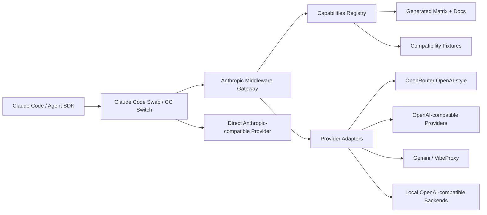
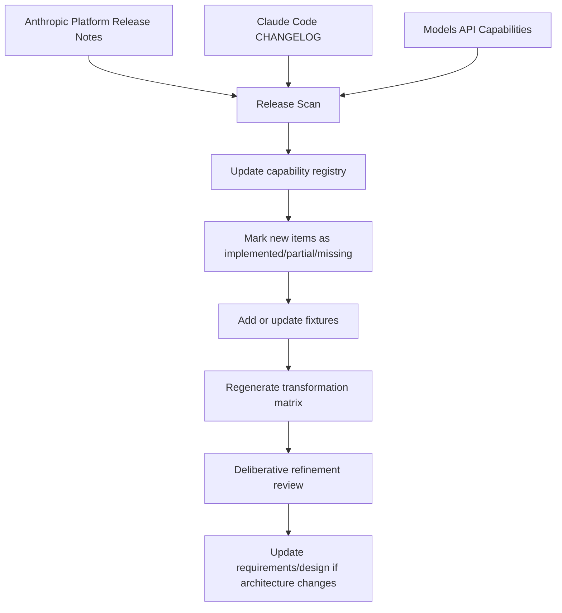

# Claude Code Middleware Gateway Design

> Updated: 2026-03-19

## Architecture Summary

The repository should be refactored into a layered gateway with a narrow core:

1. Anthropic-compatible edge for Claude Code / Agent SDK traffic.
2. Capability registry describing Anthropic protocol features and provider support.
3. Provider adapters that transform between Anthropic semantics and upstream provider semantics.
4. Compatibility test harness driven by the registry.
5. Optional addons split away from the core runtime.

Claude Code Swap / CC Switch remains the outer UX and profile manager. This project becomes the transformation engine for profiles that need protocol conversion.

## Recommended Role Split

### Claude Code Swap / CC Switch owns

- profile management
- multi-app config switching
- local app takeover
- user-facing provider switching UX
- per-app launch / failover UX

### Middleware gateway owns

- Anthropic Messages API compatibility
- request / response transformation
- SSE transformation
- provider capability negotiation
- compatibility matrix generation
- protocol-level observability and test fixtures

### Providers own

- actual model execution
- native rate limits
- provider-native extensions outside the Anthropic contract

## Target Topology

## Refactoring Direction

### Layer 1: Anthropic Edge

Keep and harden:

- Anthropic request models
- `/v1/messages`
- `/v1/messages/count_tokens`
- health and minimal diagnostics

Remove from core path:

- analytics dashboards
- billing endpoints
- reports
- alerts
- user management
- GraphQL
- crosstalk

### Layer 2: Capability Registry

Introduce a machine-readable source of truth, e.g.:

`registry/anthropic_capabilities.yaml`

Each entry should contain:

- feature id
- Anthropic surface type
- first release date
- source URL
- request fields
- response fields
- streaming events
- provider adapter support status
- fixture coverage status

### Layer 3: Provider Adapters

Refactor current conversion logic into explicit adapter contracts:

- `adapters/base.py`
- `adapters/openai_compat.py`
- `adapters/gemini_compat.py`
- `adapters/anthropic_passthrough.py`

Each adapter must declare:

- supported request fields
- supported response fields
- supported streaming events
- unsupported features and fallback behavior

### Layer 4: Matrix Generator

Generate `transformation-matrix.md` from the capability registry plus adapter declarations.

Outputs:

- human markdown table
- mermaid dependency view
- machine-readable JSON snapshot for CI

### Layer 5: Test Harness

Add fixtures that verify:

- request field transforms
- tool schema transforms
- tool streaming transforms
- stop reason mapping
- thinking block mapping
- structured output mapping
- cache control passthrough / fallback behavior

## Current-State Findings That Drive The Refactor

The current codebase is broader than the target architecture:

- [src/main.py](/home/cheta/code/claude-code-proxy/src/main.py#L4) through [src/main.py](/home/cheta/code/claude-code-proxy/src/main.py#L42) import many non-core APIs.
- [src/main.py](/home/cheta/code/claude-code-proxy/src/main.py#L271) through [src/main.py](/home/cheta/code/claude-code-proxy/src/main.py#L301) mount analytics, billing, alerts, dashboards, RBAC, provider auth, and GraphQL.
- [src/services/conversion/request_converter.py](/home/cheta/code/claude-code-proxy/src/services/conversion/request_converter.py#L308) and [src/services/conversion/response_converter.py](/home/cheta/code/claude-code-proxy/src/services/conversion/response_converter.py#L729) through [src/services/conversion/response_converter.py](/home/cheta/code/claude-code-proxy/src/services/conversion/response_converter.py#L860) contain the actual middleware value.

## Required New Documents

The spec directory should become the canonical planning bundle:

- `.claude/specs/claude-code-middleware-gateway/requirements.md`
- `.claude/specs/claude-code-middleware-gateway/design.md`
- `.claude/specs/claude-code-middleware-gateway/transformation-matrix.md`
- `.claude/specs/claude-code-middleware-gateway/final-report.md`

## Compatibility Matrix Model

Each matrix row should answer:

- what Anthropic surface exists?
- where is it defined in Anthropic docs / release notes?
- is it implemented, partial, passthrough, or missing?
- which code path handles it now?
- what exact work is needed?

## Update Workflow For New Anthropic Features

Suggested command workflow:

1. Fetch latest release notes and Claude Code changelog.
2. Diff for keywords:
   - `tool`
   - `thinking`
   - `stream`
   - `output_config`
   - `cache_control`
   - `skills`
   - `memory`
   - `subagent`
   - `count_tokens`
   - `stop_reason`
3. Update registry entries.
4. Re-run matrix generation.
5. Run compatibility fixtures.
6. Require review before any item changes from `missing` to `implemented`.

## Immediate Design Changes Recommended

### Keep In Core

- Anthropic models and request schemas
- request / response conversion
- routing / provider selection
- streaming conversion
- minimal health / logs
- compatibility registry and fixtures

### Move To Optional Addons Or Separate Subprojects

- Dashboard / web UI
- Analytics / billing / reports
- Alerts / notifications / predictive
- RBAC / provider auth UI / GraphQL
- Crosstalk and experimentation tools

## Suggested Subproject Split

### 1. `cc-middleware-core`

Owns protocol fidelity and provider transforms.

### 2. `cc-observability-addon`

Owns request metrics, cost tracking, and optional logs UI.

### 3. `cc-ops-console`

Owns dashboards, RBAC, provider setup UI, reports, alerts, and GraphQL.

### 4. `cc-labs`

Owns crosstalk, benchmarking, and experimental routing ideas.

## Decision

Do not replace the current project with LiteLLM.

Use CC Switch as the operator-facing switchboard.

Refactor this repository into the protocol gateway layer and explicitly separate non-core platform features.
