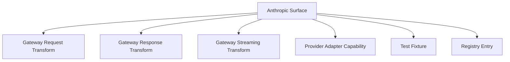

# Claude Code Middleware Transformation Matrix

> Updated: 2026-03-19
> Status legend: `implemented`, `partial`, `passthrough-only`, `missing`

## Purpose

This matrix is the authoritative map of Anthropic Messages / Claude Code protocol features versus the current gateway implementation and the target middleware refactor.

## Relationship View

## Matrix

| Surface | Anthropic contract | Current project status | Current code evidence | Required middleware action | Source anchor |
|---|---|---:|---|---|---|
| Messages endpoint | `POST /v1/messages` | implemented | [endpoints.py](/home/cheta/code/claude-code-proxy/src/api/endpoints.py) | keep as core entrypoint | Anthropic Messages API |
| Token counting | `POST /v1/messages/count_tokens` | partial | [endpoints.py](/home/cheta/code/claude-code-proxy/src/api/endpoints.py#L1091) | replace char/4 heuristic with upstream-accurate strategy or capability-backed estimation | Anthropic Token Counting API |
| Top-level `system` | top-level system content | implemented | [request_converter.py](/home/cheta/code/claude-code-proxy/src/services/conversion/request_converter.py#L286) | keep | Anthropic Messages API |
| Text content blocks | `text` blocks | implemented | [claude.py](/home/cheta/code/claude-code-proxy/src/models/claude.py#L5), [request_converter.py](/home/cheta/code/claude-code-proxy/src/services/conversion/request_converter.py#L613) | keep | Anthropic Messages API |
| Image content blocks | `image.source` base64 content blocks | partial | [claude.py](/home/cheta/code/claude-code-proxy/src/models/claude.py#L10), [request_converter.py](/home/cheta/code/claude-code-proxy/src/services/conversion/request_converter.py#L628) | formally classify supported image variants and document unsupported document/file blocks | Anthropic multimodal docs |
| Client tools | `tools` + JSON schema | implemented | [claude.py](/home/cheta/code/claude-code-proxy/src/models/claude.py#L63), [request_converter.py](/home/cheta/code/claude-code-proxy/src/services/conversion/request_converter.py#L406) | keep, capability-tag per provider | Tool use docs |
| `tool_choice` | auto / any / none / specific tool | implemented | [request_converter.py](/home/cheta/code/claude-code-proxy/src/services/conversion/request_converter.py#L431) | keep, tie to registry | Tool use docs |
| Tool use blocks | `tool_use` content blocks | implemented | [claude.py](/home/cheta/code/claude-code-proxy/src/models/claude.py#L15), [request_converter.py](/home/cheta/code/claude-code-proxy/src/services/conversion/request_converter.py#L671) | keep | Tool use docs |
| Tool result blocks | `tool_result` content blocks | implemented | [claude.py](/home/cheta/code/claude-code-proxy/src/models/claude.py#L22), [request_converter.py](/home/cheta/code/claude-code-proxy/src/services/conversion/request_converter.py#L753) | keep and add cache-control-aware variants | Tool use docs + prompt caching notes |
| Text-encoded tool calls from upstream | nonstandard `<tool_call>` markup recovery | implemented | [response_converter.py](/home/cheta/code/claude-code-proxy/src/services/conversion/response_converter.py#L729) | keep as adapter-specific recovery path, not core contract | provider workaround, not Anthropic contract |
| Fine-grained tool streaming | `input_json_delta` in Anthropic SSE | implemented | [response_converter.py](/home/cheta/code/claude-code-proxy/src/services/conversion/response_converter.py#L167), [response_converter.py](/home/cheta/code/claude-code-proxy/src/services/conversion/response_converter.py#L827) | keep and fixture-test | Feb 5 2026 release notes |
| Thinking request config | `thinking` + `budget_tokens` / `adaptive` + `effort` | partial | [claude.py](/home/cheta/code/claude-code-proxy/src/models/claude.py#L72), [request_converter.py](/home/cheta/code/claude-code-proxy/src/services/conversion/request_converter.py#L196) | add release-aware support classification for deprecated vs current modes | Extended thinking docs + Feb 5 2026 release notes |
| Thinking response blocks | `thinking`, `redacted_thinking` | partial | [claude.py](/home/cheta/code/claude-code-proxy/src/models/claude.py#L33), [response_converter.py](/home/cheta/code/claude-code-proxy/src/services/conversion/response_converter.py#L712) | preserve `signature` and display modes explicitly | Extended thinking docs + Mar 16 2026 release notes |
| Thinking signature streaming | `signature_delta` | missing | no code hit for `signature_delta` | add streaming support and fixture coverage | Streaming docs + extended thinking docs |
| Structured outputs | `output_config.format` | missing | request models expose fields only in [claude.py](/home/cheta/code/claude-code-proxy/src/models/claude.py#L107) | add request mapping, response expectations, and provider adapter capability flags | Jan 29 2026 + Feb 5 2026 release notes |
| Legacy structured outputs | `output_format` deprecated | partial | modeled only | support as legacy input shim, normalize to `output_config.format` | Jan 29 2026 release notes |
| Prompt caching | block-level and automatic `cache_control` | missing | no conversion support found | add passthrough / transform behavior and cache-aware tool_result rules | Feb 19 2026 + release notes overview |
| Stop reasons | `tool_use`, `pause_turn`, `model_context_window_exceeded`, etc. | partial | [response_converter.py](/home/cheta/code/claude-code-proxy/src/services/conversion/response_converter.py#L851) | add exhaustive mapping table and explicit unsupported handling | Sept 29 2025 + tool use docs |
| System + developer prompt semantics | Claude Code/SDK expects Anthropic-side semantics | passthrough-only | edge behavior via Anthropic endpoint | retain as Anthropic edge behavior; do not invent OpenAI-side equivalents | Claude Code docs |
| Server tools: web search | Anthropic server tool | missing | no explicit support | classify as missing or passthrough depending on upstream provider; add registry entry | Feb 17 2026 release notes + web search docs |
| Server tools: web fetch | Anthropic server tool | missing | no explicit support | same as above | Sept 10 2025 + Feb 17 2026 release notes |
| Server tools: tool search | Anthropic server tool | missing | no explicit support | same as above | Nov 24 2025 + Feb 17 2026 release notes |
| Server tools: memory | Anthropic server tool | missing | no explicit support | same as above | Sept 29 2025 + Feb 17 2026 release notes |
| Code execution / skills / container features | Anthropic container-coupled tools | missing | no explicit support | treat as separate capability family; likely passthrough-only for Anthropic providers, unsupported for generic providers | Oct 16 2025 + Feb 17 2026 release notes |
| Data residency | `inference_geo` | missing | no code path found | add generic passthrough for Anthropic-compatible upstreams | Feb 5 2026 release notes |
| Fast mode / speed | `speed` parameter | missing | no code path found | add passthrough classification | Feb 7 2026 release notes |
| Model capabilities discovery | `GET /v1/models` capability fields | missing | static / fetched model metadata only | add sync path using Anthropic model capabilities where relevant | Mar 18 2026 release notes |
| Subagent-specific model control | `CLAUDE_CODE_SUBAGENT_MODEL` / subagent runtime expectations | missing in gateway docs | no explicit gateway support | document routing expectations and add env/override handling in operator docs | Claude Code changelog + OpenRouter Claude Code guide |

## Deliberative Refinement Results

I ran a structured review on the matrix after assembling it. The main omissions that surfaced and were added before finalizing the document were:

1. `signature_delta` support for thinking continuity.
2. automatic caching and the February 19, 2026 `cache_control` changes.
3. `output_config.format` replacing `output_format`.
4. server-side Anthropic tools introduced or GA'd in late 2025 and early 2026.
5. `inference_geo`, `speed`, and model capability discovery.
6. the fact that `/v1/messages/count_tokens` is only approximate today and must not be labeled full support.

## High-Confidence Gaps

These are the most consequential current gaps:

1. Structured outputs are modeled but not transformed.
2. Prompt caching semantics are not implemented.
3. Server tools are not represented in the Anthropic request/response contract.
4. Thinking signatures and some newer streaming deltas are not handled.
5. Count-token accuracy is not authoritative.

## External Benchmark Matrix: CCR vs Claude Code Mux

| Surface | CCR codebase finding | Claude Code Mux finding | Takeaway for our gateway |
|---|---|---|---|
| `/v1/messages/count_tokens` | Implemented with tokenizer service and fallback counting in `packages/server/src/server.ts` | Implemented and routed per provider in `src/server/mod.rs`; non-Anthropic providers may still fall back to estimation in provider implementations | Both projects treat token counting as important; CCR is stronger on tokenizer infrastructure, Mux is stronger on provider-routed flow |
| Thinking request handling | Strong transformer coverage plus active maintenance: `anthropic.transformer.ts`, `reasoning.transformer.ts`; open PRs #1266, #1267, #1222 show live reasoning fixes | Supports think-mode routing and some reasoning conversion; OpenAI/Codex reasoning becomes Anthropic `thinking`, but overall request model is simpler | CCR is ahead on thinking transform depth and maintenance velocity |
| Thinking signatures / `signature_delta` | Explicit streaming support in `anthropic.transformer.ts` lines 545-558 | No explicit `signature_delta` support found; OpenAI provider uses empty signature strings | CCR is materially ahead here |
| Fine-grained tool streaming | Explicit `input_json_delta` emission in `anthropic.transformer.ts` lines 812-840 | No equivalent Anthropic-side `input_json_delta` support found in provider code | CCR is ahead |
| `cache_control` / prompt caching | `cache_control` is modeled, but several transformers strip it; PR #1220 exists specifically to avoid breaking cache | `cache_control` appears in request models, but no transformation or preservation logic was found in provider code | Neither is a clean gold standard; CCR has more real-world handling, Mux looks mostly absent |
| Web search server-tool semantics | Explicit `server_tool_use` and `web_search_tool_result` generation in `anthropic.transformer.ts` lines 972-989; PR #1230 adds Venice web search support | Routes on web search tool presence and Gemini maps `WebSearch` / `WebFetch` to native tools, but no explicit Anthropic `server_tool_use` / `web_search_tool_result` surface was found | CCR is ahead on Anthropic-shaped server-tool output; Mux is stronger on routing than protocol fidelity here |
| `tool_choice` | Explicit conversion in `anthropic.transformer.ts` lines 198-206 | OpenAI provider contains `tool_choice: None // TODO` | Mux is clearly partial here |
| Structured outputs (`output_config.format`) | No explicit support found via code search | No explicit support found via code search | Neither project appears to cover this well from public code alone |
| Subagent-specific routing | No explicit subagent tag flow found during code scan | Explicit `<CCM-SUBAGENT-MODEL>` extraction in `src/router/mod.rs` lines 192-220; open issue #15 shows edge-case bugs still exist | Mux is ahead on subagent-routing ergonomics |
| Historical evidence from issues / PRs | Active transform-heavy maintenance: cache, reasoning, image pipeline, token usage, web search | Smaller but less mature issue set: streaming corruption, missing headers, per-model params, subagent-model mismatch | CCR is more battle-tested; Mux is focused but younger and still filling gaps |

## Historical Signal From GitHub Issues And PRs

### CCR

Important live evidence from the GitHub tracker:

- PR #1275: fixes Gemini thought-signature handling
- PR #1267: fixes disabled thinking mode
- PR #1266: strips unsupported thinking for OpenAI Responses providers
- Issue #1252: `/v1/messages/count_tokens` problems
- PR #1230: adds built-in web search transformer support
- PR #1222: sanitizes reasoning parameters for OpenRouter
- PR #1220: avoids breaking cache behavior

Interpretation:

- CCR maintainers are actively fixing real Anthropic-compat edge cases.
- The repo is feature-rich, but also under constant compatibility pressure.

### Claude Code Mux

Important live evidence from the GitHub tracker:

- Issue #15: subagent-model matching bug
- Issue #9: streaming response format corruption
- Issue #7: missing identifying headers for Claude Code Max OAuth
- Issue #6: missing support for per-model request parameters

Interpretation:

- Mux has a focused gateway architecture, but it still shows visible gaps in request parameter fidelity and streaming stability.

## Verification Notes

This matrix is grounded in:

- Anthropic Claude Platform release notes through March 18, 2026.
- Claude Code changelog in Anthropic's `claude-code` repository.
- Anthropic tool use / streaming / extended thinking docs.
- Current local code paths in this repository.
- Live code inspection of:
  - `musistudio/claude-code-router`
  - `9j/claude-code-mux`
- GitHub issue / PR history for both benchmark projects.
